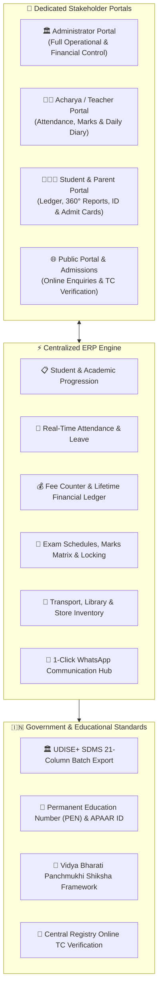
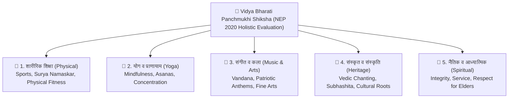

# 🏫 Saraswati Shishu Mandir (SSM) School ERP
### Enterprise School Management & Digital Empowerment Platform
*Built with reverence and precision by [init65.co.in](https://www.init65.co.in) for Vidya Bharati affiliated schools across India.*

---

<div align="center">

[](https://init65.co.in)
[](https://udiseplus.gov.in)
[](https://init65.co.in)
[](https://init65.co.in)
[](https://init65.co.in)

</div>

---

## 🌟 Developer Vision & Philosophy

> *"As a full-stack developer at init65.co.in, I built this school management ERP to solve the real, everyday challenges faced by Saraswati Shishu Mandir (SSM) schools, Acharyas (teachers), and students. By replacing tedious manual paperwork with intuitive digital tools, eliminating expensive third-party SMS costs with instant WhatsApp notifications, and honoring the timeless values of Vidya Bharati and Panchmukhi Shiksha, this platform empowers schools to become truly paperless, transparent, and digitally self-reliant."*
>
> — **Lead Engineer**, [init65.co.in](https://www.init65.co.in)

---

## 🏛️ System Architecture & Portal Ecosystem

SSM ERP operates on a unified, high-performance architecture delivering tailored experiences across four dedicated portals while strictly safeguarding data privacy and multi-branch tenant isolation.



---

## 🏫 Stakeholder Portals Showcase

| Portal | Primary Audience | Key Capabilities |
|---|---|---|
| **🏛️ Admin Portal** | Principals & Office Administrators | Complete school governance, admission approvals, fee demands & multi-mode collections, staff payroll slips, timetable management, certificate generation, and security audit logs. |
| **👨‍🏫 Acharya Portal** | Teachers & Subject Faculty | Rapid 30-second class attendance, homework diary broadcasting, tabular marks entry matrix with exam lock verification, timetable view, and salary slip access. |
| **👨‍👩‍👧 Student & Parent Portal** | Students & Guardians | Multi-branch login with sibling disambiguation, official PEN & APAAR ID badges, live attendance stats, fee payment history & digital receipts, 360° progress reports, and downloadable admit/ID cards. |
| **🌐 Public Portal** | Prospective Parents & Institutions | School history & Vedic heritage, online admission enquiry intake, and instant Transfer Certificate (TC) verification with dynamic digital school seals. |

---

## 🌸 Vidya Bharati Panchmukhi Shiksha & NEP 2020

The platform natively implements the **Panchmukhi Shiksha (Five-Dimensional Education)** framework of Vidya Bharati, evaluating the child's holistic growth alongside standard scholastic subjects:



---

## 🚀 Core Production-Hardened Modules

### 1. 📋 Student Lifecycle & Admissions
- **End-to-End Onboarding**: Manage student profiles with automatic roll number sequencing, class-section allocation, blood groups, and guardian records.
- **Online Admission Workflow**: Public inquiry form with dynamic academic session selection, parental consent tracking, and printable admission acknowledgement slips.
- **Bulk CSV Ingestion**: High-throughput student directory import with instant validation.

### 2. 📅 Attendance & Absentee Management
- **Dual Perspective Views**: Switch effortlessly between daily roll-call marking and aggregated monthly/custom date-range attendance summaries.
- **Automated Low Attendance Alerts**: Real-time identification of students falling below 75% attendance threshold.
- **1-Click WhatsApp Notices**: Instant parent notification links pre-filled with student absentee summaries.

### 3. 💰 Fee Counter & Financial Ledger
- **Demand Generation**: Create recurring and term-based fee demands per academic year with transparent fee head breakdowns.
- **Multi-Mode Collection**: Instant receipt generation supporting Cash, UPI, Bank Transfer (NEFT/RTGS), and Cheques.
- **Lifetime Financial Ledger**: Complete audit ledger showing total billed, paid, and outstanding balances with one-click past receipt reprints.
- **Automated Arrears Rollover**: Effortless year-end rollover of pending balances into the new academic session with idempotent duplication protection.

### 4. 📝 Examinations & 360° Evaluation
- **Flexible Examination Scheduling**: Date sheets, maximum marks, and room number assignments configured per session.
- **Marks Matrix**: High-speed tabular marks entry for teachers with automatic grade (`A+` to `D`) and percentage computation.
- **Result Freezing (`Lock`)**: Administrative result locking mechanism to safeguard verified marks against alteration.
- **360° NEP 2020 Progress Reports**: Multi-dimensional report cards combining scholastic achievements with Panchmukhi Shiksha co-scholastic grades.

### 5. 🚌 Operations, Library & Inventory
- **Multi-Section Timetables**: Weekly class schedule planner supporting multiple sections per grade with clean print layouts.
- **Library Cataloging**: Accession registry, book issue/return tracking, and overdue fine management.
- **Fleet Management**: Bus route creation, stop pickup/drop timings, driver details, and student route assignments.
- **Store & Uniform Inventory**: Stock transaction ledgers with low-stock warning alerts.

### 6. 🇮🇳 Government UDISE+ & Digital Identity Compliance
- **UDISE+ SDMS 21-Column Export**: Standardized UTF-8 BOM CSV batch export fully compatible with `udiseplus.gov.in`.
- **Permanent Education Number (PEN)**: Tracking the 11-digit national student ID across profiles, transfers, and certificates.
- **APAAR ID (One Nation, One Student ID)**: Seamless capture of the 12-digit digital registry ID with prominent badges on reports and student portals.
- **Institutional UDISE Code**: Official 11-digit school code integration with certified digital seals on all documents.

---

## 🪪 Interactive UI & Document Previews

### 📱 Student & Parent Portal Dashboard
```text
+-------------------------------------------------------------------------------+
|  🏛️ सरस्वती शिशु मंदिर | 👤 छात्र: आदित्य कुमार (कक्षा: 8-A, अनुक्रमांक: 104)      |
|  [PEN: 21098765432]   [APAAR ID: 9876 5432 1098]   [उपस्थिति: 94.2% 🟢 उत्तम]  |
+-------------------------------------------------------------------------------+
|  [📅 दैनिक उपस्थिति]   [📝 गृहकार्य डायरी]   [💰 शुल्क व रसीदें]   [📊 360° प्रगति पत्र] |
+-------------------------------------------------------------------------------+
|  📌 आज का गृहकार्य: गणित - अभ्यास 4.2 (परिमेय संख्याएँ प्रश्न 1 से 5 हल करें)      |
|  💳 शुल्क स्थिति: ₹0 देय (सत्र 2026-27 पूर्ण चुकता)  [🖨️ रसीद डाउनलोड करें]     |
|  📜 त्वरित प्रमाण पत्र: [🪪 परिचय पत्र]  [🎟️ प्रवेश पत्र]  [📜 Bonafide]  [🎓 TC]  |
+-------------------------------------------------------------------------------+
```

### 🪪 Standardized Student Identity Card (8-per-A4 Print Ready)
```text
+-------------------------------------------------------------+
|                सरस्वती शिशु मंदिर वरिष्ठ माध्यमिक            |
|                  शास्त्री नगर शाखा, गोरखपुर                 |
+-------------------------------------------------------------+
|  +-------+  नाम: आदित्य कुमार         कक्षा: 8-A  रोल: 104   |
|  |       |  पिता: श्री राजेश कुमार    रक्त समूह: B+         |
|  | [फोटो] |  जन्म: 14/08/2012         मोबाइल: 9876543210    |
|  |       |  PEN: 21098765432        APAAR: 9876 5432 1098  |
|  +-------+  पता: 42, आर्यनगर, गोरखपुर                      |
+-------------------------------------------------------------+
|  [QR Barcode]                              (प्राचार्य मुहर) |
+-------------------------------------------------------------+
```

---

## 🛡️ Enterprise Security & Multi-Tenancy

- **Airtight Multi-Tenant Branch Isolation**: Complete logical and database-level separation of school branch data ensuring records never co-mingle across campuses.
- **Role-Based Portal Access Control**: Discrete permission layers governing Administrators, Acharyas, Students, and Public visitors.
- **Relational Integrity & Cascades**: Real-time propagation of student profile updates across active attendance, fees, and leave records.
- **Session Protection**: Sliding-window rate limiting protecting all authentication portals against automated brute-force attacks.
- **Comprehensive Audit Trail**: Tamper-resistant activity logs tracking logins, marks submissions, leave decisions, and administrative actions.

---

## ⚡ Technology Highlights

| Dimension | Standard / Capability |
|---|---|
| **Modern Frontend** | High-performance React 19, TypeScript, and Vite with responsive Tailwind CSS |
| **Progressive Web App** | Service worker caching with resilient offline state preservation |
| **Document Processing** | Print-optimized A4 CSS layouts for certificates, fee receipts, and ID cards |
| **Bilingual Localization** | Native Hindi vocabulary with accessible English equivalents |
| **Communication Layer** | Direct client-side WhatsApp Web messaging with zero external SMS cost |

---

## 🚀 Getting Started

### Local Setup

```bash
# 1. Clone repository
git clone https://github.com/Paras65/SSM.git

# 2. Install dependencies
npm install

# 3. Configure environment
cp .env.example .env

# 4. Launch full-stack application
npm run dev:all
```

- **Frontend Application**: `http://localhost:5173`
- **Backend Service**: `http://localhost:5000`

---

## 📖 Operational Documentation

For in-depth operational walkthroughs, step-by-step role guides, and institutional workflows, explore the complete manual:
- [📘 Complete User Manual (संपूर्ण उपयोगकर्ता मार्गदर्शिका)](docs/USER_MANUAL.md)

---

## 📜 License & Intellectual Property

- **Copyright**: © 2026 [init65.co.in](https://www.init65.co.in). All Rights Reserved.
- **License**: MIT License — Built for Vidya Bharati and educational institutions nationwide.
