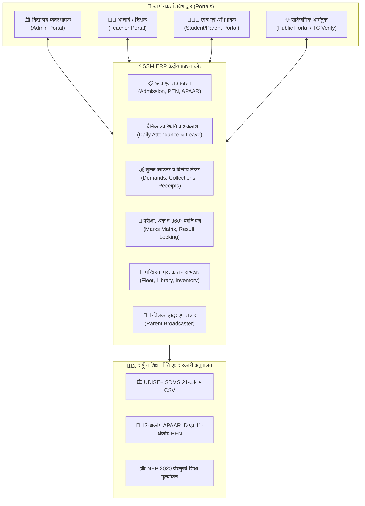
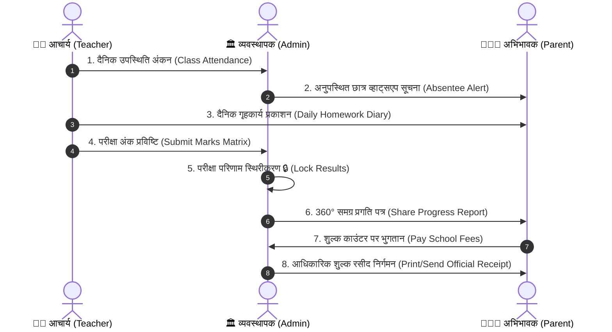
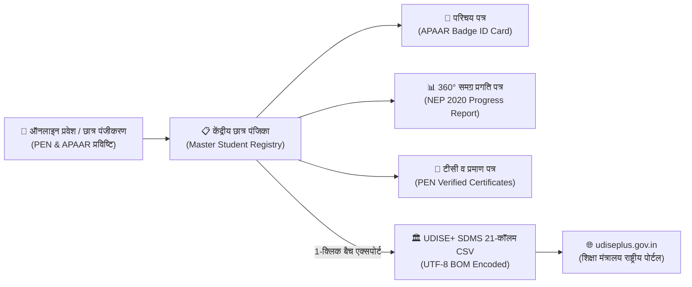
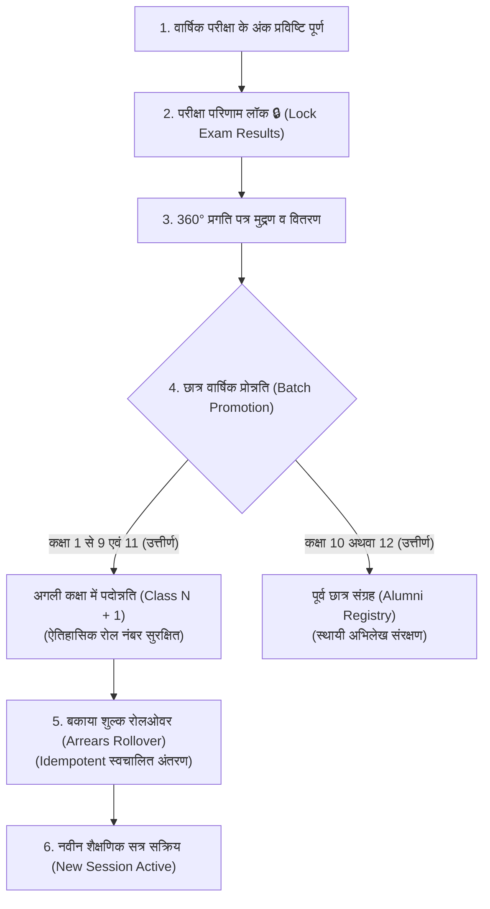
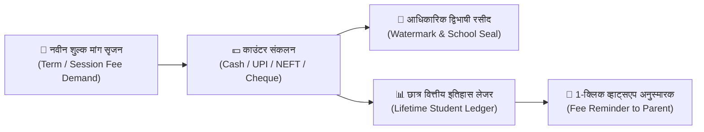
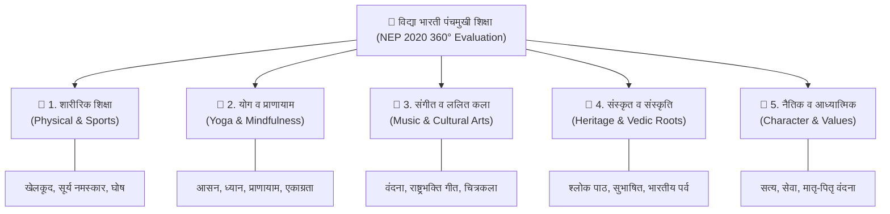

# सरस्वती शिशु मंदिर (SSM) विद्यालय प्रबंधन प्रणाली
## संपूर्ण उपयोगकर्ता मार्गदर्शिका (Complete User Manual)

---

## 📖 विषय सूची (Table of Contents)

1. [प्रणाली परिचय एवं उद्देश्य (Introduction & Philosophy)](#1-प्रणाली-परिचय-एवं-उद्देश्य)
2. [भूमिकाएं एवं प्रमाणीकरण (User Roles & Access Credentials)](#2-भूमिकाएं-एवं-प्रमाणीकरण)
3. [आचार्य / शिक्षक पोर्टल मार्गदर्शिका (Teacher Portal Guide)](#3-आचार्य--शिक्षक-पोर्टल-मार्गदर्शिका)
4. [परीक्षा प्रबंधन, डेट शीट एवं अंक प्रविष्टि (Exam & Marks Matrix)](#4-परीक्षा-प्रबंधन-डेट-शीट-एवं-अंक-प्रविष्टि)
5. [प्रवेश पत्र / हॉल टिकट (Admit Card / Hall Ticket)](#5-प्रवेश-पत्र--हॉल-टिकट)
6. [समय सारिणी प्रबंधन (Class Timetable & Bell Schedule)](#6-समय-सारिणी-प्रबंधन)
7. [अवकाश प्रबंधन कार्यप्रवाह (Leave Management System)](#7-अवकाश-प्रबंधन-कार्यप्रवाह)
8. [वाहन एवं बस रूट प्रबंधन (Transport Fleet Management)](#8-वाहन-एवं-बस-रूट-प्रबंधन)
9. [पुस्तकालय प्रबंधन प्रणाली (Library Management System)](#9-पुस्तकालय-प्रबंधन-प्रणाली)
10. [भंडार स्टॉक एवं गणवेश प्रबंधन (Inventory & Store Management)](#10-भंडार-स्टॉक-एवं-गणवेश-प्रबंधन)
11. [प्रमाण पत्र जनरेटर (Character & Bonafide Certificates)](#11-प्रमाण-पत्र-जनरेटर)
12. [व्हाट्सएप संदेश प्रसारण (WhatsApp Notification Broadcaster)](#12-व्हाट्सएप-संदेश-प्रसारण)
13. [सुरक्षा एवं ऑडिट लॉग (Security & System Audit Logs)](#13-सुरक्षा-एवं-ऑडिट-लॉग)
14. [सामान्य समस्याएं एवं समाधान (Troubleshooting & FAQs)](#14-सामान्य-समस्याएं-एवं-समाधान)
15. [छात्र एवं अभिभावक पोर्टल](#15-छात्र-एवं-अभिभावक-पोर्टल)
16. [भूमिका handoff कार्यप्रवाह](#16-शिक्षक-व्यवस्थापक-और-अभिभावक-के-बीच-handoff)
17. [छात्र आयात, संपादन और डेटा सुधार](#17-छात्र-आयात-संपादन-और-डेटा-सुधार)
18. [बैकअप, restore और recovery](#18-बैकअप-restore-और-आपातकालीन-recovery)
19. [विशेष परिस्थितियों के समाधान](#19-विशेष-परिस्थितियों-के-समाधान)
20. [गोपनीयता और डेटा सुरक्षा checklist](#20-गोपनीयता-और-डेटा-सुरक्षा-checklist)
21. [सहायता टीम को समस्या भेजने का प्रारूप](#21-सहायता-टीम-को-समस्या-भेजने-का-प्रारूप)
22. [भारत सरकार UDISE+ SDMS एवं APAAR ID अनुपालन मार्गदर्शिका](#22-भारत-सरकार-udise-sdms-एवं-apaar-id-अनुपालन-मार्गदर्शिका)
23. [वार्षिक सत्र परिवर्तन, छात्र प्रोन्नति एवं बकाया रोलओवर](#23-वार्षिक-सत्र-परिवर्तन-छात्र-प्रोन्नति-एवं-बकाया-रोलओवर)
24. [शुल्क काउंटर, रसीद निर्गमन एवं वित्तीय इतिहास](#24-शुल्क-काउंटर-रसीद-निर्गमन-एवं-वित्तीय-इतिहास)
25. [समग्र प्रगति पत्र (NEP 2020 360° Report Card) एवं पंचमुखी शिक्षा](#25-समग्र-प्रगति-पत्र-nep-2020-360-report-card-एवं-पंचमुखी-शिक्षा)
26. [छात्र पहचान पत्र (ID Cards) एवं परीक्षा हॉल टिकट बल्क जेनरेशन](#26-छात्र-पहचान-पत्र-id-cards-एवं-परीक्षा-हॉल-टिकट-बल्क-जेनरेशन)
27. [नवीनतम सुरक्षा, वित्तीय लेजर एवं शासकीय अनुपालन (Phase 1, 2, 3 संवर्द्धन)](#27-नवीनतम-सुरक्षा-वित्तीय-लेजर-एवं-शासकीय-अनुपालन)
28. [दाखिल-खारिज पंजिका (General Admission & Withdrawal Register - S.R. Register)](#28-दाखिल-खारिज-पंजिका-general-admission--withdrawal-register)

---

## 1. प्रणाली परिचय एवं उद्देश्य

सरस्वती शिशु मंदिर (SSM) विद्यालय प्रबंधन सॉफ्टवेयर विद्या भारती अखिल भारतीय शिक्षा संस्थान के सिद्धांतों, भारतीय संस्कृति तथा राष्ट्रीय शिक्षा नीति (NEP 2020) के अनुरूप विकसित एक आधुनिक, सुरक्षित तथा संपूर्ण वेब आधारित स्कूल ईआरपी (School ERP) प्रणाली है।

### मुख्य विशेषताएं:
- **बहु-शाखा समर्थन (Multi-Branch Tenant Isolation)**: गोरखपुर, दिल्ली, वाराणसी आदि प्रत्येक शाखा का डेटा पूर्णतः पृथक एवं सुरक्षित रहता है।
- **द्विभाषी इंटरफेस (Bilingual Support)**: प्राथमिक हिंदी शब्दावली के साथ सहज अंग्रेजी पर्याय।
- **ऑटो-कैलकुलेशन रिपोर्ट कार्ड**: NEP 2020 एवं पंचमुखी शिक्षा (शारीरिक, योग, संगीत, संस्कृत, नैतिक शिक्षा) आधारित समग्र मूल्यांकन।
- **1-क्लिक व्हाट्सएप संचार**: अनुपस्थित छात्र अलर्ट, शुल्क देय अनुस्मारक तथा परीक्षा परिणाम सूचना।

### 🏛️ प्रणाली वास्तुकला एवं डेटा प्रवाह (System Architecture)



### 1.1 यह दस्तावेज किसके लिए है?

यह मार्गदर्शिका निम्न सभी उपयोगकर्ताओं के लिए है:

- विद्यालय संचालक, प्रधानाचार्य और कार्यालय प्रशासक।
- आचार्य एवं दीदी जी।
- छात्र और अभिभावक।
- शाखा प्रबंधक, डेवलपर प्रशासक और तकनीकी सहायता टीम।

### 1.2 पहली बार शुरू करने का संक्षिप्त क्रम

1. सार्वजनिक होम पेज खोलें और **पोर्टल लॉगिन** से आवश्यक भूमिका चुनें।
2. नई संस्था के लिए **नई शाखा / साइन अप** खोलकर शाखा की मूल जानकारी भरें।
3. व्यवस्थापक शाखा चुनकर लॉगिन करें।
4. **विद्यालय प्रबंधन** में शाखा का नाम, पता, संपर्क, सत्र और योजना की जानकारी जांचें।
5. पहले आचार्य, फिर छात्र, फिर शुल्क संरचना और कक्षा संबंधी जानकारी दर्ज करें।
6. शिक्षक को उसके पंजीकृत मोबाइल और पिन की जानकारी सुरक्षित माध्यम से दें।
7. एक छात्र के साथ छात्र पोर्टल, उपस्थिति, शुल्क और रिपोर्ट कार्ड का परीक्षण करें।
8. डेटा सही होने के बाद ही वास्तविक अभिभावकों को पोर्टल लिंक दें।

### 1.3 डेमो मोड और वास्तविक विद्यालय डेटा

- **लाइव डेमो** केवल परीक्षण और प्रस्तुति के लिए है। इसमें नमूना छात्र, शुल्क, उपस्थिति, रिपोर्ट कार्ड और नोटिस लोड होते हैं।
- डेमो शुरू करने के लिए होम पेज पर **लाइव डेमो / डेमो** चुनें।
- डेमो समाप्त करने के लिए ऊपर दिखाई देने वाले **डेमो बंद करें** बटन का उपयोग करें।
- वास्तविक शाखा में डेमो डेटा लोड करने से पहले पुष्टि करें। एडमिन डैशबोर्ड का **डेमो लोड** बटन सक्रिय शाखा में नमूना रिकॉर्ड जोड़ता है।
- उत्पादन में कोई सार्वभौमिक पासकोड नहीं मानें। एडमिन पासकोड, शिक्षक पिन और डेवलपर पासकोड परिनियोजन के समय कॉन्फ़िगर किए जाते हैं।

### 1.4 होम पेज और सार्वजनिक सुविधाएं

बिना लॉगिन के उपयोगकर्ता निम्न काम कर सकते हैं:

- विद्यालय/ERP परिचय, घोषणाएं, दैनिक पंचांग, प्रवेश सूचना और संपर्क विवरण देखना।
- **विद्यालय खोजें** से उपलब्ध शाखाओं को खोजना और सक्रिय शाखा चुनना।
- ऑनलाइन प्रवेश पूछताछ भेजना। नाम, संपर्क और अभिभावक सहमति सही भरें।
- **टीसी सत्यापन** में रोल नंबर या प्रमाण पत्र विवरण से उपलब्ध प्रमाण पत्र जांचना।
- भाषा बटन से हिन्दी या English चुनना। चयन ब्राउज़र में सुरक्षित रहता है।
- गोपनीयता नीति, उपयोग की शर्तें और सहायता संपर्क देखना।

सार्वजनिक होम पेज platform identity दिखाता है। चुनी हुई शाखा का वास्तविक छात्र/शुल्क डेटा केवल संबंधित सुरक्षित पोर्टल में दिखता है।

### 1.5 शाखा बदलने का नियम

1. लॉगिन स्क्रीन या एडमिन शीर्ष पट्टी में **विद्यालय शाखा** चुनें।
2. शाखा बदलने के बाद दोबारा प्रमाणित करें।
3. शाखा बदलते समय पुराने छात्र, शुल्क और उपस्थिति रिकॉर्ड नई शाखा में नहीं मिलाए जाते।
4. यदि सूची खाली है, पहले शाखा पंजीकृत करें या सर्वर/डेटाबेस कनेक्शन जांचें।

### 1.6 डेटा खाली दिखने पर क्या करें?

- सुनिश्चित करें कि सही शाखा सक्रिय है।
- शीर्ष पट्टी में database status देखें और **Sync / Refresh** दबाएं।
- देखें कि उपयोगकर्ता के पास सही भूमिका और अनुमति है।
- वास्तविक शाखा में डेमो मोड बंद है या नहीं जांचें।
- छात्र सूची खाली हो तो पहले **नया छात्र** या CSV import से छात्र जोड़ें।
- नोटिस, स्टाफ, पुस्तक, बस या परीक्षा सूची खाली हो तो संबंधित मॉड्यूल में पहला रिकॉर्ड बनाएं।
- फिर भी समस्या रहे तो शाखा ID, समय, स्क्रीन और त्रुटि संदेश सहायता टीम को भेजें।

### 1.7 रिकॉर्ड बनाते समय सामान्य नियम

- एक छात्र का रोल नंबर एक ही शाखा में अद्वितीय रखें।
- छात्र का नाम, जन्मतिथि, अभिभावक संपर्क और कक्षा सेव करने से पहले जांचें।
- पुराने रिकॉर्ड हटाने के बजाय जहां संभव हो उन्हें अपडेट करें।
- भुगतान और परीक्षा अंक सेव होने के बाद रसीद/रिपोर्ट कार्ड खोलकर सत्यापित करें।
- संवेदनशील डेटा साझा स्क्रीन, सार्वजनिक चैट या अनधिकृत WhatsApp समूह में न भेजें।

### 1.8 सत्र समाप्त करना

- कार्य पूरा होने पर **लॉगआउट** दबाएं।
- साझा कंप्यूटर पर ब्राउज़र बंद करें और पासकोड सेव न करें।
- कार्यालय छोड़ने से पहले लंबित आवेदन, शुल्क, उपस्थिति और बैकअप की स्थिति जांचें।

---

## 2. भूमिकाएं एवं प्रमाणीकरण

सिस्टम में चार मुख्य स्तर के उपयोगकर्ता हैं:

| उपयोगकर्ता भूमिका | प्रवेश द्वार (Navigation) | आवश्यक विवरण (Credentials) | मुख्य अधिकार |
|---|---|---|---|
| **विद्यालय व्यवस्थापक (Admin)** | शीर्ष नेवबार -> **"प्रशासन (Admin)"** | शाखा चयन + शाखा का कॉन्फ़िगर किया गया पासकोड | पूर्ण विद्यालय नियंत्रण, शुल्क, प्रवेश, स्टाफ, प्रमाण पत्र |
| **आचार्य / दीदी (Teacher)** | शीर्ष नेवबार -> **"आचार्य पोर्टल"** | पंजीकृत मोबाइल + शाखा का 4-अंकों का पिन | उपस्थिति, गृहकार्य, अंक प्रविष्टि, समय सारिणी, अवकाश |
| **छात्र / अभिभावक (Student/Parent)** | शीर्ष नेवबार -> **"छात्र पोर्टल"** | शाखा + अनुक्रमांक (Roll No) + पंजीकृत मोबाइल | प्रगति पत्र, प्रवेश पत्र, गृहकार्य, शुल्क रसीद, अवकाश |
| **डेवलपर (Super Admin)** | प्रशासन -> **"डेवलपर मोड"** | सर्वर environment में सुरक्षित developer passcode | सभी शाखाओं की समग्र निगरानी एवं मेट्रिक्स |

### 2.1 लॉगिन विफल होने पर

1. सही शाखा चुनी है या नहीं जांचें।
2. एडमिन पासकोड में आगे/पीछे का space न रखें।
3. शिक्षक मोबाइल नंबर और पिन वही भरें जो शाखा रिकॉर्ड में है।
4. छात्र रोल नंबर, पंजीकृत संपर्क और कक्षा सही भरें।
5. बार-बार विफल प्रयास पर अनुमान लगाने के बजाय व्यवस्थापक से संपर्क करें।
6. token/session समाप्त हो तो लॉगआउट करके दोबारा लॉगिन करें।

## 2.2 विद्यालय व्यवस्थापक का दैनिक कार्यप्रवाह

### सुबह की शुरुआत

1. सही शाखा और शैक्षणिक सत्र की पुष्टि करें।
2. कल की लंबित उपस्थिति और अवकाश आवेदन देखें।
3. आज की सूचना/नोटिस प्रकाशित करें।
4. शिक्षक से उपस्थिति पूर्ण होने की पुष्टि लें।

### दिन के दौरान

1. प्रवेश पूछताछ और लंबित आवेदन की समीक्षा करें।
2. शुल्क भुगतान दर्ज करें और आवश्यक रसीद प्रिंट/साझा करें।
3. नए छात्र, शिक्षक, गृहकार्य, परीक्षा या पुस्तक रिकॉर्ड जोड़ें।
4. जरूरत होने पर प्रमाण पत्र और संदेश तैयार करें।

### दिन के अंत में

1. अनुपस्थित छात्रों और शुल्क बकाया की सूची जांचें।
2. लंबित अवकाश/प्रवेश अनुरोधों पर कार्रवाई करें।
3. महत्वपूर्ण डेटा का JSON बैकअप डाउनलोड करें।
4. ऑडिट लॉग में असामान्य गतिविधि देखें और लॉगआउट करें।

### 2.3 एडमिन डैशबोर्ड के मुख्य टैब

| टैब/बटन | उपयोग |
|---|---|
| मुख्य पृष्ठ | सारांश, त्वरित कार्य, आज की स्थिति और समय-सारणी |
| छात्र पंजिका | छात्र जोड़ना, खोज, संपादन, आयात, ID कार्ड और प्रमाण पत्र |
| दैनिक उपस्थिति | छात्रवार उपस्थिति दर्ज और संशोधित करना |
| शुल्क प्रबंधन | शुल्क रिकॉर्ड, भुगतान, बकाया और रसीद |
| प्रगति पत्र | परीक्षा परिणाम और समग्र रिपोर्ट कार्ड |
| दैनिक गृहकार्य | कक्षा/विषय के लिए गृहकार्य प्रकाशित करना |
| आचार्य एवं वेतन | स्टाफ रिकॉर्ड, पिन, वेतन और salary slip |
| प्रवेश समीक्षा | सार्वजनिक admission enquiries स्वीकार/संपर्क करना |
| सूचना प्रसारण | विद्यालय नोटिस बनाना, संपादित करना और हटाना |
| परीक्षा व अंक | परीक्षा, date sheet और admit card |
| टैबुलेशन रजिस्टर | कक्षा/परीक्षा का परिणाम सारांश |
| समय सारिणी | पीरियड, विषय, शिक्षक और कक्ष सेट करना |
| अवकाश समीक्षा | छात्र/स्टाफ leave approve या reject करना |
| बस परिवहन | route, vehicle, driver और stops |
| पुस्तकालय | catalog, issue, return और fine |
| भंडार स्टॉक | uniform, book और अन्य inventory |
| संदेश प्रसारण | अनुपस्थिति, शुल्क और सामान्य WhatsApp संदेश |

---

## 3. आचार्य / शिक्षक पोर्टल मार्गदर्शिका

आचार्य पोर्टल शिक्षकों को अपनी दैनिक शैक्षणिक जिम्मेदारियों को बिना किसी तकनीकी जटिलता के पूर्ण करने की सुविधा देता है।

### 3.1 लॉगिन प्रक्रिया
1. शीर्ष नेविगेशन बार में **"आचार्य पोर्टल"** पर क्लिक करें।
2. अपना पंजीकृत मोबाइल नंबर (उदा. `9450123456`) दर्ज करें।
3. 4-अंकों का सुरक्षा पिन दर्ज करें (डिफ़ॉल्ट: `1234`)।
4. **"सुरक्षित प्रवेश करें"** पर क्लिक करें।

### 3.2 दैनिक छात्र उपस्थिति दर्ज करना
1. टैब **"उपस्थिति (Attendance)"** चुनें।
2. कक्षा चुनें (उदा. `Class 8`) तथा तिथि का चयन करें।
3. सभी छात्रों को एक साथ उपस्थित करने के लिए **"सभी उपस्थित करें"** बटन दबाएं।
4. किसी विशेष छात्र हेतु **उपस्थित (P)**, **अनुपस्थित (A)**, अथवा **अवकाश (L)** बटन पर क्लिक करें। बदलाव स्वतः सुरक्षित हो जाते हैं।

### 3.3 गृहकार्य (Homework) देना
1. टैब **"दैनिक गृहकार्य"** चुनें।
2. **"+ नया गृहकार्य जोड़ें"** पर क्लिक करें।
3. विषय, शीर्षक (उदा. "अध्याय 4: परिमेय संख्याएँ"), विवरण एवं जमा करने की अंतिम तिथि चुनें।
4. **"गृहकार्य प्रकाशित करें"** पर क्लिक करें। यह छात्रों के पोर्टल में तुरंत दिखाई देगा।

### 3.4 परीक्षा अंक प्रविष्टि (Tabular Marks Entry Matrix)
1. टैब **"अंक प्रविष्टि (Marks Matrix)"** चुनें।
2. परीक्षा का चयन करें (उदा. `अर्धवार्षिक परीक्षा`) तथा अपना विषय चुनें।
3. कक्षा के सभी विद्यार्थियों की सूची एक स्प्रेडशीट ग्रिड में दिखाई देगी।
4. प्रत्येक छात्र के प्राप्तांक दर्ज करें।
5. **"अंक सुरक्षित करें"** बटन पर क्लिक करें। सिस्टम स्वतः कुल योग, प्रतिशत एवं ग्रेड (`A+`, `A`, `B`, आदि) की गणना कर प्रगति पत्र में अपडेट कर देता है।

### 3.5 समय सारिणी व वेतन पर्ची देखना
- **समय सारिणी (Timetable)** टैब में अपने दैनिक 8 कालांशों का समय एवं कक्ष देख सकते हैं।
- **वेतन पर्ची** टैब में जाकर अपनी मासिक वेतन पर्ची (मूल वेतन, डीए/एचआरए, पीएफ कटौती) देख व प्रिंट कर सकते हैं।

---

## 4. परीक्षा प्रबंधन, डेट शीट एवं अंक प्रविष्टि

प्रशासनिक स्तर पर संपूर्ण परीक्षा अनुसूची एवं अंक तालिका का प्रबंधन।

### 4.1 नई परीक्षा एवं डेट शीट बनाना
1. एडमिन डैशबोर्ड में **"📝 परीक्षा व अंक"** बटन पर क्लिक करें।
2. **"+ नई परीक्षा जोड़ें"** पर क्लिक करें।
3. परीक्षा का नाम (उदा. "वार्षिक परीक्षा 2025-26"), सत्र (`2025-26`), अवधि एवं कक्षाएं चुनें।
4. **विषयवार डेट शीट (Date Sheet Slot)** में विषय, परीक्षा तिथि, समय (उदा. `09:00 AM - 12:00 PM`), अधिकतम अंक एवं कक्ष संख्या जोड़ें।
5. **"परीक्षा अनुसूची सुरक्षित करें"** पर क्लिक करें।

### 4.2 बल्क मार्क्स मैट्रिक्स
- किसी भी समय किसी भी परीक्षा के विषय को चुनकर पूरी कक्षा के अंक एक साथ एक तालिका में भरे या संशोधित किए जा सकते हैं।

---

## 5. प्रवेश पत्र / हॉल टिकट (Admit Card / Hall Ticket)

विद्या भारती प्रारूप में आधिकारिक परीक्षा प्रवेश पत्र जनरेटर।

### प्रवेश पत्र प्रिंट करने के चरण:
1. एडमिन डैशबोर्ड में **"📝 परीक्षा व अंक"** में जाएं और **"प्रवेश पत्र"** पर क्लिक करें (या छात्र सूची से छात्र के सामने **"प्रवेश पत्र"** चुनें)।
2. छात्र का प्रवेश पत्र खुल जाएगा, जिसमें शामिल हैं:
   - विद्यालय का नाम, सम्बद्धता क्रमांक एवं लोगो।
   - छात्र का फोटो, नाम, अनुक्रमांक, कक्षा एवं पिता का नाम।
   - परीक्षा समय सारिणी (Date Sheet) की पूर्ण तालिका।
   - परीक्षा केंद्र के नियम व निर्देश।
   - प्रधानाचार्य एवं परीक्षा प्रभारी के हस्ताक्षर स्थान।
3. **"🖨️ प्रवेश पत्र प्रिंट करें"** पर क्लिक करके सीधे A4 साइज में प्रिंट निकालें।

> छात्र स्वयं भी अपने **छात्र पोर्टल** में लॉगिन करके अपना प्रवेश पत्र डाउनलोड कर सकते हैं।

---

## 6. समय सारिणी प्रबंधन (Class Timetable)

साप्ताहिक सोमवार से शनिवार तक के 8 कालांशों (Periods) का प्रबंधन।

### समय सारिणी सेट करने के चरण:
1. एडमिन डैशबोर्ड में **"🕒 समय सारिणी"** बटन पर क्लिक करें।
2. कक्षा (उदा. `Class 8`) तथा वर्ग (Section `A`) चुनें।
3. सप्ताह के दिनों (सोमवार से शनिवार) के अनुसार प्रत्येक पीरियड में:
   - **विषय** (उदा. गणित, विज्ञान, संस्कृत, वंदना)
   - **आचार्य का नाम**
   - **कक्ष क्रमांक** (Room No.)
4. **"समय सारिणी सुरक्षित करें"** पर क्लिक करें।
5. यह समय सारिणी शिक्षकों एवं छात्रों के पोर्टल पर तुरंत उपलब्ध हो जाती है।

---

## 7. अवकाश प्रबंधन कार्यप्रवाह (Leave System)

छात्रों एवं शिक्षकों के अवकाश आवेदनों की पारदर्शी स्वीकृति प्रणाली।

### 7.1 आवेदन जमा करना:
- **छात्र**: छात्र पोर्टल में लॉगिन करें -> **"अवकाश आवेदन"** -> प्रारंभ तिथि, समाप्ति तिथि और कारण लिखकर सबमिट करें।
- **शिक्षक**: आचार्य पोर्टल -> **"अवकाश आवेदन"** -> विवरण भरकर सबमिट करें।

### 7.2 एडमिन द्वारा समीक्षा एवं स्वीकृति:
1. एडमिन डैशबोर्ड में **"🌴 अवकाश समीक्षा"** पर क्लिक करें।
2. लंबित आवेदनों (Pending Requests) की सूची देखें।
3. कारण एवं दिनों की संख्या जांचें।
4. **"स्वीकृत करें (Approve)"** या **"अस्वीकृत करें (Reject)"** पर क्लिक करें।
5. स्थिति तुरंत अपडेट होकर आवेदक के पोर्टल में दिखने लगती है।

---

## 8. वाहन एवं बस रूट प्रबंधन (Transport Fleet)

विद्यालय की बसों, रूटों, चालकों तथा स्टॉप्स का सुव्यवस्थित रिकॉर्ड।

### नया रूट जोड़ने के चरण:
1. एडमिन डैशबोर्ड में **"🚌 बस परिवहन"** पर क्लिक करें।
2. **"+ नया रूट जोड़ें"** पर क्लिक करें।
3. रूट का नाम (उदा. "रूट 1 - शास्त्री चौक से विद्यालय") दर्ज करें।
4. वाहन क्रमांक (उदा. `UP 53 AB 1234`), चालक का नाम, मोबाइल नंबर तथा मासिक शुल्क दर्ज करें।
5. प्रत्येक बस स्टॉप का नाम, प्रातः पिकअप समय (उदा. `07:30 AM`) तथा दोपहर ड्रॉप समय (उदा. `02:00 PM`) दर्ज करें।
6. **"रूट सुरक्षित करें"** पर क्लिक करें।

---

## 9. पुस्तकालय प्रबंधन प्रणाली (Library Management)

विद्यालय पुस्तकालय में पुस्तकों का वर्गीकरण तथा निर्गमन/वापसी (Issue/Return) रजिस्टर।

### 9.1 नई पुस्तक जोड़ना (Cataloging)
1. एडमिन डैशबोर्ड में **"📚 पुस्तकालय"** पर क्लिक करें।
2. **"+ नई पुस्तक जोड़ें"** पर क्लिक करें।
3. पुस्तक परिग्रहण संख्या (Accession No. उदा. `BK-104`), शीर्षक, लेखक, श्रेणी (संस्कार व महापुरुष, गीता, विज्ञान, गणित आदि), रैक संख्या एवं कुल प्रतियां दर्ज करें।
4. **"पुस्तक जोड़ें"** पर क्लिक करें।

### 9.2 पुस्तक जारी करना (Issue Book)
1. **"पुस्तक निर्गमन (Issue Book)"** टैब चुनें।
2. पुस्तक का चयन करें, छात्र का नाम/रोल नंबर दर्ज करें और वापसी की अंतिम तिथि (Due Date) चुनें।
3. **"पुस्तक निर्गमित करें"** पर क्लिक करें। उपलब्ध प्रतियों (Available Copies) की संख्या स्वतः 1 घट जाएगी।

### 9.3 पुस्तक वापसी (Return Book)
1. जारी पुस्तकों की सूची में छात्र के नाम के आगे **"वापसी प्राप्त करें (Return)"** पर क्लिक करें।
2. यदि कोई विलंब शुल्क (Fine) हो तो दर्ज करें।
3. पुस्तक पुस्तकालय में पुनः उपलब्ध हो जाएगी और स्टॉक संख्या स्वतः 1 बढ़ जाएगी।

---

## 10. भंडार स्टॉक एवं गणवेश प्रबंधन (Store Inventory)

विद्यालय गणवेश, पाठ्यपुस्तकें, अभ्यास पुस्तिकाएं, बेल्ट, बैज तथा टाई का स्टॉक नियंत्रण।

### मुख्य सुविधाएं:
- **न्यूनतम स्टॉक चेतावनी (Low-Stock Alert)**: जब भी किसी सामग्री का स्टॉक निर्धारित न्यूनतम सीमा से नीचे जाता है, उस पर लाल चेतावनी बैज आ जाता है।
- **स्टॉक समायोजन (Stock Delta Adjustment)**: नई सामग्री आने पर `+ संख्या` या वितरित होने पर `- संख्या` डालकर 1-क्लिक में स्टॉक अपडेट करें।
- **मूल्य सूची**: प्रत्येक वस्तु का विक्रय मूल्य प्रदर्शित होता है।

---

## 11. प्रमाण पत्र जनरेटर (Certificates)

विद्या भारती मानकों के अनुसार द्विभाषी (हिंदी-अंग्रेजी) आधिकारिक प्रमाण पत्र।

### 11.1 चरित्र प्रमाण पत्र (Character Certificate)
1. एडमिन डैशबोर्ड में **"छात्र सूची"** (Students) पर जाएं।
2. छात्र की पंक्ति में **"चरित्र"** बटन पर क्लिक करें।
3. प्रमाण पत्र जनरेट होगा जिसमें छात्र का आचरण, खेलकूद/सांस्कृतिक सहभागिता, विद्यालय छोड़ने का वर्ष एवं विद्या भारती सील मुद्रित होगी।
4. **"🖨️ प्रिंट करें"** दबाएं।

### 11.2 अध्ययनरत प्रमाण पत्र (Bonafide Certificate)
1. छात्र सूची में छात्र के सामने **"अध्ययनरत"** बटन पर क्लिक करें।
2. वर्तमान कक्षा, जन्मतिथि, पिता का नाम एवं प्रवेश क्रमांक युक्त औपचारिक अध्ययनरत प्रमाण पत्र खुलेगा।
3. इसे सरकारी छात्रवृत्ति, बैंक खाता खोलने अथवा पासपोर्ट सत्यापन हेतु सीधे प्रिंट किया जा सकता है।

### 11.3 स्थानांतरण प्रमाण पत्र एवं ऑनलाइन सत्यापन (Transfer Certificate & Verification)
1. **टीसी जनरेशन**: छात्र सूची में **"टीसी"** बटन दबाकर स्वचालित टीसी संख्या, प्रवेश व निकासी दिनांक, आचरण, और शुल्क अद्यतन स्थिति सहित स्थानांतरण प्रमाण पत्र प्रिंट करें।
2. **सार्वजनिक ऑनलाइन टीसी सत्यापन**: होम पेज, नेवबार या फुटर से **"टीसी सत्यापन"** खोलें।
3. शाखा चयन ड्रॉपडाउन से शाखा चुनें अथवा "सभी शाखाएं (Central Registry)" विकल्प रखें।
4. छात्र का 11-अंकीय PEN, टीसी क्रमांक या अनुक्रमांक दर्ज करके **"सत्यापित करें"** दबाएं।
5. सिस्टम सीधे मूल विद्यालय अभिलेखों से मिलान करके जारीकर्ता संस्था की प्राधिकृत मुहर, UDISE कोड एवं छात्र विवरण प्रदर्शित करता है।

---

## 12. व्हाट्सएप संदेश प्रसारण (Bulk Notification Broadcaster)

बिना किसी तीसरे पक्ष के महंगे एसएमएस गेटवे के अभिभावकों को सीधे व्हाट्सएप वेब द्वारा आधिकारिक संदेश।

### प्रसारण कैसे करें:
1. एडमिन डैशबोर्ड के **Overview (सिंहावलोकन)** टैब पर जाएं।
2. त्वरित कार्य में **"📢 संदेश प्रसारण"** पर क्लिक करें।
3. प्रसारण का प्रकार चुनें:
   - **आज अनुपस्थित छात्र**: आज जिन छात्रों की अनुपस्थिति दर्ज हुई है, उनके अभिभावकों को एक क्लिक में व्यक्तिगत संदेश लिंक।
   - **बकाया शुल्क अनुस्मारक**: जिन छात्रों की फीस बकाया है, उनकी राशि सहित अनुस्मारक संदेश।
   - **सामान्य विद्यालय सूचना**: अवकाश, परीक्षा अथवा उत्सव संबंधी सूचना।
4. छात्र के नाम के सामने **"व्हाट्सएप भेजें"** पर क्लिक करें। व्हाट्सएप वेब पूर्व-लिखित औपचारिक संदेश के साथ खुल जाएगा।

---

## 13. सुरक्षा एवं ऑडिट लॉग (Audit Logs)

प्रणाली की अखंडता एवं जवाबदेही सुनिश्चित करने के लिए सभी संवेदनशील कार्यों की स्वचालित लॉगिंग।

### ऑडिट लॉग देखना:
1. एडमिन डैशबोर्ड के शीर्ष नेवबार में **"🛡️ ऑडिट लॉग"** पर क्लिक करें।
2. यहाँ निम्नलिखित सभी कार्यों का रिकॉर्ड सुरक्षित रहता है:
   - किसने कब लॉगिन किया (Admin / Teacher)।
   - किस शिक्षक ने किस कक्षा व विषय के अंक दर्ज या संशोधित किए।
   - किसने अवकाश स्वीकृत या अस्वीकृत किया।
   - कौन सी पुस्तक किसे जारी या वापस की गई।
   - भंडार में स्टॉक कब बढ़ाया या घटाया गया।
3. उपयोगकर्ता के प्रकार (Admin, Teacher, Student) के आधार पर फिल्टर करें अथवा कीवर्ड से खोजें।

---

## 14. सामान्य समस्याएं एवं समाधान (Troubleshooting & FAQs)

### प्रश्न 1: क्या यह सॉफ्टवेयर इंटरनेट के बिना या धीमे इंटरनेट में काम कर सकता है?
**उत्तर**: हाँ! फ्रंटेंड में पूर्ण ऑफलाइन रेजिलिएंस और लोकल स्टेट फॉलबैक समाहित है। यदि बैकएंड डिस्कनेक्ट भी हो जाता है, तो स्क्रीन क्रैश नहीं होती।

### प्रश्न 2: शिक्षक का पिन भूल जाने पर क्या करें?
**उत्तर**: विद्यालय व्यवस्थापक (Admin) **"आचार्य एवं वेतन"** टैब में जाकर शिक्षक की प्रोफाइल से पिन रीसेट या देख सकते हैं। नया पिन तुरंत प्रभावी हो जाता है।

### प्रश्न 3: सर्वर या डेटाबेस की स्थिति कैसे जांचें?
**उत्तर**: एडमिन डैशबोर्ड की शीर्ष पट्टी में डेटाबेस कनेक्शन स्थिति (Online / Connected) का संकेतक दिखाई देता है। आवश्यकता पड़ने पर शीर्ष पट्टी में दिए गए **डेटा रीफ्रेश (Sync)** बटन पर क्लिक करें।

### प्रश्न 4: यदि कोई त्रुटि आए तो क्या करें?
**उत्तर**:
1. **डैशबोर्ड में**: एडमिन डैशबोर्ड में **"🛡️ ऑडिट लॉग"** टैब खोलकर सुरक्षा और गतिविधि रिकॉर्ड देखें।
2. **स्क्रीन रीफ्रेश**: पेज को रीफ्रेश करें अथवा शीर्ष पट्टी से डेटा पुनः लोड करें।
3. **सहायता संपर्क**: समस्या बनी रहने पर स्क्रीन का स्क्रीनशॉट लेकर अधिकृत तकनीकी सहायता टीम (`support@init65.co.in`) को सूचित करें।

---

## 15. छात्र एवं अभिभावक पोर्टल

### 15.1 छात्र लॉगिन

1. होम पेज पर **पोर्टल लॉगिन -> छात्र एवं अभिभावक पोर्टल** चुनें।
2. अपनी शाखा चुनें (यदि एक से अधिक शाखाएं पंजीकृत हैं, तो ड्रॉपडाउन से अपनी शाखा का चयन करें)।
3. अनुक्रमांक/रोल नंबर और पंजीकृत 10-अंकीय मोबाइल नंबर दर्ज करें।
4. **सहोदर (Sibling) टकराव निवारण**: यदि एक ही मोबाइल नंबर पर दो भाई-बहन पंजीकृत हैं, तो ड्रॉपडाउन से संबंधित बच्चे की कक्षा चुनें।
5. **सुरक्षा पिन / जन्मतिथि**: यदि व्यवस्थापक द्वारा 4-अंकीय सुरक्षा पिन सेट किया गया है, तो अतिरिक्त सुरक्षा फ़ील्ड खोलकर पिन या जन्मतिथि दर्ज करें।
6. **सुरक्षित प्रवेश करें** दबाएं।

### 15.2 छात्र पोर्टल में उपलब्ध कार्य

```text
+-------------------------------------------------------------------------------+
|  🏛️ सरस्वती शिशु मंदिर | 👤 छात्र: आदित्य कुमार (कक्षा: 8-A, रोल नं: 104)        |
|  [PEN: 21098765432]  [APAAR ID: 9876 5432 1098]  [उपस्थिति: 94.2% 🟢 उत्तम]   |
+-------------------------------------------------------------------------------+
|  [📅 दैनिक उपस्थिति]  [📝 गृहकार्य डायरी]  [💰 शुल्क व रसीदें]  [📊 360° प्रगति पत्र]  |
+-------------------------------------------------------------------------------+
|  📌 आज का गृहकार्य: गणित - अभ्यास 4.2 (परिमेय संख्याएँ प्रश्न 1 से 5 हल करें)       |
|  💳 शुल्क स्थिति: ₹0 बकाया (सत्र 2026-27 पूर्ण चुकता)  [🖨️ रसीद डाउनलोड करें]     |
|  📜 त्वरित प्रमाण पत्र: [🪪 परिचय पत्र]  [🎟️ प्रवेश पत्र]  [📜 Bonafide]  [🎓 TC] |
+-------------------------------------------------------------------------------+
```

- प्रोफाइल, सक्रिय शाखा, तथा भारत सरकार की **स्थायी शिक्षा संख्या (PEN)** एवं **APAAR ID** बैज देखना।
- दैनिक उपस्थिति और मासिक उपस्थिति प्रतिशत देखना।
- दैनिक गृहकार्य पढ़ना और कार्य पूर्ण होने पर चेकबॉक्स चिह्नित करना।
- शुल्क स्थिति, भुगतान इतिहास और डिजिटल रसीद डाउनलोड/प्रिंट करना।
- NEP 2020 360° समग्र प्रगति पत्र (Report Card) देखना व प्रिंट करना।
- परीक्षा प्रवेश पत्र (Admit Card), छात्र परिचय पत्र (ID Card), स्थानांतरण प्रमाण पत्र (TC), चरित्र प्रमाण पत्र एवं अध्ययनरत (Bonafide) प्रमाण पत्र प्राप्त करना।
- समय सारिणी और कक्षावार डिजिटल नोटिस पढ़ना।
- अवकाश आवेदन (Apply Leave) प्रेषित करना।
- काम पूरा होने पर सुरक्षित लॉगआउट करना।

### 15.3 अभिभावक सहायता

अभिभावक छात्र की जानकारी उसी छात्र के अधिकृत लॉगिन से देखें। किसी दूसरे छात्र का रोल नंबर या मोबाइल उपयोग न करें। नाम, कक्षा, संपर्क या शुल्क में गलती मिले तो स्क्रीनशॉट के साथ शाखा कार्यालय को सूचित करें; स्वयं दूसरे छात्र की जानकारी से लॉगिन करने का प्रयास न करें।

## 16. शिक्षक, व्यवस्थापक और अभिभावक के बीच handoff

### 🔄 दैनिक सहयोग एवं डेटा handoff प्रवाह (Operational Collaboration)



| स्थिति | कौन शुरू करता है | अगला कदम |
|---|---|---|
| नया छात्र | कार्यालय | छात्र रिकॉर्ड बनाकर अभिभावक को लॉगिन विवरण दें |
| दैनिक उपस्थिति | शिक्षक | उपस्थिति पूर्ण होने पर कार्यालय को बताएं |
| अनुपस्थित छात्र | शिक्षक | व्यवस्थापक संदेश प्रसारण से अभिभावक को सूचना भेजे |
| गृहकार्य | शिक्षक | छात्र पोर्टल में प्रकाशित करें |
| परीक्षा अंक | शिक्षक | अंक सेव करें; व्यवस्थापक रिपोर्ट कार्ड जांचे |
| शुल्क भुगतान | कार्यालय | शुल्क रिकॉर्ड सेव करके रसीद दें |
| प्रवेश पूछताछ | अभिभावक/सार्वजनिक उपयोगकर्ता | व्यवस्थापक आवेदन देखकर संपर्क करे |
| अवकाश आवेदन | छात्र/शिक्षक | व्यवस्थापक कारण देखकर स्वीकृत या अस्वीकृत करे |
| प्रमाण पत्र | व्यवस्थापक | छात्र रिकॉर्ड सत्यापित करके प्रिंट करे |

## 17. छात्र आयात, संपादन और डेटा सुधार

### CSV से छात्र जोड़ना

1. एडमिन में **छात्र पंजिका -> Bulk Import** खोलें।
2. सिस्टम का CSV template डाउनलोड करें।
3. नाम, रोल नंबर, कक्षा, वर्ग, अभिभावक और संपर्क भरें।
4. तारीखों और रोल नंबर में duplicate/extra spaces हटाएं।
5. CSV अपलोड करें और preview में कुछ रिकॉर्ड जांचें।
6. पुष्टि के बाद import चलाएं।
7. छात्र सूची में नाम और संख्या मिलाकर देखें।

### 17.2 गलत डेटा सुधारना

- छात्र सूची में सही रिकॉर्ड खोजें और "संपादन (Edit)" बटन पर क्लिक करके आवश्यक फ़ील्ड बदलें।
- रोल नंबर बदलने से पहले उससे जुड़े शुल्क, उपस्थिति और रिपोर्ट कार्ड का प्रभाव जांचें।
- डुप्लिकेट रिकॉर्ड हटाने से पहले बैकअप डाउनलोड कर लें।
- बड़े सुधार से पहले कुछ छात्रों पर परीक्षण करें और फिर स्क्रीन रीफ्रेश करें।

### 17.3 UDISE+ SDMS 21-कॉलम सरकारी बैच एक्सपोर्ट

भारत सरकार के शिक्षा मंत्रालय के पोर्टल (`udiseplus.gov.in`) पर सीधे अपलोड करने हेतु सिस्टम में 21-कॉलम मानकीकृत CSV एक्सपोर्ट उपलब्ध है:

1. एडमिन डैशबोर्ड में **"छात्र पंजिका"** टैब खोलें।
2. टूलबार में दिए गए **"🏛️ UDISE+ SDMS CSV"** बटन पर क्लिक करें।
3. ब्राउज़र में UTF-8 BOM एनकोडेड फ़ाइल `udise_sdms_batch_<branchId>_<date>.csv` स्वतः डाउनलोड हो जाएगी।
4. **21 मानकीकृत फ़ील्ड्स**:
   - स्थायी शिक्षा संख्या (PEN), छात्र का पूरा नाम, लिंग (M/F), जन्मतिथि (DD/MM/YYYY)।
   - माता का नाम, पिता का नाम, आधार संख्या, सामाजिक श्रेणी (GEN/OBC/SC/ST), धर्म, मातृभाषा।
   - वर्तमान कक्षा, वर्ग (Section), अनुक्रमांक (Roll No), प्रवेश संख्या (Admission No), प्रवेश तिथि।
   - शिक्षण माध्यम, रक्त समूह, अभिभावक मोबाइल, आवासीय पता, 12-अंकीय APAAR ID, एवं CWSN (दिव्यांगता) स्थिति।
5. यह फ़ाइल सीधे माइक्रोसॉफ्ट एक्सेल में बिना किसी फ़ॉन्ट विकृति के खुलती है और सरकारी SDMS पोर्टल के बल्क इंपोर्ट में मान्य है।

## 18. बैकअप, restore और आपातकालीन recovery

### बैकअप बनाना

1. एडमिन शीर्ष पट्टी में **डेटा बैकअप (डाउनलोड)** चुनें।
2. डाउनलोड की गई JSON फाइल को शाखा, सत्र और तारीख के नाम से सुरक्षित स्थान पर रखें।
3. बैकअप को उसी कंप्यूटर तक सीमित न रखें; अधिकृत सुरक्षित storage में दूसरी copy रखें।

### Restore करना

1. पहले वर्तमान डेटा का नया backup लें।
2. **डेटा रीस्टोर (फ़ाइल से)** चुनें।
3. सही शाखा और सही JSON फाइल चुनें।
4. preview/counts पढ़कर पुष्टि करें।
5. restore के बाद छात्र, शुल्क, रिपोर्ट कार्ड और नोटिस की संख्या जांचें।

गलत शाखा की फाइल restore न करें। Restore असफल हो तो दोबारा बार-बार submit न करें; file, branch ID और error message सहायता टीम को दें।

## 19. विशेष परिस्थितियों के समाधान

### शाखा सूची नहीं आ रही

Database status देखें, refresh करें और backend API उपलब्ध है या नहीं जांचें। यदि server offline है तो शाखा सूची database से नहीं आ पाएगी।

### रिकॉर्ड शून्य दिख रहे हैं

सही शाखा, सही role और demo mode की स्थिति जांचें। सार्वजनिक होम पेज पर tenant के छात्र/शुल्क रिकॉर्ड दिखना अपेक्षित नहीं है; यह जानकारी संबंधित portal में दिखती है।

### WhatsApp नहीं खुल रहा

ब्राउज़र popup/blocker जांचें, मोबाइल नंबर सही है या नहीं देखें और WhatsApp Web/मोबाइल ऐप में लॉगिन करें। संदेश भेजने से पहले प्राप्तकर्ता और सामग्री की समीक्षा करें।

### Print सही नहीं है

प्रिंट संवाद में A4 और portrait/landscape उपयुक्त विकल्प चुनें। browser headers/footers बंद करें। पहले preview देखें, फिर कागज पर प्रिंट करें।

### स्क्रीन बहुत चौड़ी या कटी हुई लग रही है

ब्राउज़र zoom 100% करें। लंबे tab bar में horizontal scrollbar से दाएं-बाएं जाएं। मोबाइल पर portal को portrait में और desktop पर सामान्य zoom में उपयोग करें।

### डेमो डेटा वास्तविक शाखा में दिख रहा है

तुरंत डेटा निर्माण रोकें, branch और demo banner जांचें, backup लें और व्यवस्थापक/तकनीकी टीम को सूचित करें। Demo data को वास्तविक production records न मानें।

## 20. गोपनीयता और डेटा सुरक्षा checklist

- केवल आवश्यक छात्र डेटा दर्ज करें।
- अभिभावक सहमति के बिना admission enquiry का उपयोग न करें।
- पासकोड, teacher PIN, JWT या developer credentials किसी message में न भेजें।
- public computer में session खुला न छोड़ें।
- गलत प्राप्तकर्ता को WhatsApp संदेश न भेजें।
- पुराने export और backup की access सूची बनाए रखें।
- डेटा सुधार, deletion और anonymization जैसे कार्यों का audit record सुरक्षित रखें।
- कानूनी नीति, retention और grievance प्रक्रिया के लिए **डेटा गोपनीयता एवं छात्र सुरक्षा नीति** देखें।

## 21. सहायता टीम को समस्या भेजने का प्रारूप

सहायता मांगते समय यह जानकारी दें:

1. शाखा का नाम/ID और उपयोगकर्ता भूमिका।
2. समस्या वाली स्क्रीन और कदमों का क्रम।
3. समस्या की तारीख और समय।
4. दिखाई दे रहा error message या screenshot।
5. browser, device और internet स्थिति।
6. क्या समस्या केवल एक रिकॉर्ड में है या पूरी शाखा में।

पासकोड, token, पूरा मोबाइल नंबर या छात्र का अनावश्यक निजी डेटा screenshot में शामिल न करें।

---

## 22. भारत सरकार UDISE+ SDMS एवं APAAR ID अनुपालन मार्गदर्शिका

राष्ट्रीय शिक्षा नीति (NEP 2020) एवं भारत सरकार के शिक्षा मंत्रालय (Ministry of Education) द्वारा अनिवार्य किए गए डिजिटल पहचान मानकों का SSM ERP में पूर्ण एकीकरण किया गया है।

### 🏛️ डिजिटल पहचान एवं राष्ट्रीय डेटा पाइपलाइन (National Registry Flow)



### 22.1 स्थायी शिक्षा संख्या (PEN - Permanent Education Number)
- **परिचय**: PEN भारत सरकार के UDISE+ पोर्टल द्वारा प्रत्येक छात्र को आवंटित 11-अंकीय अद्वितीय राष्ट्रीय पहचान संख्या है।
- **प्रविष्टि एवं संपादन**: 
  1. छात्र नामांकन अथवा संपादन करते समय **"PEN (Permanent Education Number)"** फ़ील्ड में 11-अंकीय कोड दर्ज करें।
  2. यदि छात्र किसी अन्य विद्यालय से स्थानांतरित होकर आया है, तो ऑनलाइन प्रवेश पूछताछ (Online Admission) भरते समय ही अभिभावक अपना पूर्व PEN दर्ज कर सकते हैं।
- **दृश्यता**: यह संख्या छात्र सूची, छात्र पोर्टल, स्थानांतरण प्रमाण पत्र (TC), तथा NEP 2020 समग्र प्रगति पत्र पर आधिकारिक रूप से मुद्रित होती है।

### 22.2 APAAR ID (One Nation, One Student ID)
- **परिचय**: APAAR (Automated Permanent Academic Account Registry) भारत सरकार की 12-अंकीय डिजिटल आईडी है जो छात्र के संपूर्ण शैक्षणिक रिकॉर्ड एवं DigiLocker से संबद्ध होती है।
- **प्रविष्टि**: छात्र प्रोफाइल में 12-अंकीय APAAR ID दर्ज करें।
- **प्रमाण पत्र एवं पहचान पत्र पर मुद्रण**: छात्र के परिचय पत्र (ID Card) तथा 360° समग्र प्रगति पत्र पर एक विशिष्ट **"APAAR ID"** बैज स्वतः मुद्रित होता है।
- **छात्र पोर्टल पर प्रदर्शन**: छात्र एवं अभिभावक अपने पोर्टल के शीर्ष प्रोफाइल कार्ड में अपनी APAAR ID को लाइव देख सकते हैं।

### 22.3 संस्थागत 11-अंकीय विद्यालय UDISE कोड
- विद्यालय की प्रत्येक शाखा का भारत सरकार द्वारा प्रदत्त 11-अंकीय UDISE कोड (उदा. `09520100101`) विद्यालय प्रबंधन (School Management) में पंजीकृत रहता है।
- यह कोड सभी मुद्रित प्रमाण पत्रों (TC, Bonafide, Character) एवं आधिकारिक रिपोर्टों के शीर्ष पर विद्यालय की आधिकारिक मुहर के साथ अंकित होता है।

---

## 23. वार्षिक सत्र परिवर्तन, छात्र प्रोन्नति एवं बकाया रोलओवर

वार्षिक परीक्षा परिणाम घोषित होने के उपरांत (मार्च-अप्रैल माह में) नए शैक्षणिक सत्र (उदा. 2025-26 से 2026-27) में सुगम संक्रमण हेतु चरणबद्ध कार्यप्रवाह:

### 🔄 वार्षिक सत्र चक्र एवं प्रोन्नति प्रवाह (Session Rollover Lifecycle)



### 23.1 सत्र परिवर्तन कार्यप्रवाह (Academic Session Transition)
1. **परीक्षा परिणाम स्थिरीकरण (Exam Lock)**:
   - वार्षिक परीक्षा के सभी विषयों के अंक भरने के उपरांत, **"परीक्षा व अंक"** टैब में जाकर संबंधित परीक्षा के सामने **"🔒 लॉक (Lock)"** बटन दबाएं।
   - परीक्षा लॉक होने पर अंकों में किसी भी प्रकार का अनपेक्षित संशोधन पूर्णतः प्रतिबंधित हो जाता है, जिससे परिणाम सुरक्षित रहते हैं।
2. **सत्र-वार प्रगति पत्र (Report Cards)**:
   - सभी विद्यार्थियों के प्रगति पत्र डाउनलोड अथवा प्रिंट कर लें।
3. **छात्र वार्षिक प्रोन्नति (Batch Promotion)**:
   - **"सत्र प्रबंधन (Session Management)"** टैब में जाएं।
   - उत्तीर्ण छात्रों को अगली कक्षा में प्रमोट करने हेतु कक्षा चयन करें (उदा. कक्षा 8 -> कक्षा 9)।
   - अंतिम कक्षा (कक्षा 10 अथवा 12) के उत्तीर्ण छात्रों को **'Alumni (पूर्व छात्र)'** के रूप में संग्रहित करें।
   - प्रोन्नति के समय छात्र का पिछला शैक्षणिक इतिहास एवं रोल नंबर हमेशा सुरक्षित रहता है।

### 23.2 बकाया शुल्क रोलओवर (Fee Arrears Rollover)
- पुराने सत्र का जो शुल्क छात्रों पर बकाया रह जाता है, उसे नए सत्र में स्थानांतरित करने हेतु:
  1. एडमिन डैशबोर्ड में **"शुल्क प्रबंधन"** टैब खोलें।
  2. टूलबार में **"बकाया रोलओवर (Rollover)"** बटन पर क्लिक करें।
  3. सिस्टम स्वचालित रूप से सभी छात्रों के पिछले सत्र के शेष बकाए की गणना करता है और नए सत्र में `'Past Session Arrears'` मांग के रूप में जोड़ देता है।
  4. **सुरक्षा गारंटी**: यह प्रक्रिया Idempotent है—अर्थात यदि रोलओवर दोबारा चलाया जाए, तो भी पुराना बकाया कभी डुप्लिकेट नहीं होता।

---

## 24. शुल्क काउंटर, रसीद निर्गमन एवं वित्तीय इतिहास

विद्यालय के दैनिक शुल्क संकलन एवं अभिभावक पारदर्शिता हेतु संपूर्ण वित्तीय प्रबंधन:

### 💰 शुल्क प्रबंधन एवं वित्तीय प्रवाह (Financial Workflow)



### 24.1 नवीन शुल्क मांग (Fee Demand Creation)
1. **"शुल्क प्रबंधन"** टैब में **"नवीन शुल्क मांग"** बटन दबाएं।
2. छात्र का चयन करें, शैक्षणिक सत्र चुनें, तथा शुल्क का प्रकार चुनें (उदा. "मासिक शिक्षण शुल्क - अप्रैल", "परीक्षा शुल्क", "वार्षिक विकास शुल्क")।
3. देय राशि एवं अंतिम भुगतान तिथि निर्धारित करें।
4. **"मांग सुरक्षित करें"** दबाएं।

### 24.2 शुल्क संकलन एवं भुगतान रसीद (Collection & Receipts)
1. शुल्क सूची में संबंधित छात्र के रिकॉर्ड के सामने **"भुगतान दर्ज करें (Collect)"** चुनें।
2. प्राप्त राशि दर्ज करें तथा भुगतान माध्यम चुनें:
   - **Cash (नकद)**
   - **Bank Transfer (NEFT/RTGS)**
   - **UPI (PhonePe / Google Pay / Paytm)**
   - **Cheque (चेक संख्या एवं बैंक विवरण सहित)**
3. यदि कोई रियायत (Concession/Scholarship) दी गई है, तो उसका विवरण टिप्पणी में दर्ज करें।
4. **"भुगतान स्वीकार करें"** दबाएं।
5. सिस्टम तुरंत एक आधिकारिक द्विभाषी शुल्क रसीद जनरेट करेगा जिसमें विद्यालय का नाम, सम्बद्धता क्रमांक, रसीद संख्या, छात्र विवरण, शुल्क मदवार तालिका एवं अधिकृत हस्ताक्षर स्थान शामिल होंगे।

### 24.3 छात्र शुल्क इतिहास (Lifetime Financial Ledger)
- किसी भी छात्र के संपूर्ण शैक्षणिक जीवनकाल का वित्तीय ब्योरा देखने हेतु छात्र के नाम के आगे **"शुल्क इतिहास (Ledger)"** पर क्लिक करें।
- यहाँ सत्र-वार कुल मांग, कुल संकलित राशि, वर्तमान शेष बकाया, तथा पूर्व में काटी गई सभी रसीदों की तारीखवार सूची दिखाई देती है, जिसे 1-क्लिक में पुनः प्रिंट किया जा सकता है।

---

## 25. समग्र प्रगति पत्र (NEP 2020 360° Report Card) एवं पंचमुखी शिक्षा

विद्या भारती की सनातन परंपरा और राष्ट्रीय शिक्षा नीति 2020 के अनुरूप विद्यार्थी के सर्वांगीण विकास का बहुआयामी मूल्यांकन:

### 25.1 शैक्षिक मूल्यांकन (Scholastic Evaluation)
- हिंदी, संस्कृत, अंग्रेजी, गणित, विज्ञान, सामाजिक विज्ञान, संगणक (कंप्यूटर) आदि विषयों में:
  - आवधिक परीक्षा (FA-1, FA-2)
  - अर्द्धवार्षिक परीक्षा (Half-Yearly)
  - वार्षिक परीक्षा (Annual Examination)
  - प्राप्तांक, अधिकतम अंक, विषयवार प्रतिशत एवं ग्रेड (`A+` से `D`) का स्वतः परिकलन।

### 25.2 पंचमुखी शिक्षा एवं सह-शैक्षिक मूल्यांकन (Co-Scholastic Holistic Domains)



विद्या भारती के पंचमुखी शिक्षा दर्शन के 5 प्रमुख स्तंभों पर ग्रेडिंग (`A` - उत्तम, `B` - संतोषजनक, `C` - सुधार अपेक्षित):
1. **शारीरिक शिक्षा (Sharirik Shiksha)**: खेलकूद, व्यायाम, सूर्य नमस्कार, अनुशासन एवं शारीरिक सौष्ठव।
2. **योग एवं प्राणायाम (Yoga & Pranayama)**: ध्यान, आसन, एकाग्रता एवं मानसिक संतुलन।
3. **संगीत एवं कला (Sangeet & Arts)**: देश-भक्ति गीत, वंदना, ताल-सुर एवं चित्रकला।
4. **संस्कृत एवं संस्कृति (Sanskrit & Cultural Heritage)**: श्लोक उच्चारण, सुभाषित, भारतीय पर्व एवं इतिहास बोध।
5. **नैतिक एवं आध्यात्मिक शिक्षा (Naitik & Spiritual Education)**: सत्य, सेवा, माता-पिता/गुरुजनों का आदर, एवं पर्यावरण रक्षा।

### 25.3 प्रगति पत्र मुद्रण एवं अभिभावक संचार
- **एकल प्रिंट**: किसी भी छात्र का रिपोर्ट कार्ड A4 साइज पर रंगीन, बॉर्डर एवं वॉटरमार्क सहित मुद्रित करें।
- **बल्क मुद्रण**: पूरी कक्षा के प्रगति पत्र एक साथ प्रिंट करें।
- **व्हाट्सएप परिणाम प्रेषण**: छात्र के प्राप्तांक, कुल प्रतिशत एवं ग्रेड का संक्षिप्त औपचारिक सारांश सीधे अभिभावक के मोबाइल पर 1-क्लिक व्हाट्सएप द्वारा भेजें।

---

## 26. छात्र पहचान पत्र (ID Cards) एवं परीक्षा हॉल टिकट बल्क जेनरेशन

सत्र के प्रारंभ में एवं परीक्षा के समय आवश्यक आधिकारिक दस्तावेजों का द्रुत मुद्रण:

### 26.1 छात्र पहचान पत्र (Identity Cards)

```text
+-------------------------------------------------------------+
|                सरस्वती शिशु मंदिर वरिष्ठ माध्यमिक             |
|                  शास्त्री नगर शाखा, गोरखपुर                 |
+-------------------------------------------------------------+
|  +-------+  नाम: आदित्य कुमार         कक्षा: 8-A  रोल: 104   |
|  |       |  पिता: श्री राजेश कुमार    रक्त समूह: B+         |
|  | [फोटो] |  जन्म: 14/08/2012         मोबाइल: 9876543210    |
|  |       |  PEN: 21098765432        APAAR: 9876 5432 1098  |
|  +-------+  पता: 42, आर्यनगर, गोरखपुर                      |
+-------------------------------------------------------------+
|  [QR Barcode]                              (प्राचार्य मुहर) |
+-------------------------------------------------------------+
```

1. **"छात्र पंजिका"** में जाकर **"🪪 परिचय पत्र"** पर क्लिक करें।
2. **व्यक्तिगत अथवा बल्क मोड**: संपूर्ण कक्षा अथवा चयनित छात्रों के परिचय पत्र एक साथ A4 शीट पर ग्रिड प्रारूप में खुलेंगे।
3. **पहचान पत्र में शामिल विवरण**:
   - विद्यालय का रंगीन लोगो, शाखा का नाम एवं पता।
   - छात्र का पासपोर्ट आकार फोटो, नाम, कक्षा, वर्ग एवं अनुक्रमांक।
   - स्थायी शिक्षा संख्या (PEN) एवं **APAAR ID**।
   - रक्त समूह (Blood Group) एवं पिता का नाम।
   - आपातकालीन अभिभावक मोबाइल नंबर एवं पता।
   - संस्था प्रधान के डिजिटल हस्ताक्षर एवं मुहर।
4. **मुद्रण**: लैमिनेशन अथवा पीवीसी कार्ड प्रिंटिंग हेतु सीधे रंगीन A4 पर 8 कार्ड प्रति पृष्ठ प्रिंट करें।

### 26.2 परीक्षा प्रवेश पत्र (Admit Card / Hall Ticket)
- परीक्षा प्रारंभ होने से 1 सप्ताह पूर्व **"परीक्षा व अंक" -> "प्रवेश पत्र"** पर क्लिक करें।
- प्रवेश पत्र में संबंधित कक्षा की पूर्ण डेट शीट, छात्र का रोल नंबर, परीक्षा केंद्र, बैठने का कमरा (Room No.) एवं परीक्षा नियम मुद्रित होते हैं।

---

## 27. नवीनतम सुरक्षा, वित्तीय लेजर एवं शासकीय अनुपालन

विद्यालय प्रबंधन प्रणाली के 2026 ऑडिट एवं आधुनिकीकरण के अंतर्गत प्रणाली में उच्च-स्तरीय सुरक्षा, वित्तीय जवाबदेही तथा भारत सरकार के नवीनतम शैक्षणिक नियमों का समावेश किया गया है:

### 27.1 🇮🇳 भारत सरकार UDISE+ SDMS 42-कॉलम मास्टर डेटा एक्सपोर्ट
- **शिक्षा मंत्रालय (DoSEL) अनुपालन**: छात्र पंजिका से 1-क्लिक में आधिकारिक 42-कॉलम UDISE+ SDMS बैच सीएसवी (CSV) फ़ाइल निर्यात की जा सकती है।
- **शामिल प्रमुख फ़ील्ड्स**:
  - स्थायी शिक्षा संख्या (**PEN**) एवं 12-अंकीय **APAAR ID**।
  - सामान्य प्रोफ़ाइल (GP), नामांकन प्रोफ़ाइल (EP) एवं सुविधा प्रोफ़ाइल (FP)।
  - सामाजिक वर्ग, मातृभाषा, दिव्यांगता प्रकार (CWSN), बीपीएल/ईडब्ल्यूएस लाभ, पूर्व शैक्षणिक वर्ष की उपस्थिति एवं परीक्षा परिणाम।
- **Excel हिंदी सपोर्ट**: निर्यात की गई फ़ाइल में स्वचालित UTF-8 BOM (`\uFEFF`) समाविष्ट है, जिससे Microsoft Excel में देवनागरी/हिंदी नाम बिना किसी फ़ॉन्ट विकृति के साफ़ खुलते हैं।

### 27.2 💳 वित्तीय लेनदेन लेजर एवं संचयी आंशिक भुगतान
- **अपरिवर्तनीय लेजर (`FeePaymentTransaction`)**: शुल्क काउंटर से प्राप्त प्रत्येक किस्त या पूर्ण भुगतान पर एक स्वतंत्र ऑडिट लेनदेन दर्ज होता है।
- **संचयी गणना (Cumulative Installments)**: पूर्व में हुई आंशिक भुगतानों को बिना मिटाए प्रत्येक नई किस्त पिछले भुगतान में संचित होती है, जिससे बहीखाते का वास्तविक हिसाब बना रहता है।

### 27.3 🏦 चेक एवं डिमांड ड्राफ्ट (DD) क्लीयरेंस चक्र
- **बहु-चरणीय स्थितियां**:
  - `Under Clearance`: जब अभिभावक द्वारा चेक/डीडी जमा किया जाता है।
  - `Cleared`: बैंक द्वारा राशि खाते में जमा होने पर रसीद 'Paid' या 'Partial' में स्वतः बदल जाती है।
  - `Bounced`: चेक अनादृत होने पर भुगतान राशि स्वतः शून्य हो जाती है तथा शुल्क स्थिति पुनः 'Pending' में बदल जाती है।
- **पारदर्शिता**: प्रत्येक लेनदेन में चेक/डीडी संख्या (`instrumentNo`), बैंक का नाम तथा क्लीयरेंस तिथि दर्ज होती है।

### 27.4 👨‍👩‍👧 सहोदर परिवार समूहीकरण एवं स्वचालित शुल्क छूट (Sibling Concession)
- **परिवार कोड (`familyId`)**: एक ही परिवार के सगे भाई-बहनों को एक ही `familyId` से संबद्ध किया जाता है।
- **स्वचालित विद्या भारती छूट**:
  - **प्रथम संतान (1st Sibling)**: 100% पूर्ण शुल्क।
  - **द्वितीय संतान (2nd Sibling)**: 25% स्वचालित शिक्षण शुल्क छूट।
  - **तृतीय अथवा अग्रिम संतान (3rd+ Sibling)**: 50% स्वचालित शिक्षण शुल्क छूट।
- मांग सृजन के समय छूट की राशि एवं कारण रसीद में स्पष्ट अंकित होता है।

### 27.5 🛡️ बाल अभिरक्षा (Child Custody) एवं अधिकृत पिकअप सुरक्षा
- **पारिवारिक विवाद एवं न्यायालय आदेश सुरक्षा**:
  - छात्र प्रोफ़ाइल में `guardianship` के अंतर्गत प्राथमिक अभिभावक (माता/पिता/संरक्षक) दर्ज होता है।
  - **अधिकृत पिकअप व्यक्ति**: केवल उन्हीं परिजनों की सूची (नाम, सम्बंध, फ़ोन, फोटो) मान्य होती है जिन्हें विद्यालय से छुट्टी के समय छात्र को ले जाने का अधिकार है।
  - **कस्टडी अलर्ट (`custodyAlert`)**: यदि किसी गैर-अधिकृत अभिभावक के विरुद्ध न्यायालय आदेश या प्रतिबंध है, तो विद्यालय कर्मचारियों को पिकअप समय पर तत्काल चेतावनी प्रदर्शित होती है।

### 27.6 🏫 कक्षा शिक्षक कार्यक्षेत्र नियंत्रण (Class Teacher RBAC Scope)
- प्रत्येक आचार्य/शिक्षिका को उनके पोर्टल लॉगिन में केवल उनकी **आवंटित कक्षाएं** (`assignedClasses`) अनुमत होती हैं।
- कक्षा शिक्षक केवल अपनी कक्षा के भैया-बहिनों की दैनिक उपस्थिति एवं परीक्षा अंक दर्ज कर सकते हैं। अन्य कक्षाओं के रिकॉर्ड में अनधिकृत परिवर्तन प्रतिबंधित है।

### 27.7 📲 अभिभावक पोर्टल एवं 1-क्लिक सहोदर स्विचिंग
- अभिभावक अपने पंजीकृत मोबाइल नंबर से सीधे अभिभावक पोर्टल में लॉगिन कर सकते हैं।
- यदि विद्यालय में उनके दो या अधिक बच्चे अध्ययनरत हैं, तो पोर्टल एक ही स्क्रीन पर सभी बच्चों के कार्ड प्रदर्शित करता है, जहां 1-क्लिक में किसी भी बच्चे की उपस्थिति, गृहकार्य एवं शुल्क विवरण देखा जा सकता है।

---

## 28. दाखिल-खारिज पंजिका (General Admission & Withdrawal Register - S.R. Register)

### 28.1 📜 वैधानिक महत्व एवं 16-कॉलम शासकीय प्रारूप
- **शिक्षा संहिता एवं मान्यता उपनियम अनुपालन**: राज्य शिक्षा विभाग (शिक्षा संहिता / State Education Code) एवं बोर्ड मान्यता नियमों के अनुसार 'दाखिल-खारिज पंजिका' (General Admission & Withdrawal Register / Scholar Register) विद्यालय का सर्वाधिक महत्वपूर्ण व स्थायी वैधानिक अभिलेख (Permanent Statutory Ledger) है।
- **16-कॉलम शासकीय प्रारूप**: सॉफ्टवेयर में राज्य शिक्षा विभाग के निर्धारित 16 कानूनी कॉलम लैंडस्केप प्रारूप में उपलब्ध हैं:
  1. **क्रम संख्या (S.No.)**
  2. **प्रवेश संख्या (S.R. No. / Admission No.)**
  3. **प्रवेश तिथि (Date of Admission)**
  4. **छात्र/छात्रा का पूरा नाम (Student Name in Hindi & English)**
  5. **पिता का नाम (Father's Name)**
  6. **माता का नाम (Mother's Name)**
  7. **स्थायी पता एवं दूरभाष (Permanent Address & Mobile No.)**
  8. **व्यवसाय (Parent Occupation)**
  9. **जाति एवं श्रेणी (Caste & Category - GEN/OBC/SC/ST/EWS)**
  10. **जन्म तिथि - अंकों में (Date of Birth in Figures - DD-MM-YYYY)**
  11. **जन्म तिथि - शब्दों में (Date of Birth in Hindi Words)**
  12. **पूर्व विद्यालय का नाम व अंतिम उत्तीर्ण कक्षा (Previous School & Last Class Attended)**
  13. **प्रवेश के समय कक्षा (Class Admitted)**
  14. **विद्यालय छोड़ने की तिथि (Date of School Leaving / TC Date)**
  15. **विद्यालय छोड़ने का कारण (Reason for Leaving)**
  16. **टी.सी. क्रमांक, अंतिम उत्तीर्ण कक्षा एवं आचरण (TC No., Final Class & Conduct Remarks)**

### 28.2 🔤 जन्मतिथि का हिंदी शब्दों में स्वतः रूपांतरण (Automated Devanagari DOB Words)
- विधिक पंजिका में जन्मतिथि अंकों के साथ-साथ शुद्ध हिंदी शब्दों में दर्ज होना अनिवार्य होता है ताकि कोई हेरफेर न हो सके।
- सॉफ्टवेयर प्रत्येक छात्र की जन्मतिथि को स्वतः शुद्ध विधिक देवनागरी शब्दों में रूपांतरित करता है:
  - उदाहरण: `15/08/2014` ➔ **"पंद्रह अगस्त दो हजार चौदह"**
  - उदाहरण: `02/01/2011` ➔ **"दो जनवरी दो हजार ग्यारह"**
- यह स्वतः रूपांतरण मानवीय लिपिकीय त्रुटियों (Clerical Errors) को शून्य कर देता है।

### 28.3 🔍 दाखिल (Enrolled) व खारिज (Withdrawn/TC) फ़िल्टर एवं त्वरित खोज
- **प्रवेश स्थिति फ़िल्टर (Status Filter)**:
  - **सभी छात्र (All Records)**: विद्यालय में कभी भी पंजीकृत हुए समस्त भैया-बहिनों का संचयी स्थायी रिकॉर्ड।
  - **दाखिल छात्र (Active / Enrolled)**: वर्तमान में विद्यालय में नियमित अध्ययनरत छात्र।
  - **खारिज छात्र (Withdrawn / T.C. Issued)**: स्थानांतरण प्रमाण-पत्र (TC) लेकर जा चुके या नाम पृथक छात्र।
- **कक्षा फ़िल्टर (Class Filter)**: विशिष्ट कक्षा (जैसे Nursery से 12th) के अनुसार पंजिका देखना।
- **त्वरित खोज (Live Search)**: नाम, प्रवेश क्रमांक (S.R. No.), पिता के नाम या टी.सी. संख्या से तत्काल खोज।

### 28.4 🖨️ A4/Legal लैंडस्केप प्रिंटिंग एवं तीन-स्तरीय आधिकारिक हस्ताक्षर ब्लॉक
- **सरकारी निरीक्षण योग्य लेआउट**: A4 अथवा Legal आकार में लैंडस्केप (Landscape) प्रिंटिंग।
- **त्रि-स्तरीय आधिकारिक हस्ताक्षर ब्लॉक**: निरीक्षण एवं प्रमाणीकरण हेतु प्रत्येक पृष्ठ पर तीन अनिवार्य हस्ताक्षर स्थान:
  1. **लिपिक / पंजिका प्रभारी (Clerk / Register In-charge)**
  2. **कार्यालय अधीक्षक (Office Superintendent)**
  3. **प्रधानाचार्य / प्रधानाचार्या (Principal with Seal)**

### 28.5 📥 Excel / CSV संपूर्ण पंजिका निर्यात (UTF-8 BOM Support)
- **1-क्लिक बैकअप**: `Dakhil_Kharij_Register_<Branch>_<Date>.csv` के रूप में संपूर्ण डेटा डाउनलोड।
- **UTF-8 BOM एन्कोडिंग**: MS Excel, Google Sheets एवं LibreOffice में हिंदी नाम व शब्द बिना किसी फॉन्ट विकृति (Font Corruption) के त्रुटिरहित खुलते हैं।

### 28.6 🚀 उपयोग विधि (How to Access)
1. **व्यवस्थापक डैशबोर्ड (Admin Dashboard)** ➔ **छात्र प्रबंधन (Students Tab)** पर जाएं।
2. शीर्ष एक्शन बार में **"दाखिल-खारिज पंजिका"** (या 'More' ड्रॉपडाउन / मोबाइल क्विक लिंक्स में **"दाखिल-खारिज"**) बटन पर क्लिक करें।
3. आवश्यकतानुसार 'दाखिल', 'खारिज' या कक्षा का चयन करें।
4. **"🖨️ प्रिंट पंजिका"** से प्रिंट निकालें या **"📥 CSV डाउनलोड"** से एक्सेल बैकअप प्राप्त करें।

---

## 👨‍💻 डेवलपर विज़न एवं रचना: init65.co.in

> *"init65.co.in के एक फुल-स्टैक डेवलपर के रूप में, मैंने यह विद्यालय प्रबंधन प्रणाली (School ERP) सरस्वती शिशु मंदिर के भैया-बहिनों, आचार्यों एवं प्रबंध समिति की जमीनी समस्याओं के पूर्ण समाधान हेतु निर्मित की है। कागजी रजिस्टरों की जटिलता को 1-क्लिक डिजिटल टूल्स से बदलना, महंगे एसएमएस की जगह निःशुल्क व्हाट्सएप अलर्ट देना तथा विद्या भारती की पंचमुखी शिक्षा के सनातन मूल्यों को डिजिटल युग में सशक्त बनाना इस परियोजना का मूल उद्देश्य है।"*

- **डेवलपर वेबसाइट एवं पोर्टफोलियो**: [init65.co.in](https://www.init65.co.in)

---

## ⚖️ बौद्धिक संपदा एवं कॉपीराइट सूचना (Intellectual Property & Disclaimer)

- **सॉफ्टवेयर कॉपीराइट (Software Copyright)**: © 2026 **init65.co.in**। सर्वाधिकार सुरक्षित (All Rights Reserved)।
- **अस्वीकरण (Disclaimer)**: यह सॉफ्टवेयर **init65.co.in** द्वारा स्वतंत्र रूप से विकसित शैक्षणिक प्रबंधन समाधान (School ERP) है। विद्या भारती एवं सरस्वती शिशु मंदिर के नाम, आदर्श एवं वैदिक ध्येय वाक्य ('सा विद्या या विमुक्तये') का उल्लेख केवल सांस्कृतिक एवं शैक्षणिक संदर्भ हेतु निष्पक्ष उपयोग (Fair Use) के तहत किया गया है। यह सॉफ्टवेयर किसी भी तृतीय पक्ष के मालिकाना कोड, डेटा अथवा ट्रेडमार्क का उल्लंघन नहीं करता है।

