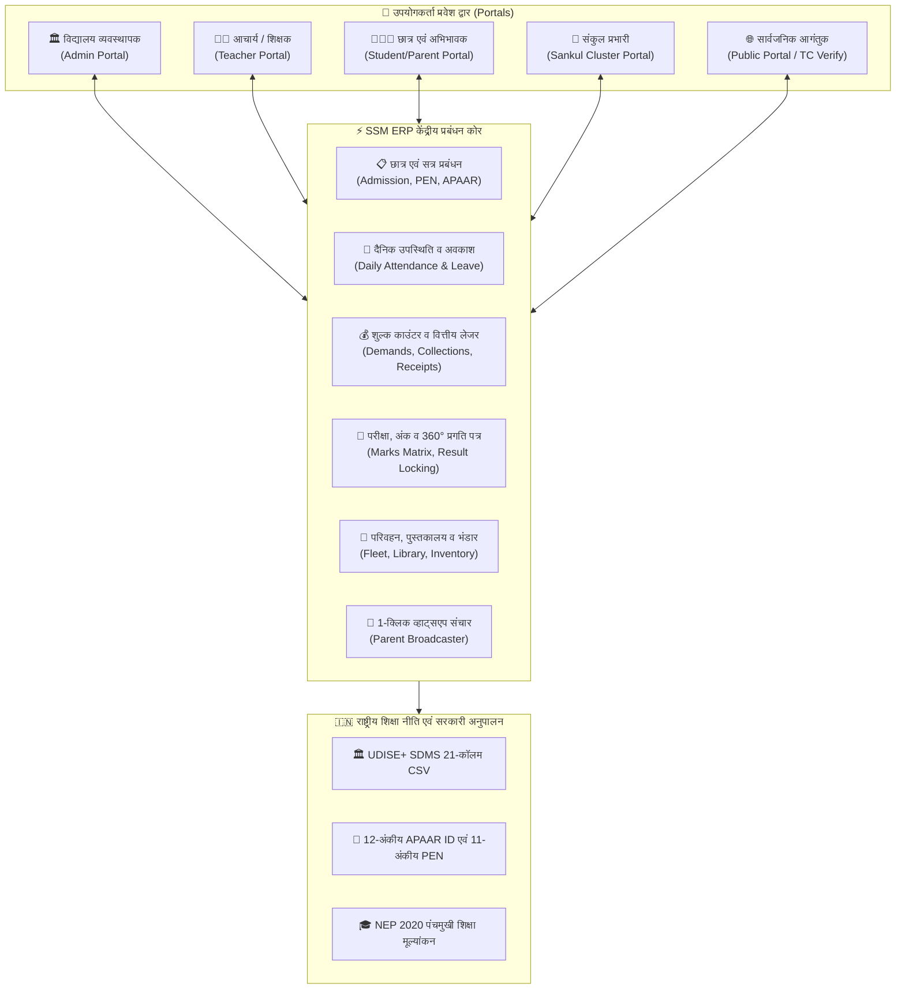
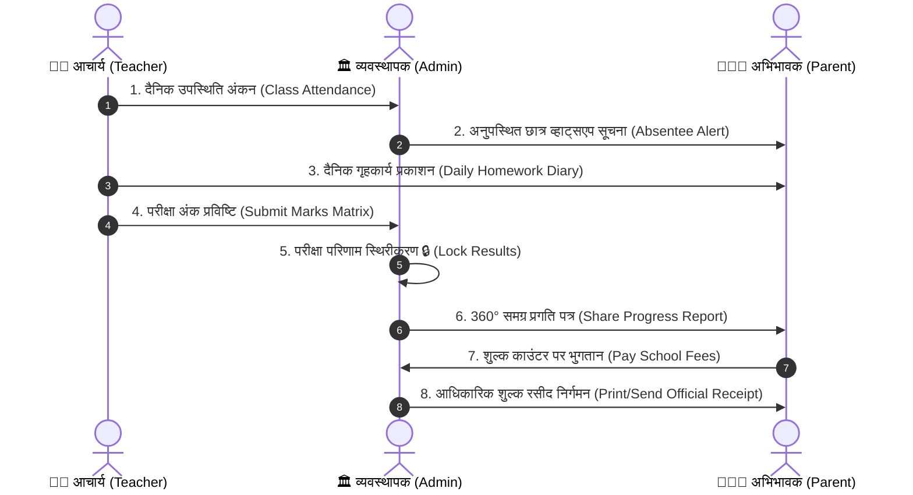
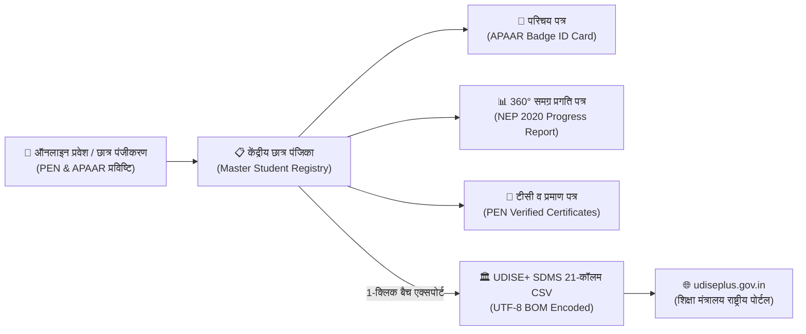
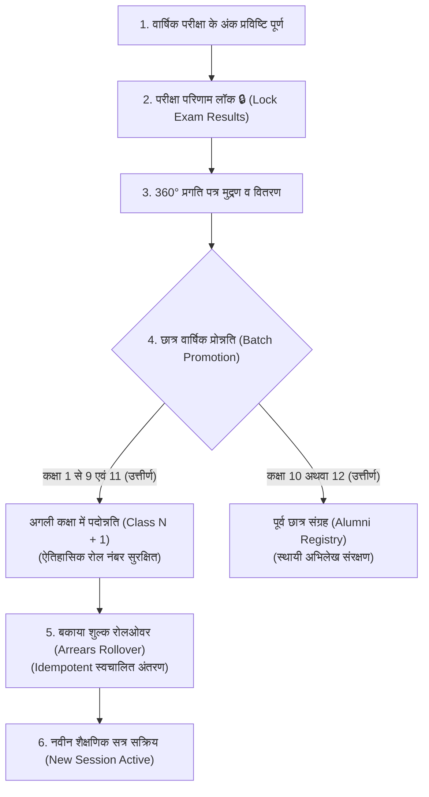
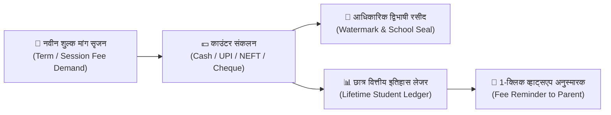
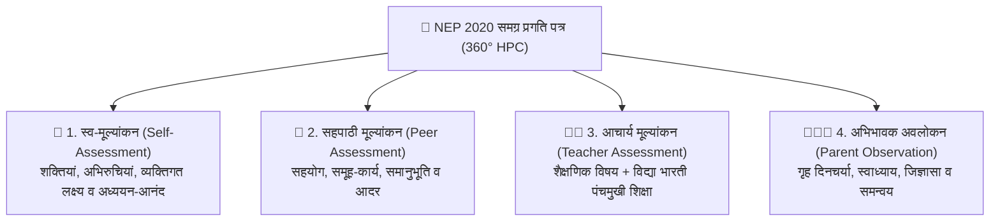

# सरस्वती शिशु मंदिर (SSM) विद्यालय प्रबंधन प्रणाली
## संपूर्ण उपयोगकर्ता मार्गदर्शिका (Complete User Manual)

---

## 📖 विषय सूची (Table of Contents)

1. [प्रणाली परिचय एवं उद्देश्य (Introduction & Philosophy)](#1-प्रणाली-परिचय-एवं-उद्देश्य)
2. [भूमिकाएं एवं प्रमाणीकरण (User Roles & Access Credentials)](#2-भूमिकाएं-एवं-प्रमाणीकरण)
3. [आचार्य / शिक्षक पोर्टल मार्गदर्शिका (Teacher Portal Guide)](#3-आचार्य--शिक्षक-पोर्टल-मार्गदर्शिका)
4. [परीक्षा प्रबंधन, डेट शीट एवं अंक प्रविष्टि (Exam & Marks Matrix)](#4-परीक्षा-प्रबंधन-डेट-शीट-एवं-अंक-प्रविष्टि)
5. [प्रवेश पत्र / हॉल टिकट (Admit Card / Hall Ticket)](#5-प्रवेश-पत्र--हॉल-टिकट)
6. [समय सारिणी प्रबंधन (Class Timetable & Bell Schedule)](#6-समय-सारिणी-प्रबंधन)
7. [अवकाश प्रबंधन कार्यप्रवाह (Leave Management System)](#7-अवकाश-प्रबंधन-कार्यप्रवाह)
8. [वाहन एवं बस रूट प्रबंधन (Transport Fleet Management)](#8-वाहन-एवं-बस-रूट-प्रबंधन)
9. [पुस्तकालय प्रबंधन प्रणाली (Library Management System)](#9-पुस्तकालय-प्रबंधन-प्रणाली)
10. [भंडार स्टॉक एवं गणवेश प्रबंधन (Inventory & Store Management)](#10-भंडार-स्टॉक-एवं-गणवेश-प्रबंधन)
11. [प्रमाण पत्र जनरेटर (Character & Bonafide Certificates)](#11-प्रमाण-पत्र-जनरेटर)
12. [व्हाट्सएप संदेश प्रसारण (WhatsApp Notification Broadcaster)](#12-व्हाट्सएप-संदेश-प्रसारण)
13. [सुरक्षा एवं ऑडिट लॉग (Security & System Audit Logs)](#13-सुरक्षा-एवं-ऑडिट-लॉग)
14. [सामान्य समस्याएं एवं समाधान (Troubleshooting & FAQs)](#14-सामान्य-समस्याएं-एवं-समाधान)
15. [छात्र एवं अभिभावक पोर्टल](#15-छात्र-एवं-अभिभावक-पोर्टल)
16. [भूमिका handoff कार्यप्रवाह](#16-शिक्षक-व्यवस्थापक-और-अभिभावक-के-बीच-handoff)
17. [छात्र आयात, संपादन और डेटा सुधार](#17-छात्र-आयात-संपादन-और-डेटा-सुधार)
18. [बैकअप, restore और recovery](#18-बैकअप-restore-और-आपातकालीन-recovery)
19. [विशेष परिस्थितियों के समाधान](#19-विशेष-परिस्थितियों-के-समाधान)
20. [गोपनीयता और डेटा सुरक्षा checklist](#20-गोपनीयता-और-डेटा-सुरक्षा-checklist)
21. [सहायता टीम को समस्या भेजने का प्रारूप](#21-सहायता-टीम-को-समस्या-भेजने-का-प्रारूप)
22. [भारत सरकार UDISE+ SDMS एवं APAAR ID अनुपालन मार्गदर्शिका](#22-भारत-सरकार-udise-sdms-एवं-apaar-id-अनुपालन-मार्गदर्शिका)
23. [वार्षिक सत्र परिवर्तन, छात्र प्रोन्नति एवं बकाया रोलओवर](#23-वार्षिक-सत्र-परिवर्तन-छात्र-प्रोन्नति-एवं-बकाया-रोलओवर)
24. [शुल्क काउंटर, रसीद निर्गमन एवं वित्तीय इतिहास](#24-शुल्क-काउंटर-रसीद-निर्गमन-एवं-वित्तीय-इतिहास)
25. [समग्र प्रगति पत्र (NEP 2020 360° Report Card) एवं पंचमुखी शिक्षा](#25-समग्र-प्रगति-पत्र-nep-2020-360-report-card-एवं-पंचमुखी-शिक्षा)
26. [छात्र पहचान पत्र (ID Cards) एवं परीक्षा हॉल टिकट बल्क जेनरेशन](#26-छात्र-पहचान-पत्र-id-cards-एवं-परीक्षा-हॉल-टिकट-बल्क-जेनरेशन)
27. [नवीनतम सुरक्षा, वित्तीय लेजर एवं शासकीय अनुपालन (Phase 1, 2, 3 संवर्द्धन)](#27-नवीनतम-सुरक्षा-वित्तीय-लेजर-एवं-शासकीय-अनुपालन)
28. [दाखिल-खारिज पंजिका (General Admission & Withdrawal Register - S.R. Register)](#28-दाखिल-खारिज-पंजिका-general-admission--withdrawal-register)
29. [शाखा स्तरीय वैकल्पिक सुविधा नियंत्रण (Dynamic UPI, Staff LOP & Storage Saver)](#29-शाखा-स्तरीय-वैकल्पिक-सुविधा-नियंत्रण)
30. [ग्लोबल क्विक कमांड पैलेट (Ctrl + K Spotlight Search) एवं समय बचत कार्यप्रवाह](#30-ग्लोबल-क्विक-कमांड-पैलेट-ctrl--k-spotlight-search-एवं-समय-बचत-कार्यप्रवाह)
31. [त्वरित छात्र प्रवेश एवं हार्ड-कॉपी रजिस्टर स्मार्ट स्कैनर (Fast Admission & Hard-Copy Smart Scanner)](#31-त्वरित-छात्र-प्रवेश-एवं-हार्ड-कॉपी-रजिस्टर-स्मार्ट-स्कैनर)
32. [दैनिक उपस्थिति 1-क्लिक अनुपस्थित व्हाट्सएप प्रसारण (Daily Attendance Absentee Broadcaster)](#32-दैनिक-उपस्थिति-1-क्लिक-अनुपस्थित-व्हाट्सएप-प्रसारण)
33. [शुल्क काउंटर, दैनिक रोकड़ बही (DCR) एवं भौतिक नोट मिलान (Fee Counter & Daily Cash Register)](#33-शुल्क-काउंटर-दैनिक-रोकड़-बही-dcr-एवं-भौतिक-नोट-मिलान)
34. [परीक्षा अंक मैट्रिक्स कीबोर्ड नेविगेशन एवं कक्षावार बल्क 360° प्रगति पत्र मुद्रण (Exam Marks Matrix & Bulk HPC Printing)](#34-परीक्षा-अंक-मैट्रिक्स-कीबोर्ड-नेविगेशन-एवं-कक्षावार-बल्क-360-प्रगति-पत्र-मुद्रण)
35. [स्थानांतरण प्रमाण पत्र (TC) एवं स्वचालित उपस्थिति-शुल्क गणना (Dynamic Transfer Certificate & Auto Dues Sync)](#35-स्थानांतरण-प्रमाण-पत्र-tc-एवं-स्वचालित-उपस्थिति-शुल्क-गणना)
36. [ऑफ़लाइन हार्ड-कॉपी सेतु: A4 रिक्त प्रवेश प्रपत्र एवं 31-दिवसीय उपस्थिति पंजिका (Paper Bridges: Blank Forms & 31-Day Register Sheets)](#36-ऑफ़लाइन-हार्ड-कॉपी-सेतु-a4-रिक्त-प्रवेश-प्रपत्र-एवं-31-दिवसीय-उपस्थिति-पंजिका)
37. [संकुल प्रभारी पटल: बहु-विद्यालय क्लस्टर निरीक्षण एवं संकलित प्रबंधन (Sankul Prabhari Cluster Oversight Portal)](#37-संकुल-प्रभारी-पटल-बहु-विद्यालय-क्लस्टर-निरीक्षण-एवं-संकलित-प्रबंधन)
38. [स्मार्ट प्रश्न पत्र निर्माता: मासिक इकाई मूल्यांकन एवं त्रैमासिक परीक्षा (Smart Question Paper Generator: Monthly Unit Test & Traimasik)](#38-स्मार्ट-प्रश्न-पत्र-निर्माता-मासिक-इकाई-मूल्यांकन-एवं-त्रैमासिक-परीक्षा)
39. [केंद्रीय बौद्धिक सहायक एवं गैर-तकनीकी सुगमता (Central Smart Assistant & Non-Tech User Ease)](#39-केंद्रीय-बौद्धिक-सहायक-एवं-गैर-तकनीकी-सुगमता)
40. [सुव्यवस्थित सार्वजनिक मुख्य पृष्ठ एवं सांस्कृतिक केंद्र (Streamlined Public Homepage & Cultural Hub)](#40-सुव्यवस्थित-सार्वजनिक-मुख्य-पृष्ठ-एवं-सांस्कृतिक-केंद्र)
41. [सिस्टम रखरखाव, डाउनटाइम अधिसूचना एवं सर्वर माइग्रेशन (System Maintenance, Downtime Notice & Server Migration)](#41-सिस्टम-रखरखाव-डाउनटाइम-अधिसूचना-एवं-सर्वर-माइग्रेशन)
42. [दैनिक प्रशासनिक सार, भंडारण सुरक्षा चेतावनी, बोर्ड फ़ोटो निर्यात एवं प्रमाणित वाटरमार्क (Daily Digest, Storage Alert, Photo Export & Certified Watermark)](#42-दैनिक-प्रशासनिक-सार-भंडारण-सुरक्षा-चेतावनी-बोर्ड-फ़ोटो-निर्यात-एवं-प्रमाणित-वाटरमार्क)
43. [दस्तावेज़ मुद्रण एवं स्वच्छ A4/Landscape PDF अलगाव (Clean Document Printing & PDF Isolation)](#43-दस्तावेज़-मुद्रण-एवं-स्वच्छ-a4landscape-pdf-अलगाव)


---

## 1. प्रणाली परिचय एवं उद्देश्य

सरस्वती शिशु मंदिर (SSM) विद्यालय प्रबंधन सॉफ्टवेयर विद्या भारती अखिल भारतीय शिक्षा संस्थान के सिद्धांतों, भारतीय संस्कृति तथा राष्ट्रीय शिक्षा नीति (NEP 2020) के अनुरूप विकसित एक आधुनिक, सुरक्षित तथा संपूर्ण वेब आधारित स्कूल ईआरपी (School ERP) प्रणाली है।

### मुख्य विशेषताएं:
- **बहु-शाखा समर्थन (Multi-Branch Tenant Isolation)**: गोरखपुर, दिल्ली, वाराणसी आदि प्रत्येक शाखा का डेटा पूर्णतः पृथक एवं सुरक्षित रहता है।
- **द्विभाषी इंटरफेस (Bilingual Support)**: प्राथमिक हिंदी शब्दावली के साथ सहज अंग्रेजी पर्याय।
- **ऑटो-कैलकुलेशन रिपोर्ट कार्ड**: NEP 2020 एवं पंचमुखी शिक्षा (शारीरिक, योग, संगीत, संस्कृत, नैतिक शिक्षा) आधारित समग्र मूल्यांकन।
- **1-क्लिक व्हाट्सएप संचार**: अनुपस्थित छात्र अलर्ट, शुल्क देय अनुस्मारक तथा परीक्षा परिणाम सूचना।

### 🏛️ प्रणाली वास्तुकला एवं डेटा प्रवाह (System Architecture)



### 1.1 यह दस्तावेज किसके लिए है?

यह मार्गदर्शिका निम्न सभी उपयोगकर्ताओं के लिए है:

- विद्यालय संचालक, प्रधानाचार्य और कार्यालय प्रशासक।
- आचार्य एवं दीदी जी।
- संकुल प्रभारी एवं क्लस्टर पर्यवेक्षक।
- छात्र और अभिभावक।
- शाखा प्रबंधक, डेवलपर प्रशासक और तकनीकी सहायता टीम।

### 1.2 पहली बार शुरू करने का संक्षिप्त क्रम

1. सार्वजनिक होम पेज खोलें और **पोर्टल लॉगिन** से आवश्यक भूमिका चुनें।
2. नई संस्था के लिए **नई शाखा / साइन अप** खोलकर शाखा की मूल जानकारी भरें।
3. व्यवस्थापक शाखा चुनकर लॉगिन करें।
4. **विद्यालय प्रबंधन** में शाखा का नाम, पता, संपर्क, सत्र और योजना की जानकारी जांचें।
5. पहले आचार्य, फिर छात्र, फिर शुल्क संरचना और कक्षा संबंधी जानकारी दर्ज करें।
6. शिक्षक को उसके पंजीकृत मोबाइल और पिन की जानकारी सुरक्षित माध्यम से दें।
7. एक छात्र के साथ छात्र पोर्टल, उपस्थिति, शुल्क और रिपोर्ट कार्ड का परीक्षण करें।
8. डेटा सही होने के बाद ही वास्तविक अभिभावकों को पोर्टल लिंक दें।

### 1.3 डेमो मोड और वास्तविक विद्यालय डेटा

- **लाइव डेमो** केवल परीक्षण और प्रस्तुति के लिए है। इसमें नमूना छात्र, शुल्क, उपस्थिति, रिपोर्ट कार्ड और नोटिस लोड होते हैं।
- डेमो शुरू करने के लिए होम पेज पर **लाइव डेमो / डेमो** चुनें।
- डेमो समाप्त करने के लिए ऊपर दिखाई देने वाले **डेमो बंद करें** बटन का उपयोग करें।
- वास्तविक शाखा में डेमो डेटा लोड करने से पहले पुष्टि करें। एडमिन डैशबोर्ड का **डेमो लोड** बटन सक्रिय शाखा में नमूना रिकॉर्ड जोड़ता है।
- उत्पादन में कोई सार्वभौमिक पासकोड नहीं मानें। एडमिन पासकोड, शिक्षक पिन और डेवलपर पासकोड परिनियोजन के समय कॉन्फ़िगर किए जाते हैं।

### 1.4 होम पेज और सार्वजनिक सुविधाएं (Public Homepage & 4 Use-Case Pillars)

बिना लॉगिन के कोई भी आगंतुक, अभिभावक या विद्यालय प्रबंधक निम्न सुविधाएं प्राप्त कर सकते हैं:

- **४ प्रमुख उपयोग-मामले (Use-Case Pillars) एवं १४ डिजिटल नवाचार**: होम पेज पर ईआरपी की सभी प्रमुख सुविधाओं को ४ स्वाभाविक विद्यालयी कार्यप्रवाह स्तम्भों में लक्ष्य-आधारित रूप से देखना:
  1. **स्तम्भ १: 🌅 प्रातःकालीन व दैनिक संचालन (Daily Operations)** — हाजिरी, 1-क्लिक व्हाट्सएप, शुल्क काउंटर, दैनिक रोकड़ बही (DCR) व नोट मिलान।
  2. **स्तम्भ २: 📚 परीक्षा, AI पेपर व 360° मूल्यांकन (Exams & Evaluation)** — स्मार्ट प्रश्न पत्र निर्माता, परीक्षा डेट शीट, हॉल टिकट, 360° समग्र प्रगति पत्र (HPC) व टैबुलेशन रजिस्टर।
  3. **स्तम्भ ३: 🏛️ छात्र अभिलेख, दाखिला व शासकीय अनुपालन (Registry & Govt Compliance)** — नवीन दाखिला व सहोदर ऑटो-फिल, दाखिल-खारिज पंजिका, डायनामिक टी.सी. व UDISE+ SDMS।
  4. **स्तम्भ ४: 🚌 संसाधन, संकुल व संस्थागत सुरक्षा (Logistics, Cluster & Governance)** — बस रूट, पुस्तकालय, भंडार स्टॉक, संकुल निरीक्षण, वार्षिक सत्र प्रोन्नति व 1-क्लिक ऑफ़लाइन बैकअप।
- **📖 संपूर्ण उपयोगकर्ता मार्गदर्शिका व सक्रिय सहायता केंद्र (Interactive Help Guide)**: होम पेज के हीरो सेक्शन, ईआरपी मॉड्यूल सेक्शन, नेवबार ('अन्य अनुभाग') और फूटर से सीधे 1-क्लिक में इंटरैक्टिव मार्गदर्शिका खोलना। बिना किसी क्षैतिज स्क्रॉल के डेस्कटॉप पर सभी विषय तुरंत रैप होते हैं तथा मोबाइल पर सुगम ड्रॉपडाउन चयन मिलता है, जिससे सभी 39 अध्यायों और दैनिक प्रक्रियाओं के उत्तर तुरंत खोजे जा सकते हैं।
- **विद्यालय परिचय एवं गौरवशाली परंपरा**: 1952 से विद्या भारती की शैक्षणिक परंपरा, पंचमुखी शिक्षा और सांस्कृतिक आदर्श।
- **दैनिक पंचांग व सरस्वती वंदना**: तिथि, नक्षत्र, पक्ष, वैदिक ध्येय वाक्य एवं प्रार्थना मंत्र।
- **विद्यालय खोजें (School Locator)**: नजदीकी सरस्वती शिशु मंदिर शाखाओं को खोजना और सीधे संबंधित शाखा का पोर्टल देखना।
- **ऑनलाइन प्रवेश पूछताछ (Online Admission Inquiry)**: नए सत्र (2026-27) हेतु सीधे ऑनलाइन फॉर्म भरना।
- **ऑनलाइन टीसी सत्यापन (Verify TC)**: जारी स्थानांतरण प्रमाण पत्र (TC) का सीरियल नंबर या छात्र विवरण दर्ज करके ऑनलाइन सत्यता जांचना।
- **बहुभाषी समर्थन (Bilingual & Regional)**: हिन्दी, English एवं अन्य भारतीय भाषाओं में 1-क्लिक भाषा परिवर्तन।
- **गोपनीयता नीति (DPDP Act 2023) व नियम**: डेटा सुरक्षा, अनामीकरण और कानूनी सुरक्षा शर्तें देखना।

सार्वजनिक होम पेज विद्यालय की डिजिटल पहचान (Public Identity) को प्रस्तुत करता है। वास्तविक छात्र, शुल्क एवं व्यक्तिगत डेटा बहु-शाखा टेनेंट सुरक्षा के तहत केवल अधिकृत लॉगिन पर ही सुलभ होता है।

### 1.5 शाखा बदलने का नियम

1. लॉगिन स्क्रीन या एडमिन शीर्ष पट्टी में **विद्यालय शाखा** चुनें।
2. शाखा बदलने के बाद दोबारा प्रमाणित करें।
3. शाखा बदलते समय पुराने छात्र, शुल्क और उपस्थिति रिकॉर्ड नई शाखा में नहीं मिलाए जाते।
4. यदि सूची खाली है, पहले शाखा पंजीकृत करें या सर्वर/डेटाबेस कनेक्शन जांचें।

### 1.6 डेटा खाली दिखने पर क्या करें?

- सुनिश्चित करें कि सही शाखा सक्रिय है।
- शीर्ष पट्टी में database status देखें और **Sync / Refresh** दबाएं।
- देखें कि उपयोगकर्ता के पास सही भूमिका और अनुमति है।
- वास्तविक शाखा में डेमो मोड बंद है या नहीं जांचें।
- छात्र सूची खाली हो तो पहले **नया छात्र** या CSV import से छात्र जोड़ें।
- नोटिस, स्टाफ, पुस्तक, बस या परीक्षा सूची खाली हो तो संबंधित मॉड्यूल में पहला रिकॉर्ड बनाएं।
- फिर भी समस्या रहे तो शाखा ID, समय, स्क्रीन और त्रुटि संदेश सहायता टीम को भेजें।

### 1.7 रिकॉर्ड बनाते समय सामान्य नियम

- एक छात्र का रोल नंबर एक ही शाखा में अद्वितीय रखें।
- छात्र का नाम, जन्मतिथि, अभिभावक संपर्क और कक्षा सेव करने से पहले जांचें।
- पुराने रिकॉर्ड हटाने के बजाय जहां संभव हो उन्हें अपडेट करें।
- भुगतान और परीक्षा अंक सेव होने के बाद रसीद/रिपोर्ट कार्ड खोलकर सत्यापित करें।
- संवेदनशील डेटा साझा स्क्रीन, सार्वजनिक चैट या अनधिकृत WhatsApp समूह में न भेजें।

### 1.8 सत्र समाप्त करना

- कार्य पूरा होने पर **लॉगआउट** दबाएं।
- साझा कंप्यूटर पर ब्राउज़र बंद करें और पासकोड सेव न करें।
- कार्यालय छोड़ने से पहले लंबित आवेदन, शुल्क, उपस्थिति और बैकअप की स्थिति जांचें।

---

## 2. भूमिकाएं एवं प्रमाणीकरण

सिस्टम में चार मुख्य स्तर के उपयोगकर्ता हैं:

| उपयोगकर्ता भूमिका | प्रवेश द्वार (Navigation) | आवश्यक विवरण (Credentials) | मुख्य अधिकार |
|---|---|---|---|
| **विद्यालय व्यवस्थापक (Admin)** | शीर्ष नेवबार -> **"प्रशासन (Admin)"** | शाखा चयन + शाखा का कॉन्फ़िगर किया गया पासकोड | पूर्ण विद्यालय नियंत्रण, शुल्क, प्रवेश, स्टाफ, प्रमाण पत्र |
| **आचार्य / दीदी (Teacher)** | शीर्ष नेवबार -> **"आचार्य पोर्टल"** | पंजीकृत मोबाइल + शाखा का 4-अंकों का पिन | उपस्थिति, गृहकार्य, अंक प्रविष्टि, समय सारिणी, अवकाश |
| **छात्र / अभिभावक (Student/Parent)** | शीर्ष नेवबार -> **"छात्र पोर्टल"** | शाखा + अनुक्रमांक (Roll No) + पंजीकृत मोबाइल | प्रगति पत्र, प्रवेश पत्र, गृहकार्य, शुल्क रसीद, अवकाश |
| **डेवलपर (Super Admin)** | प्रशासन -> **"डेवलपर मोड"** | सर्वर environment में सुरक्षित developer passcode | सभी शाखाओं की समग्र निगरानी एवं मेट्रिक्स |

### 2.1 लॉगिन विफल होने पर

1. सही शाखा चुनी है या नहीं जांचें।
2. एडमिन पासकोड में आगे/पीछे का space न रखें।
3. शिक्षक मोबाइल नंबर और पिन वही भरें जो शाखा रिकॉर्ड में है।
4. छात्र रोल नंबर, पंजीकृत संपर्क और कक्षा सही भरें।
5. बार-बार विफल प्रयास पर अनुमान लगाने के बजाय व्यवस्थापक से संपर्क करें।
6. token/session समाप्त हो तो लॉगआउट करके दोबारा लॉगिन करें।

## 2.2 विद्यालय व्यवस्थापक का दैनिक कार्यप्रवाह

### सुबह की शुरुआत

1. सही शाखा और शैक्षणिक सत्र की पुष्टि करें।
2. कल की लंबित उपस्थिति और अवकाश आवेदन देखें।
3. आज की सूचना/नोटिस प्रकाशित करें।
4. शिक्षक से उपस्थिति पूर्ण होने की पुष्टि लें।

### दिन के दौरान

1. प्रवेश पूछताछ और लंबित आवेदन की समीक्षा करें।
2. शुल्क भुगतान दर्ज करें और आवश्यक रसीद प्रिंट/साझा करें।
3. नए छात्र, शिक्षक, गृहकार्य, परीक्षा या पुस्तक रिकॉर्ड जोड़ें।
4. जरूरत होने पर प्रमाण पत्र और संदेश तैयार करें।

### दिन के अंत में

1. अनुपस्थित छात्रों और शुल्क बकाया की सूची जांचें।
2. लंबित अवकाश/प्रवेश अनुरोधों पर कार्रवाई करें।
3. महत्वपूर्ण डेटा का JSON बैकअप डाउनलोड करें।
4. ऑडिट लॉग में असामान्य गतिविधि देखें और लॉगआउट करें।

### 2.3 एडमिन डैशबोर्ड के मुख्य टैब

| टैब/बटन | उपयोग |
|---|---|
| मुख्य पृष्ठ | सारांश, त्वरित कार्य, आज की स्थिति और समय-सारणी |
| छात्र पंजिका | छात्र जोड़ना, खोज, संपादन, आयात, ID कार्ड और प्रमाण पत्र |
| दैनिक उपस्थिति | छात्रवार उपस्थिति दर्ज और संशोधित करना |
| शुल्क प्रबंधन | शुल्क रिकॉर्ड, भुगतान, बकाया और रसीद |
| प्रगति पत्र | परीक्षा परिणाम और समग्र रिपोर्ट कार्ड |
| दैनिक गृहकार्य | कक्षा/विषय के लिए गृहकार्य प्रकाशित करना |
| आचार्य एवं वेतन | स्टाफ रिकॉर्ड, पिन, कक्षाध्यापक दायित्व (आवंटित कक्षाएं), वेतन और salary slip |
| प्रवेश समीक्षा | सार्वजनिक admission enquiries स्वीकार/संपर्क करना |
| सूचना प्रसारण | विद्यालय नोटिस बनाना, संपादित करना और हटाना |
| परीक्षा व अंक | परीक्षा, date sheet और admit card |
| टैबुलेशन रजिस्टर | कक्षा/परीक्षा का परिणाम सारांश |
| समय सारिणी | पीरियड, विषय, शिक्षक और कक्ष सेट करना |
| अवकाश समीक्षा | छात्र/स्टाफ leave approve या reject करना |
| बस परिवहन | route, vehicle, driver और stops |
| पुस्तकालय | catalog, issue, return और fine |
| भंडार स्टॉक | uniform, book और अन्य inventory |
| संदेश प्रसारण | अनुपस्थिति, शुल्क और सामान्य WhatsApp संदेश |

### 2.4 आचार्य प्रबंधन एवं कक्षाध्यापक दायित्व आवंटन (Staff & Class Teacher Assignment)

1. एडमिन डैशबोर्ड में **"आचार्य एवं वेतन"** टैब खोलें।
2. **"+ नया आचार्य / कर्मचारी जोड़ें"** पर क्लिक करें (या मौजूदा आचार्य के नाम के सामने **"संपादित करें"** चुनें)।
3. आचार्य का नाम, पद, मोबाइल नंबर, ईमेल और वेतन विवरण भरें (सिस्टम प्रत्येक नए आचार्य हेतु स्वतः एक सुरक्षित यादृच्छिक 4-अंकीय गुप्त पिन जनरेट करता है)।
4. **"🎓 कक्षाध्यापक दायित्व / आवंटित कक्षाएं (Assigned Classes)"** विकल्प में आचार्य को सौंपी जाने वाली कक्षाएं दर्ज करें (उदा. `Class 8, Class 5-A`)।
5. **"सुरक्षित करें"** दबाएं।
6. स्टाफ तालिका में आचार्य के पद के नीचे उनकी आवंटित कक्षाओं का विशेष बैज (उदा. `🎓 Class 8`) प्रदर्शित होगा।
7. जब संबंधित आचार्य अपने पंजीकृत मोबाइल नंबर और सुरक्षा पिन से **आचार्य पोर्टल** में प्रवेश करेंगे, तो वे केवल अपनी अधिकृत कक्षाओं के विद्यार्थियों की दैनिक उपस्थिति और परीक्षा अंक सुरक्षित कर सकेंगे। इससे विद्यालय का शैक्षणिक रिकॉर्ड सुरक्षित और व्यवस्थित रहता है।

---

## 3. आचार्य / शिक्षक पोर्टल मार्गदर्शिका

आचार्य पोर्टल शिक्षकों को अपनी दैनिक शैक्षणिक जिम्मेदारियों को बिना किसी तकनीकी जटिलता के पूर्ण करने की सुविधा देता है।

> **कक्षाध्यापक अधिकार क्षेत्र (Class Teacher Scope):** यदि विद्यालय व्यवस्थापक द्वारा आचार्य को विशिष्ट कक्षाएं (उदा. `Class 8`) आवंटित की गई हैं, तो आचार्य पोर्टल में वे केवल अपनी आवंटित कक्षाओं की दैनिक उपस्थिति और परीक्षा अंक दर्ज/संशोधित कर सकेंगे। अन्य कक्षाओं का डेटा सुरक्षित रहता है।

### 3.1 लॉगिन प्रक्रिया
1. शीर्ष नेविगेशन बार में **"आचार्य पोर्टल"** पर क्लिक करें।
2. अपना पंजीकृत मोबाइल नंबर (उदा. `9450123456`) दर्ज करें।
3. विद्यालय व्यवस्थापक द्वारा आवंटित 4-अंकीय व्यक्तिगत सुरक्षा पिन दर्ज करें।
4. **"सुरक्षित प्रवेश करें"** पर क्लिक करें।

### 3.2 दैनिक छात्र उपस्थिति दर्ज करना
1. टैब **"उपस्थिति (Attendance)"** चुनें।
2. कक्षा चुनें (उदा. `Class 8`) तथा तिथि का चयन करें।
3. सभी छात्रों को एक साथ उपस्थित करने के लिए **"सभी उपस्थित करें"** बटन दबाएं।
4. किसी विशेष छात्र हेतु **उपस्थित (P)**, **अनुपस्थित (A)**, अथवा **अवकाश (L)** बटन पर क्लिक करें। बदलाव स्वतः सुरक्षित हो जाते हैं।

### 3.3 गृहकार्य (Homework) देना
1. टैब **"दैनिक गृहकार्य"** चुनें।
2. **"+ नया गृहकार्य जोड़ें"** पर क्लिक करें।
3. विषय, शीर्षक (उदा. "अध्याय 4: परिमेय संख्याएँ"), विवरण एवं जमा करने की अंतिम तिथि चुनें।
4. **"गृहकार्य प्रकाशित करें"** पर क्लिक करें। यह छात्रों के पोर्टल में तुरंत दिखाई देगा।

### 3.4 परीक्षा अंक प्रविष्टि (Tabular Marks Entry Matrix)
1. टैब **"अंक प्रविष्टि (Marks Matrix)"** चुनें।
2. परीक्षा का चयन करें (उदा. `अर्धवार्षिक परीक्षा`) तथा अपना विषय चुनें।
3. कक्षा के सभी विद्यार्थियों की सूची एक स्प्रेडशीट ग्रिड में दिखाई देगी।
4. प्रत्येक छात्र के प्राप्तांक दर्ज करें।
5. **"अंक सुरक्षित करें"** बटन पर क्लिक करें। सिस्टम स्वतः कुल योग, प्रतिशत एवं ग्रेड (`A+`, `A`, `B`, आदि) की गणना कर प्रगति पत्र में अपडेट कर देता है।

### 3.5 समय सारिणी व वेतन पर्ची देखना
- **समय सारिणी (Timetable)** टैब में अपने दैनिक 8 कालांशों का समय एवं कक्ष देख सकते हैं।
- **वेतन पर्ची** टैब में जाकर अपनी मासिक वेतन पर्ची (मूल वेतन, डीए/एचआरए, पीएफ कटौती) देख व प्रिंट कर सकते हैं।

---

## 4. परीक्षा प्रबंधन, डेट शीट एवं अंक प्रविष्टि

प्रशासनिक स्तर पर संपूर्ण परीक्षा अनुसूची एवं अंक तालिका का प्रबंधन।

### 4.1 नई परीक्षा एवं डेट शीट बनाना
1. एडमिन डैशबोर्ड में **"📝 परीक्षा व अंक"** बटन पर क्लिक करें।
2. **"+ नई परीक्षा जोड़ें"** पर क्लिक करें।
3. परीक्षा का नाम (उदा. "वार्षिक परीक्षा 2025-26"), सत्र (`2025-26`), अवधि एवं कक्षाएं चुनें।
4. **विषयवार डेट शीट (Date Sheet Slot)** में विषय, परीक्षा तिथि, समय (उदा. `09:00 AM - 12:00 PM`), अधिकतम अंक एवं कक्ष संख्या जोड़ें।
5. **"परीक्षा अनुसूची सुरक्षित करें"** पर क्लिक करें।

### 4.2 बल्क मार्क्स मैट्रिक्स
- किसी भी समय किसी भी परीक्षा के विषय को चुनकर पूरी कक्षा के अंक एक साथ एक तालिका में भरे या संशोधित किए जा सकते हैं।

---

## 5. प्रवेश पत्र / हॉल टिकट (Admit Card / Hall Ticket)

विद्या भारती प्रारूप में आधिकारिक परीक्षा प्रवेश पत्र जनरेटर।

### प्रवेश पत्र प्रिंट करने के चरण:
1. एडमिन डैशबोर्ड में **"📝 परीक्षा व अंक"** में जाएं और **"प्रवेश पत्र"** पर क्लिक करें (या छात्र सूची से छात्र के सामने **"प्रवेश पत्र"** चुनें)।
2. छात्र का प्रवेश पत्र खुल जाएगा, जिसमें शामिल हैं:
   - विद्यालय का नाम, सम्बद्धता क्रमांक एवं लोगो।
   - छात्र का फोटो, नाम, अनुक्रमांक, कक्षा एवं पिता का नाम।
   - परीक्षा समय सारिणी (Date Sheet) की पूर्ण तालिका।
   - परीक्षा केंद्र के नियम व निर्देश।
   - प्रधानाचार्य एवं परीक्षा प्रभारी के हस्ताक्षर स्थान।
3. **"🖨️ प्रवेश पत्र प्रिंट करें"** पर क्लिक करके सीधे A4 साइज में प्रिंट निकालें।

> छात्र स्वयं भी अपने **छात्र पोर्टल** में लॉगिन करके अपना प्रवेश पत्र डाउनलोड कर सकते हैं।

---

## 6. समय सारिणी प्रबंधन (Class Timetable)

साप्ताहिक सोमवार से शनिवार तक के 8 कालांशों (Periods) का प्रबंधन।

### समय सारिणी सेट करने के चरण:
1. एडमिन डैशबोर्ड में **"🕒 समय सारिणी"** बटन पर क्लिक करें।
2. कक्षा (उदा. `Class 8`) तथा वर्ग (Section `A`) चुनें।
3. सप्ताह के दिनों (सोमवार से शनिवार) के अनुसार प्रत्येक पीरियड में:
   - **विषय** (उदा. गणित, विज्ञान, संस्कृत, वंदना)
   - **आचार्य का नाम**
   - **कक्ष क्रमांक** (Room No.)
4. **"समय सारिणी सुरक्षित करें"** पर क्लिक करें।
5. यह समय सारिणी शिक्षकों एवं छात्रों के पोर्टल पर तुरंत उपलब्ध हो जाती है।

---

## 7. अवकाश प्रबंधन कार्यप्रवाह (Leave System)

छात्रों एवं शिक्षकों के अवकाश आवेदनों की पारदर्शी स्वीकृति प्रणाली।

### 7.1 आवेदन जमा करना:
- **छात्र**: छात्र पोर्टल में लॉगिन करें -> **"अवकाश आवेदन"** -> प्रारंभ तिथि, समाप्ति तिथि और कारण लिखकर सबमिट करें।
- **शिक्षक**: आचार्य पोर्टल -> **"अवकाश आवेदन"** -> विवरण भरकर सबमिट करें।

### 7.2 एडमिन द्वारा समीक्षा एवं स्वीकृति:
1. एडमिन डैशबोर्ड में **"🌴 अवकाश समीक्षा"** पर क्लिक करें।
2. लंबित आवेदनों (Pending Requests) की सूची देखें।
3. कारण एवं दिनों की संख्या जांचें।
4. **"स्वीकृत करें (Approve)"** या **"अस्वीकृत करें (Reject)"** पर क्लिक करें।
5. स्थिति तुरंत अपडेट होकर आवेदक के पोर्टल में दिखने लगती है।

---

## 8. वाहन एवं बस रूट प्रबंधन (Transport Fleet)

विद्यालय की बसों, रूटों, चालकों तथा स्टॉप्स का सुव्यवस्थित रिकॉर्ड।

### नया रूट जोड़ने के चरण:
1. एडमिन डैशबोर्ड में **"🚌 बस परिवहन"** पर क्लिक करें।
2. **"+ नया रूट जोड़ें"** पर क्लिक करें।
3. रूट का नाम (उदा. "रूट 1 - शास्त्री चौक से विद्यालय") दर्ज करें।
4. वाहन क्रमांक (उदा. `UP 53 AB 1234`), चालक का नाम, मोबाइल नंबर तथा मासिक शुल्क दर्ज करें।
5. प्रत्येक बस स्टॉप का नाम, प्रातः पिकअप समय (उदा. `07:30 AM`) तथा दोपहर ड्रॉप समय (उदा. `02:00 PM`) दर्ज करें।
6. **"रूट सुरक्षित करें"** पर क्लिक करें।

---

## 9. पुस्तकालय प्रबंधन प्रणाली (Library Management)

विद्यालय पुस्तकालय में पुस्तकों का वर्गीकरण तथा निर्गमन/वापसी (Issue/Return) रजिस्टर।

### 9.1 नई पुस्तक जोड़ना (Cataloging)
1. एडमिन डैशबोर्ड में **"📚 पुस्तकालय"** पर क्लिक करें।
2. **"+ नई पुस्तक जोड़ें"** पर क्लिक करें।
3. पुस्तक परिग्रहण संख्या (Accession No. उदा. `BK-104`), शीर्षक, लेखक, श्रेणी (संस्कार व महापुरुष, गीता, विज्ञान, गणित आदि), रैक संख्या एवं कुल प्रतियां दर्ज करें।
4. **"पुस्तक जोड़ें"** पर क्लिक करें।

### 9.2 पुस्तक जारी करना (Issue Book)
1. **"पुस्तक निर्गमन (Issue Book)"** टैब चुनें।
2. पुस्तक का चयन करें, छात्र का नाम/रोल नंबर दर्ज करें और वापसी की अंतिम तिथि (Due Date) चुनें।
3. **"पुस्तक निर्गमित करें"** पर क्लिक करें। उपलब्ध प्रतियों (Available Copies) की संख्या स्वतः 1 घट जाएगी।

### 9.3 पुस्तक वापसी (Return Book)
1. जारी पुस्तकों की सूची में छात्र के नाम के आगे **"वापसी प्राप्त करें (Return)"** पर क्लिक करें।
2. यदि कोई विलंब शुल्क (Fine) हो तो दर्ज करें।
3. पुस्तक पुस्तकालय में पुनः उपलब्ध हो जाएगी और स्टॉक संख्या स्वतः 1 बढ़ जाएगी।

---

## 10. भंडार स्टॉक एवं गणवेश प्रबंधन (Store Inventory)

विद्यालय गणवेश, पाठ्यपुस्तकें, अभ्यास पुस्तिकाएं, बेल्ट, बैज तथा टाई का स्टॉक नियंत्रण।

### मुख्य सुविधाएं:
- **न्यूनतम स्टॉक चेतावनी (Low-Stock Alert)**: जब भी किसी सामग्री का स्टॉक निर्धारित न्यूनतम सीमा से नीचे जाता है, उस पर लाल चेतावनी बैज आ जाता है।
- **स्टॉक समायोजन (Stock Delta Adjustment)**: नई सामग्री आने पर `+ संख्या` या वितरित होने पर `- संख्या` डालकर 1-क्लिक में स्टॉक अपडेट करें।
- **मूल्य सूची**: प्रत्येक वस्तु का विक्रय मूल्य प्रदर्शित होता है।

---

## 11. प्रमाण पत्र जनरेटर (Certificates)

विद्या भारती मानकों के अनुसार द्विभाषी (हिंदी-अंग्रेजी) आधिकारिक प्रमाण पत्र।

### 11.1 चरित्र प्रमाण पत्र (Character Certificate)
1. एडमिन डैशबोर्ड में **"छात्र पंजिका"** (Students) पर जाएं।
2. छात्र की पंक्ति में **"📜 चरित्र"** बटन पर क्लिक करें।
3. मोबाइल एवं कंप्यूटर दोनों पर अनुकूलित (Responsive) संवाद में प्रमाण पत्र प्रदर्शित होगा, जिसमें छात्र का आचरण, सह-शैक्षणिक सहभागिता, संस्था की अधिकृत मुहर एवं प्रधानाचार्य के हस्ताक्षर का औपचारिक प्रारूप रहता है। शीर्ष पर स्थायी रूप से दृश्यमान 'वापस' (Back) तथा 'बंद करें' (✕) बटन से मोबाइल पर नेविगेशन सुगम रहता है।
4. **"प्रमाण पत्र प्रिंट करें"** दबाकर A4 आकार में आधिकारिक मुद्रण निकालें।

### 11.2 अध्ययनरत प्रमाण पत्र (Bonafide Certificate)
1. छात्र पंजिका में संबंधित छात्र के सामने **"📄 अध्ययनरत"** बटन पर क्लिक करें।
2. मोबाइल-अनुकूलित पूर्वावलोकन में वर्तमान कक्षा, वर्ग, अनुक्रमांक, प्रवेश तिथि, जन्मतिथि एवं रक्त समूह युक्त औपचारिक अध्ययनरत प्रमाण पत्र खुलेगा। शीर्ष पर स्थायी बैक व क्रॉस बटन से किसी भी स्क्रीन पर बिना कटे सहजता से बंद किया जा सकता है।
3. इसे छात्रवृत्ति, बस/रेलवे रियायत अथवा बैंक/प्रशासनिक सत्यापन हेतु 1-क्लिक में A4 मुद्रित किया जा सकता है।

### 11.3 स्थानांतरण प्रमाण पत्र एवं ऑनलाइन सत्यापन (Transfer Certificate & Verification)
1. **टीसी जनरेशन**: छात्र सूची में **"टीसी"** बटन दबाकर स्वचालित टीसी संख्या, प्रवेश व निकासी दिनांक, आचरण, और शुल्क अद्यतन स्थिति सहित स्थानांतरण प्रमाण पत्र प्रिंट करें।
2. **सार्वजनिक ऑनलाइन टीसी सत्यापन**: होम पेज, नेवबार या फुटर से **"टीसी सत्यापन"** खोलें।
3. शाखा चयन ड्रॉपडाउन से शाखा चुनें अथवा "सभी शाखाएं (Central Registry)" विकल्प रखें।
4. छात्र का 11-अंकीय PEN, टीसी क्रमांक या अनुक्रमांक दर्ज करके **"सत्यापित करें"** दबाएं।
5. सिस्टम सीधे मूल विद्यालय अभिलेखों से मिलान करके जारीकर्ता संस्था की प्राधिकृत मुहर, UDISE कोड एवं छात्र विवरण प्रदर्शित करता है।

---

## 12. व्हाट्सएप संदेश प्रसारण (Bulk Notification Broadcaster)

बिना किसी तीसरे पक्ष के महंगे एसएमएस गेटवे के अभिभावकों को सीधे व्हाट्सएप वेब द्वारा आधिकारिक संदेश।

### प्रसारण कैसे करें:
1. एडमिन डैशबोर्ड के **Overview (सिंहावलोकन)** टैब पर जाएं।
2. त्वरित कार्य में **"📢 संदेश प्रसारण"** पर क्लिक करें।
3. प्रसारण का प्रकार चुनें:
   - **आज अनुपस्थित छात्र**: आज जिन छात्रों की अनुपस्थिति दर्ज हुई है, उनके अभिभावकों को एक क्लिक में व्यक्तिगत संदेश लिंक।
   - **बकाया शुल्क अनुस्मारक**: जिन छात्रों की फीस बकाया है, उनकी राशि सहित अनुस्मारक संदेश।
   - **सामान्य विद्यालय सूचना**: अवकाश, परीक्षा अथवा उत्सव संबंधी सूचना।
4. छात्र के नाम के सामने **"व्हाट्सएप भेजें"** पर क्लिक करें। व्हाट्सएप वेब पूर्व-लिखित औपचारिक संदेश के साथ खुल जाएगा।

---

## 13. सुरक्षा एवं ऑडिट लॉग (Security Audit Trail & Storage Saver)

प्रणाली की अखंडता एवं जवाबदेही सुनिश्चित करने के लिए सभी संवेदनशील कार्यों की ऑडिट लॉगिंग सुविधा उपलब्ध है।

### 13.1 स्टोरेज संवर्धन एवं डिफ़ॉल्ट स्थिति (Default Storage Optimization):
- **डिफ़ॉल्ट रूप से बंद (Zero Storage Consumption)**: विद्यालय के डेटाबेस स्टोरेज की बचत हेतु प्रत्येक शाखा में ऑडिट लॉगिंग डिफ़ॉल्ट रूप से अक्षम (Disabled) रहती है।
- **गतिशील नियंत्रण (Dynamic Branch Control)**: गोरखपुर, दिल्ली, वाराणसी अथवा किसी भी अन्य शाखा के विद्यालय व्यवस्थापक आवश्यकतानुसार इसे कभी भी 1-क्लिक में चालू या बंद कर सकते हैं।

### 13.2 ऑडिट लॉगिंग चालू/बंद करने की विधि:
1. **विधि 1 (सीधे ऑडिट कंसोल से)**: एडमिन डैशबोर्ड के शीर्ष नेवबार में **"🛡️ ऑडिट लॉग"** खोलें। शीर्ष पर दिए गए स्टोरेज कंट्रोल बैनर में **"ऑडिट लॉगिंग चालू करें"** या **"लॉगिंग बंद करें (स्टोरेज बचाएं)"** बटन पर क्लिक करें।
2. **विधि 2 (शाखा सुविधा सेटिंग्स से)**: **"शाखाएं" ➔ "⚙️ सुविधा सेटिंग्स"** में जाकर **"गतिशील सुरक्षा ऑडिट लॉगिंग एवं स्टोरेज संवर्धन"** टॉगल को आवश्यकतानुसार चालू या बंद करें और **"सुविधा सेटिंग्स सुरक्षित करें"** दबाएं।

### 13.3 ऑडिट लॉग देखना व खोजना:
1. एडमिन डैशबोर्ड के शीर्ष नेवबार में **"🛡️ ऑडिट लॉग"** पर क्लिक करें।
2. यहाँ निम्नलिखित सभी कार्यों का रिकॉर्ड देखा जा सकता है:
   - किसने कब लॉगिन किया (व्यवस्थापक / आचार्य / छात्र)।
   - किस शिक्षक ने किस कक्षा व विषय के अंक दर्ज या संशोधित किए।
   - किसने अवकाश स्वीकृत या अस्वीकृत किया।
   - कौन सी पुस्तक किसे जारी या वापस की गई।
   - भंडार में स्टॉक कब बढ़ाया या घटाया गया।
3. उपयोगकर्ता के प्रकार (व्यवस्थापक, आचार्य, छात्र) के आधार पर फिल्टर करें अथवा कीवर्ड से खोजें।
4. **CSV निर्यात**: आवश्यकता पड़ने पर विधिक ऑडिट अथवा रिकॉर्ड हेतु **"CSV निर्यात"** बटन से पूर्ण रिपोर्ट डाउनलोड करें।

### 13.4 ⏱️ सत्र सुरक्षा, बहु-टैब समन्वय एवं ३०-मिनट निष्क्रियता स्वतः-लॉक (Session Security & Multi-Tab Synchronization):
- **सक्रिय सत्रों का सुरक्षित प्रतिधारण**: लॉगिन के उपरांत उपयोगकर्ता का सत्र ब्राउज़र में सुरक्षित रहता है। यदि उपयोगकर्ता उसी ब्राउज़र में अन्य टैब में विद्यालय प्रणाली खोलता है, तो सत्र स्वतः समन्वयित हो जाता है और बार-बार लॉगिन करने की आवश्यकता नहीं पड़ती। साथ ही, किसी भी एक टैब से लॉगआउट करने पर सुरक्षा कारणों से सभी संबंधित टैब स्वतः बंद/लॉगआउट हो जाते हैं।
- **३०-मिनट निष्क्रियता स्वतः-लॉक (30-Minute Inactivity Auto-Lock)**: विद्यालय के कार्यालय अथवा स्टाफ-रूम में साझा कंप्यूटरों पर डेटा सुरक्षा सुनिश्चित करने हेतु व्यवस्थापक, शिक्षक अथवा संकुल पटल पर ३० मिनट तक कोई गतिविधि (कीबोर्ड अथवा माउस) न होने पर स्क्रीन स्वतः सुरक्षित लॉक हो जाती है। पुनः कार्य करने हेतु अधिकृत पिन या पासकोड दर्ज करके तुरंत वहीं से कार्य प्रारंभ किया जा सकता है, अथवा 1-क्लिक में सुरक्षित लॉगआउट किया जा सकता है।
- **कम्प्यूटर लैब व साझा नेटवर्क सुरक्षा**: विद्यालय की कम्प्यूटर लैब में जब कई छात्र एक ही समय में प्रवेश पत्र या परिणाम देखने हेतु लॉगिन करते हैं, तो प्रणाली प्रत्येक छात्र के अनुक्रमांक और कक्षा के आधार पर सुरक्षित प्रमाणीकरण करती है, जिससे किसी वैध छात्र के लॉगिन में कोई बाधा या रुकावट नहीं आती।

### 13.5 🔐 आचार्य सुरक्षा पिन एवं सेवामुक्ति सुरक्षा (Teacher Security PIN & Deactivation Safeguard):
- **प्रारंभिक पिन सुरक्षा परामर्श (Default PIN Advisory)**: यदि किसी शिक्षक का लॉगिन पिन अभी भी सिस्टम का प्रारंभिक डिफ़ॉल्ट पिन है, तो शिक्षक पोर्टल के मुख्य पृष्ठ पर एक सुरक्षा परामर्श पट्टी प्रदर्शित होती है, जहाँ से शिक्षक 1-क्लिक में अपना व्यक्तिगत गोपनीय 4-अंकीय पिन सेट कर सकते हैं।
- **तात्कालिक खाता निलंबन व सत्र समाप्ति (Instant Account Revocation)**: यदि विद्यालय व्यवस्थापक द्वारा किसी शिक्षक की स्थिति को 'सेवामुक्त' (Resigned) चिह्नित किया जाता है, तो उनका सक्रिय लॉगिन सत्र उसी क्षण स्वतः समाप्त हो जाता है और वे अंक प्रविष्टि अथवा किसी भी छात्र रिकॉर्ड में कोई अनाधिकृत परिवर्तन नहीं कर सकते।

---

## 14. सामान्य समस्याएं एवं समाधान (Troubleshooting & FAQs)

### प्रश्न 1: क्या यह सॉफ्टवेयर इंटरनेट के बिना या धीमे इंटरनेट में काम कर सकता है?
**उत्तर**: हाँ! फ्रंटेंड में पूर्ण ऑफलाइन रेजिलिएंस और लोकल स्टेट फॉलबैक समाहित है। यदि बैकएंड डिस्कनेक्ट भी हो जाता है, तो स्क्रीन क्रैश नहीं होती।

### प्रश्न 2: शिक्षक का पिन भूल जाने पर क्या करें?
**उत्तर**: विद्यालय व्यवस्थापक (Admin) **"आचार्य एवं वेतन"** टैब में जाकर शिक्षक की प्रोफाइल से पिन रीसेट या देख सकते हैं। नया पिन तुरंत प्रभावी हो जाता है।

### प्रश्न 3: सर्वर या डेटाबेस की स्थिति कैसे जांचें?
**उत्तर**: एडमिन डैशबोर्ड की शीर्ष पट्टी में डेटाबेस कनेक्शन स्थिति (Online / Connected) का संकेतक दिखाई देता है। आवश्यकता पड़ने पर शीर्ष पट्टी में दिए गए **डेटा रीफ्रेश (Sync)** बटन पर क्लिक करें।

### प्रश्न 4: यदि कोई त्रुटि आए तो क्या करें?
**उत्तर**:
1. **डैशबोर्ड में**: एडमिन डैशबोर्ड में **"🛡️ ऑडिट लॉग"** टैब खोलकर सुरक्षा और गतिविधि रिकॉर्ड देखें।
2. **स्क्रीन रीफ्रेश**: पेज को रीफ्रेश करें अथवा शीर्ष पट्टी से डेटा पुनः लोड करें।
3. **सहायता संपर्क**: समस्या बनी रहने पर स्क्रीन का स्क्रीनशॉट लेकर अधिकृत तकनीकी सहायता टीम (`support@init65.co.in`) को सूचित करें।

---

## 15. छात्र एवं अभिभावक पोर्टल

### 15.1 छात्र लॉगिन

1. होम पेज पर **पोर्टल लॉगिन -> छात्र एवं अभिभावक पोर्टल** चुनें।
2. अपनी शाखा चुनें (यदि एक से अधिक शाखाएं पंजीकृत हैं, तो ड्रॉपडाउन से अपनी शाखा का चयन करें)।
3. अनुक्रमांक/रोल नंबर और पंजीकृत 10-अंकीय मोबाइल नंबर दर्ज करें।
4. **सहोदर (Sibling) टकराव निवारण**: यदि एक ही मोबाइल नंबर पर दो भाई-बहन पंजीकृत हैं, तो ड्रॉपडाउन से संबंधित बच्चे की कक्षा चुनें।
5. **सुरक्षा पिन / जन्मतिथि**: यदि व्यवस्थापक द्वारा 4-अंकीय सुरक्षा पिन सेट किया गया है, तो अतिरिक्त सुरक्षा फ़ील्ड खोलकर पिन या जन्मतिथि दर्ज करें।
6. **सुरक्षित प्रवेश करें** दबाएं।

### 15.2 छात्र पोर्टल में उपलब्ध कार्य

```text
+-------------------------------------------------------------------------------+
|  🏛️ सरस्वती शिशु मंदिर | 👤 छात्र: आदित्य कुमार (कक्षा: 8-A, रोल नं: 104)        |
|  [PEN: 21098765432]  [APAAR ID: 9876 5432 1098]  [उपस्थिति: 94.2% 🟢 उत्तम]   |
+-------------------------------------------------------------------------------+
|  [📅 दैनिक उपस्थिति]  [📝 गृहकार्य डायरी]  [💰 शुल्क व रसीदें]  [📊 360° प्रगति पत्र]  |
+-------------------------------------------------------------------------------+
|  📌 आज का गृहकार्य: गणित - अभ्यास 4.2 (परिमेय संख्याएँ प्रश्न 1 से 5 हल करें)       |
|  💳 शुल्क स्थिति: ₹0 बकाया (सत्र 2026-27 पूर्ण चुकता)  [🖨️ रसीद डाउनलोड करें]     |
|  📜 त्वरित प्रमाण पत्र: [🪪 परिचय पत्र]  [🎟️ प्रवेश पत्र]  [📜 Bonafide]  [🎓 TC] |
+-------------------------------------------------------------------------------+
```

- प्रोफाइल, सक्रिय शाखा, तथा भारत सरकार की **स्थायी शिक्षा संख्या (PEN)** एवं **APAAR ID** बैज देखना।
- दैनिक उपस्थिति और मासिक उपस्थिति प्रतिशत देखना।
- दैनिक गृहकार्य पढ़ना और कार्य पूर्ण होने पर चेकबॉक्स चिह्नित करना।
- शुल्क स्थिति, भुगतान इतिहास और डिजिटल रसीद डाउनलोड/प्रिंट करना।
- NEP 2020 360° समग्र प्रगति पत्र (Report Card) देखना व प्रिंट करना।
- परीक्षा प्रवेश पत्र (Admit Card), छात्र परिचय पत्र (ID Card), स्थानांतरण प्रमाण पत्र (TC), चरित्र प्रमाण पत्र एवं अध्ययनरत (Bonafide) प्रमाण पत्र प्राप्त करना।
- समय सारिणी और कक्षावार डिजिटल नोटिस पढ़ना।
- अवकाश आवेदन (Apply Leave) प्रेषित करना।
- काम पूरा होने पर सुरक्षित लॉगआउट करना।

### 15.3 अभिभावक सहायता

अभिभावक छात्र की जानकारी उसी छात्र के अधिकृत लॉगिन से देखें। किसी दूसरे छात्र का रोल नंबर या मोबाइल उपयोग न करें। नाम, कक्षा, संपर्क या शुल्क में गलती मिले तो स्क्रीनशॉट के साथ शाखा कार्यालय को सूचित करें; स्वयं दूसरे छात्र की जानकारी से लॉगिन करने का प्रयास न करें।

## 16. शिक्षक, व्यवस्थापक और अभिभावक के बीच handoff

### 🔄 दैनिक सहयोग एवं डेटा handoff प्रवाह (Operational Collaboration)



| स्थिति | कौन शुरू करता है | अगला कदम |
|---|---|---|
| नया छात्र | कार्यालय | छात्र रिकॉर्ड बनाकर अभिभावक को लॉगिन विवरण दें |
| दैनिक उपस्थिति | शिक्षक | उपस्थिति पूर्ण होने पर कार्यालय को बताएं |
| अनुपस्थित छात्र | शिक्षक | व्यवस्थापक संदेश प्रसारण से अभिभावक को सूचना भेजे |
| गृहकार्य | शिक्षक | छात्र पोर्टल में प्रकाशित करें |
| परीक्षा अंक | शिक्षक | अंक सेव करें; व्यवस्थापक रिपोर्ट कार्ड जांचे |
| शुल्क भुगतान | कार्यालय | शुल्क रिकॉर्ड सेव करके रसीद दें |
| प्रवेश पूछताछ | अभिभावक/सार्वजनिक उपयोगकर्ता | व्यवस्थापक आवेदन देखकर संपर्क करे |
| अवकाश आवेदन | छात्र/शिक्षक | व्यवस्थापक कारण देखकर स्वीकृत या अस्वीकृत करे |
| प्रमाण पत्र | व्यवस्थापक | छात्र रिकॉर्ड सत्यापित करके प्रिंट करे |

## 17. छात्र आयात, संपादन और डेटा सुधार

### 17.1 CSV से थोक छात्र नामांकन (Bulk Student Import - 16-कॉलम सिंक प्रारूप)

1. एडमिन डैशबोर्ड में **"छात्र पंजिका (Students)"** ➔ **"एक्सेल आयात (Bulk Import)"** खोलें।
2. **चरण 1: प्रारूप डाउनलोड करें**: **"नमूना CSV टेम्पलेट"** बटन दबाएं। यह केंद्रीय `csvExport.ts` से 16-कॉलम का पूर्ण सिंक किया हुआ प्रारूप डाउनलोड करता है:
   - `Roll No`, `Name`, `Gender (Bhaiya/Bahin)`, `Class`, `Section`
   - `Father Name`, `Mother Name`, `Contact`, `Address`, `DOB (YYYY-MM-DD)`
   - `Admission Date (YYYY-MM-DD)` *(प्रवेश तिथि सुरक्षित रखने हेतु)*
   - `Blood Group`
   - `PEN (11 Digits)` *(भारत सरकार स्थायी शिक्षा संख्या)*
   - `APAAR ID (12 Digits)` *(वन नेशन वन स्टूडेंट आईडी)*
   - `Social Category (General/OBC/SC/ST)`
   - `Family ID (Optional)` *(सहोदर 25%/50% स्वचालित छूट लिंकिंग हेतु)*
3. **स्मार्ट बैकवर्ड कम्पैटिबिलिटी (Backward Compatibility)**: 
   - यदि आपके पास पुराना 11-कॉलम वाला CSV है, तो भी पार्सर बिना किसी त्रुटि के उसे स्वीकार करता है।
   - यदि नवीन 16-कॉलम वाला CSV अपलोड किया जाता है, तो PEN, APAAR ID, प्रवेश तिथि, श्रेणी व परिवार कोड सीधे डेटाबेस में मैप हो जाते हैं।
4. **चरण 2: फ़ाइल अपलोड व पूर्वावलोकन**: CSV फ़ाइल चुनें, तालिका में छात्र डेटा व लिंग अनुपात जांचें, फिर **"छात्र सुरक्षित करें"** पर क्लिक करें।

### 17.2 गलत डेटा सुधारना

- छात्र सूची में सही रिकॉर्ड खोजें और "संपादन (Edit)" बटन पर क्लिक करके आवश्यक फ़ील्ड बदलें।
- रोल नंबर बदलने से पहले उससे जुड़े शुल्क, उपस्थिति और रिपोर्ट कार्ड का प्रभाव जांचें।
- डुप्लिकेट रिकॉर्ड हटाने से पहले बैकअप डाउनलोड कर लें।
- बड़े सुधार से पहले कुछ छात्रों पर परीक्षण करें और फिर स्क्रीन रीफ्रेश करें।

### 17.3 भारत सरकार UDISE+ SDMS 42-कॉलम आधिकारिक मास्टर एक्सपोर्ट

भारत सरकार के शिक्षा मंत्रालय (DoSEL / MoE) के पोर्टल (`udiseplus.gov.in`) पर सीधे अपलोड करने हेतु सिस्टम में आधिकारिक 42-कॉलम मानकीकृत CSV एक्सपोर्ट उपलब्ध है:

1. एडमिन डैशबोर्ड में **"छात्र पंजिका"** टैब खोलें।
2. शीर्ष टूलबार में **"UDISE+ निर्यात (42-Col)"** बटन पर क्लिक करें।
3. ब्राउज़र में UTF-8 BOM एनकोडेड फ़ाइल `UDISE_PLUS_SDMS_42_MASTER_<Branch>_<Date>.csv` स्वतः डाउनलोड होगी।
4. **42 आधिकारिक फ़ील्ड्स**:
   - UDISE कोड, विद्यालय का नाम, PEN, APAAR ID, प्रवेश क्रमांक, छात्र नाम, लिंग, जन्मतिथि।
   - माता, पिता, संरक्षक, आधार मास्क नंबर (DPDP अनुपालन), आधार नाम, सामाजिक श्रेणी, अल्पसंख्यक वर्ग, BPL/EWS, दिव्यांगता (CWSN)।
   - मातृभाषा, शिक्षण माध्यम, कक्षा, वर्ग, अनुक्रमांक, स्ट्रीम, पूर्व वर्ष की पढ़ाई स्थिति, पूर्व वर्ष उपस्थिति दिवस, प्रवेश तिथि, रक्त समूह, तथा GP/EP/FP स्थिति।
5. यह फ़ाइल सीधे माइक्रोसॉफ्ट एक्सेल में बिना किसी फ़ॉन्ट विकृति (Font Corruption) के खुलती है।

### 17.4 त्वरित नवीन छात्र प्रवेश पंजीयन कार्यप्रवाह (Fast Registration & Time-Saving Workflow)

विद्यालय कार्यालय में नए सत्र अथवा प्रवेश अभियान के दौरान ऑपरेटर का बहुमूल्य समय बचाने तथा मानवीय त्रुटियों को समाप्त करने हेतु नवीन छात्र प्रवेश संवाद (`AddStudentModal`) में निम्नलिखित अत्याधुनिक समय-बचत सुविधाएं एकीकृत की गई हैं:

1. **"सहेजें एवं अगला छात्र जोड़ें" (Save & Add Another)**:
   - एक ही कक्षा के अनेक छात्रों का एकसाथ नामांकन करते समय डायलॉग बार-बार बंद करने या पुनः खोलने की आवश्यकता नहीं है।
   - बटन दबाते ही वर्तमान छात्र तुरंत पंजीकृत हो जाता है, कक्षा (`Class`), वर्ग (`Section`) और प्रवेश तिथि (`Admission Date`) स्वतः सुरक्षित (Retained) रहते हैं, अनुक्रमांक स्वतः +1 बढ़ जाता है, छात्र-विशिष्ट फ़ील्ड्स (नाम, जन्मतिथि, आधार, पेन) साफ़ हो जाते हैं, तथा कर्सर सीधे छात्र नाम फ़ील्ड पर स्वतः फ़ोकस हो जाता है।

2. **कक्षा-वार गतिशील अनुक्रमांक एवं डुप्लीकेट अलर्ट (Class-Aware Auto Roll No & Duplicate Warning)**:
   - कक्षा या वर्ग बदलने पर सिस्टम उस विशिष्ट कक्षा-वर्ग के उच्चतम अनुक्रमांक की गणना करके `max(roll) + 1` स्वतः भर देता है।
   - यदि ऑपरेटर कोई ऐसा रोल नंबर मैन्युअली टाइप करता है जो उस कक्षा-वर्ग में पहले से आवंटित है, तो तुरंत इनलाइन चेतावनी प्रदर्शित होती है (`⚠️ रोल नं. X इस वर्ग में पहले से आवंटित है`)।

3. **सहोदर परिवार स्वतः पहचान एवं 1-क्लिक ऑटो-फिल (Smart Sibling Auto-Fill)**:
   - 10-अंकीय अभिभावक मोबाइल नंबर दर्ज करते ही यदि उसी परिवार का कोई सहोदर छात्र विद्यालय में पहले से पंजीकृत है, तो एक आकर्षक बैनर प्रकट होता है (*"✨ सहोदर परिवार मिला: [पिता का नाम] (सहोदर: [नाम], [कक्षा])"*).
   - **"स्वतः भरें (Auto-Fill)"** पर 1-क्लिक करते ही पिता का नाम, माता का नाम, स्थायी निवास पता, पिन कोड, सामाजिक श्रेणी स्वतः भर जाते हैं तथा सहोदर Family ID स्वतः लिंक हो जाती है—जिससे 25%/50% सहोदर शुल्क छूट स्वतः लागू हो जाती है।

4. **स्मार्ट इनपुट फ़ॉर्मेटिंग (Intelligent Input Formatting)**:
   - **APAAR ID (12-अंक)**: टाइप करते समय स्वतः `XXXX-XXXX-XXXX` प्रारूप में विभाजित होती है।
   - **PEN (11-अंक)**: गैर-अंकीय वर्णों का स्वतः परिशोधन (Sanitization)।
   - **मोबाइल नंबर**: स्वतः 10-अंकीय परिशोधन।

### 17.5 हार्ड कॉपी रजिस्टर डायरेक्ट स्कैनर एवं AI विज़न डेटा एक्सट्रैक्शन (Direct Hard-Copy Register Scanner & AI Vision Extraction)

पारंपरिक भौतिक हार्ड-कॉपी रजिस्टर (दाखिल-खारिज पंजिका, छात्र पंजिका, हस्तलिखित प्रवेश आवेदन प्रपत्र) से सीधे कंप्यूटर में स्वतः प्रविष्टि करने हेतु **AI-पावर्ड रजिस्टर डायरेक्ट स्कैनर (`RegisterScannerModal`)** उपलब्ध कराया गया है:

1. **डायरेक्ट लाइव कैमरा व्यूफाइंडर (Direct Live Camera Capture)**:
   - मोबाइल फोन अथवा वेबकैम के सीधे उपयोग हेतु मोडल खुलते ही लाइव कैमरा फ्रेम सक्रिय हो जाता है।
   - स्क्रीन पर लक्ष्य फ्रेम (Document Guide Box) दिखाई देता है जिसमें रजिस्टर के पन्ने या हाथ से भरे एडमिशन फॉर्म को रखकर एक क्लिक में **"फोटो खींचें एवं स्कैन करें (Snap & Scan)"** दबाया जाता है।
   - यदि ऑपरेटर कंप्यूटर पर काम कर रहा है, तो वह पहले से ली गई फोटो को सीधे **"फोटो अपलोड (Upload Image)"** टैब से ड्रैग-एंड-ड्रॉप या सेलेक्ट कर सकता है।

2. **Google Gemini विज़न मॉडल द्वारा स्वतः डेटा पठन (Intelligent Vision OCR Extraction)**:
   - उन्नत विज़न AI मॉडल (`gemini-2.5-flash`) रजिस्टर के खानों और पंक्तियों का विश्लेषण करता है।
   - देवनागरी (हिंदी) एवं अंग्रेजी हस्तलिखित पाठ को स्वतः पढ़कर प्रत्येक छात्र हेतु निम्नलिखित फ़ील्ड्स एक्सट्रैक्ट करता है:
     - **अनुक्रमांक (Roll No / S.R. No)**
     - **छात्र का नाम** (लिंग के आधार पर भैया/बहिन उपसर्ग सहित)
     - **कक्षा एवं वर्ग** (Class & Section)
     - **पिता व माता का नाम**
     - **संपर्क मोबाइल नंबर (10 अंक)**
     - **जन्मतिथि (YYYY-MM-DD प्रारूप में रूपांतरित)**
     - **स्थायी पता एवं पिन कोड**

3. **साइड-बाय-साइड दृश्य सत्यापन तालिका (Side-by-Side Verification Grid)**:
   - ऑपरेटर की सुविधा और 100% डेटा शुद्धता सुनिश्चित करने हेतु स्क्रीन दो भागों में विभाजित होती है:
     - **बाईं ओर (Left)**: मूल रजिस्टर की फोटो (ज़ूम-इन `+`, ज़ूम-आउट `-`, एवं 90° रोटेशन `↻` नियंत्रण के साथ)।
     - **दाईं ओर (Right)**: एक्सट्रैक्ट की गई संपादन योग्य तालिका (Interactive Spreadsheet Grid)।
   - यदि किसी शिक्षक की लिखावट में कोई मात्रा या अक्षर अस्पष्ट हो, तो ऑपरेटर फोटो देखकर सीधे उसी सेल में क्लिक करके तत्काल सुधार कर सकता है।
   - **त्वरित कक्षा आवंटन**: शीर्ष पर डिफ़ॉल्ट कक्षा/सेक्शन चुनकर **"सब पर लागू करें"** दबाने से पूरी तालिका में एक साथ सही कक्षा भर जाती है।
   - **मैन्युअल पंक्ति नियंत्रण**: नई पंक्ति जोड़ने (`+ नई पंक्ति जोड़ें`) या अवांछित पंक्ति हटाने (`हटाएं`) की सुविधा।

4. **1-क्लिक बल्क छात्र नामांकन (1-Click Bulk Enrollment)**:
   - तालिका में डेटा जांचने के पश्चात **"सभी छात्र पंजीकृत करें"** पर क्लिक करते ही सभी वैध छात्र सीधे स्कूल डेटाबेस में पंजीकृत हो जाते हैं।

5. **त्वरित एक्सेस (Shortcut & Triggers)**:
   - छात्र पंजिका टूलबार में **"रजिस्टर डायरेक्ट स्कैन"** बटन।
   - एकल छात्र प्रवेश मोडल (`AddStudentModal`) के शीर्ष पर त्वरित स्कैन लिंक।
   - ग्लोबल कमांड पैलेट (`Ctrl + K` ➔ *"रजिस्टर डायरेक्ट स्कैन"*).

### 17.6 सुरक्षित छात्र विलोपन एवं इन-ऐप पुष्टि कार्यप्रवाह (Safe Student Deletion & In-App Confirmation Workflow)

छात्र रिकॉर्ड हटाने की प्रक्रिया को सुरक्षित, मानवीय भूल से मुक्त तथा सुगम बनाने हेतु सिस्टम में इन-ऐप विलोपन संवाद एवं सजीव टोस्ट अधिसूचना एकीकृत है:

1. **ब्राउज़र अलर्ट से मुक्ति**: किसी छात्र के नाम के आगे लाल रंग का 'हटाएं' (Trash) आइकन दबाने पर कोई अपरिष्कृत ब्राउज़र पॉप-अप अलर्ट नहीं खुलता, बल्कि एक सुरुचिपूर्ण इन-ऐप पुष्टि बॉक्स (Custom Confirmation Modal) खुलता है।
2. **सत्यापन विवरण पत्रक**: संवाद बॉक्स में संबंधित छात्र का पूरा नाम, कक्षा, वर्ग, अनुक्रमांक तथा UDISE+ PEN स्पष्ट प्रदर्शित होता है, जिससे किसी अन्य छात्र का रिकॉर्ड असावधानी से न हटे।
3. **संबद्ध डेटा सुरक्षा चेतावनी**: प्रणाली ऑपरेटर को सचेत करती है कि छात्र का रिकॉर्ड हटाने पर उनकी संबंधित उपस्थिति व परीक्षा प्रविष्टियां भी स्वतः निष्कासित हो जाएंगी।
4. **सजीव टोस्ट पुष्टि (Real-Time Toast Feedback)**: "हां, हटाएं" बटन दबाने पर रिकॉर्ड सुरक्षित रूप से हटाया जाता है और स्क्रीन पर स्पष्ट हरा सफलता टोस्ट संदेश प्रकट होता है (*"'[छात्र का नाम]' का रिकॉर्ड सफलतापूर्वक हटाया गया!"*).
5. **रद्द करने की सुगमता**: "रद्द करें" बटन दबाकर किसी भी समय बिना किसी बदलाव के प्रक्रिया को तुरंत वापस लिया जा सकता है।


## 18. बैकअप, restore और आपातकालीन recovery

### बैकअप बनाना

1. एडमिन शीर्ष पट्टी में **डेटा बैकअप (डाउनलोड)** चुनें।
2. डाउनलोड की गई JSON फाइल को शाखा, सत्र और तारीख के नाम से सुरक्षित स्थान पर रखें।
3. बैकअप को उसी कंप्यूटर तक सीमित न रखें; अधिकृत सुरक्षित storage में दूसरी copy रखें।

### Restore करना

1. पहले वर्तमान डेटा का नया backup लें।
2. **डेटा रीस्टोर (फ़ाइल से)** चुनें।
3. सही शाखा और सही JSON फाइल चुनें।
4. preview/counts पढ़कर पुष्टि करें।
5. restore के बाद छात्र, शुल्क, रिपोर्ट कार्ड और नोटिस की संख्या जांचें।

गलत शाखा की फाइल restore न करें। Restore असफल हो तो दोबारा बार-बार submit न करें; file, branch ID और error message सहायता टीम को दें।

## 19. विशेष परिस्थितियों के समाधान

### शाखा सूची नहीं आ रही

इंटरनेट कनेक्शन जांचें, पेज रीफ्रेश करें अथवा व्यवस्थापक से सर्वर स्थिति की पुष्टि करें। यदि सिस्टम ऑफ़लाइन है तो शाखा सूची लोड नहीं होगी।

### रिकॉर्ड शून्य दिख रहे हैं

सही शाखा, सही role और demo mode की स्थिति जांचें। सार्वजनिक होम पेज पर tenant के छात्र/शुल्क रिकॉर्ड दिखना अपेक्षित नहीं है; यह जानकारी संबंधित portal में दिखती है।

### WhatsApp नहीं खुल रहा

ब्राउज़र popup/blocker जांचें, मोबाइल नंबर सही है या नहीं देखें और WhatsApp Web/मोबाइल ऐप में लॉगिन करें। संदेश भेजने से पहले प्राप्तकर्ता और सामग्री की समीक्षा करें।

### Print सही नहीं है

प्रिंट संवाद में A4 और portrait/landscape उपयुक्त विकल्प चुनें। browser headers/footers बंद करें। पहले preview देखें, फिर कागज पर प्रिंट करें।

### स्क्रीन बहुत चौड़ी या कटी हुई लग रही है

ब्राउज़र zoom 100% करें। लंबे tab bar में horizontal scrollbar से दाएं-बाएं जाएं। मोबाइल पर portal को portrait में और desktop पर सामान्य zoom में उपयोग करें।

### डेमो डेटा वास्तविक शाखा में दिख रहा है

तुरंत डेटा निर्माण रोकें, branch और demo banner जांचें, backup लें और व्यवस्थापक/तकनीकी टीम को सूचित करें। Demo data को वास्तविक production records न मानें।

## 20. गोपनीयता और डेटा सुरक्षा checklist

### 20.1 सामान्य परिचालन सुरक्षा (Operational Security Checklist)
- केवल आवश्यक छात्र डेटा दर्ज करें।
- अभिभावक सहमति के बिना admission enquiry का उपयोग न करें।
- पासकोड, शिक्षक पिन या कोई भी सुरक्षा क्रेडेंशियल किसी असुरक्षित संदेश में साझा न करें।
- public computer में session खुला न छोड़ें।
- गलत प्राप्तकर्ता को WhatsApp संदेश न भेजें।
- पुराने export और backup की access सूची बनाए रखें।
- डेटा सुधार, deletion और anonymization जैसे कार्यों का audit record सुरक्षित रखें।
- कानूनी नीति, retention और grievance प्रक्रिया के लिए **डेटा गोपनीयता एवं छात्र सुरक्षा नीति** देखें।

### 20.2 डेटा गोपनीयता एवं न्यूनतम सूचना संप्रेषण मानक (Data Privacy & Least-Privilege Access Policy)
SSM ERP प्रणाली में सूचना सुरक्षा एवं गोपनीयता को सर्वोच्च प्राथमिकता दी गई है। यह सुनिश्चित करने के लिए कि अनधिकृत व्यक्तियों या बाहरी आगंतुकों को कोई भी संवेदनशील डेटा प्राप्त न हो, प्रणाली में बहु-स्तरीय गोपनीयता सुरक्षा लागू है:

1. **पोर्टल-स्तरीय सख्त डेटा अलगाव (Portal-Scoped Data Isolation)**:
   - **सार्वजनिक होमपेज**: सार्वजनिक वेबसाइट पर केवल सामान्य विद्यालय लोकेटर एवं सार्वजनिक सूचनाएं ही प्रदर्शित होती हैं। किसी भी छात्र की निजी पंजिका, उपस्थिति, शुल्क लेजर अथवा अंकपत्र सार्वजनिक रूप से कभी प्रसारित नहीं होते।
   - **छात्र एवं अभिभावक पोर्टल**: छात्र लॉगिन के पश्चात केवल संबंधित छात्र का स्वयं का अधिकृत रिकॉर्ड ही प्रदर्शित होता है; अन्य किसी भी छात्र का विवरण देखना पूर्णतः प्रतिबंधित रहता है।
   - **व्यवस्थापक एवं शिक्षक पोर्टल**: कक्षा या संपूर्ण विद्यालय का समग्र डेटा केवल अधिकृत व्यवस्थापक अथवा शिक्षक द्वारा सुरक्षित लॉगिन करने पर ही उपलब्ध होता है।

2. **पासवर्ड एवं सुरक्षा पिन का पूर्ण संरक्षण (Strict Password & PIN Protection)**:
   - **व्यवस्थापक पासकोड एवं शिक्षक पिन**: विद्यालय के प्रशासनिक पासकोड एवं शिक्षकों के व्यक्तिगत पिन कभी भी खुले रूप में प्रदर्शित नहीं होते।
   - **छात्र सुरक्षा पिन**: छात्र लॉगिन पिन केवल सुरक्षित प्रमाणीकरण हेतु उपयोग होता है और किसी भी छात्र सूची या प्रोफ़ाइल में प्रदर्शित नहीं किया जाता।

3. **सार्वजनिक विद्यालय लोकेटर गोपनीयता (School Locator Privacy)**:
   - सामान्य आगंतुकों के लिए विद्यालय लोकेटर में केवल आवश्यक बुनियादी जानकारी (विद्यालय का नाम, शहर, राज्य, ध्येय वाक्य एवं संबद्धता) ही प्रदर्शित होती है।
   - प्रधानाचार्य एवं संस्थापकों के व्यक्तिगत फोन नंबर, निजी पते अथवा आंतरिक प्रशासनिक विवरण सार्वजनिक आगंतुकों से पूर्णतः सुरक्षित व गोपनीय रखे जाते हैं।

4. **विभागीय एवं परिचालन डेटा सुरक्षा (Operational & Departmental Isolation)**:
   - **भंडार एवं गणवेश स्टॉक**: विद्यालय का आंतरिक भंडार, सामग्री का क्रय मूल्य एवं विक्रेता विवरण केवल अधिकृत प्रशासनिक लॉगिन के अंतर्गत ही देखा जा सकता है।
   - **वाहन एवं परिवहन सुरक्षा**: बस मार्गों की सामान्य जानकारी संबंधित विद्यालय के चयन पर ही उपलब्ध होती है, और वाहन चालकों के व्यक्तिगत फोन नंबर केवल अधिकृत व्यवस्थापक को ही प्रदर्शित होते हैं।
   - **समय सारिणी, पुस्तकालय एवं आंतरिक सूचनाएं**: प्रत्येक विद्यालय का दैनिक समय चक्र, पुस्तकालय पुस्तकें एवं संस्थागत आंतरिक सूचनाएं संबंधित विद्यालय के अधिकृत उपयोगकर्ताओं हेतु ही सुरक्षित रूप से उपलब्ध रहती हैं।

5. **विधिक संरक्षण एवं दायित्व विभाजन (DPDPA 2023 Statutory Roles)**:
   - **डेटा न्यासी (Data Fiduciary)**: संबंधित सरस्वती शिशु मंदिर विद्यालय प्रबंध समिति। विद्यालय अपने छात्रों एवं अभिभावकों के डेटा की विधिक संरक्षक है।
   - **डेटा संसाधक (Data Processor)**: init65 ईआरपी प्लेटफ़ॉर्म, जो केवल अधिकृत शैक्षणिक एवं प्रशासनिक प्रबंधन हेतु सुरक्षित तकनीकी सेवाएं उपलब्ध कराता है।
   - **अभिभावकीय अधिकार**: अभिभावकों को अपने बच्चों के डेटा तक पहुंच, उसमें संशोधन एवं विधिक आवश्यकताओं के अनुरूप डेटा प्रबंधन का पूर्ण अधिकार प्राप्त है।

---

## 21. सहायता टीम को समस्या भेजने का प्रारूप

सहायता मांगते समय यह जानकारी दें:

1. शाखा का नाम/ID और उपयोगकर्ता भूमिका।
2. समस्या वाली स्क्रीन और कदमों का क्रम।
3. समस्या की तारीख और समय।
4. दिखाई दे रहा error message या screenshot।
5. browser, device और internet स्थिति।
6. क्या समस्या केवल एक रिकॉर्ड में है या पूरी शाखा में।

पासकोड, token, पूरा मोबाइल नंबर या छात्र का अनावश्यक निजी डेटा screenshot में शामिल न करें।

---

## 22. भारत सरकार UDISE+ SDMS एवं APAAR ID अनुपालन मार्गदर्शिका

राष्ट्रीय शिक्षा नीति (NEP 2020) एवं भारत सरकार के शिक्षा मंत्रालय (Ministry of Education) द्वारा अनिवार्य किए गए डिजिटल पहचान मानकों का SSM ERP में पूर्ण एकीकरण किया गया है।

### 🏛️ डिजिटल पहचान एवं राष्ट्रीय डेटा पाइपलाइन (National Registry Flow)



### 22.1 स्थायी शिक्षा संख्या (PEN - Permanent Education Number)
- **परिचय**: PEN भारत सरकार के UDISE+ पोर्टल द्वारा प्रत्येक छात्र को आवंटित 11-अंकीय अद्वितीय राष्ट्रीय पहचान संख्या है।
- **प्रविष्टि एवं संपादन**: 
  1. छात्र नामांकन अथवा संपादन करते समय **"PEN (Permanent Education Number)"** फ़ील्ड में 11-अंकीय कोड दर्ज करें।
  2. यदि छात्र किसी अन्य विद्यालय से स्थानांतरित होकर आया है, तो ऑनलाइन प्रवेश पूछताछ (Online Admission) भरते समय ही अभिभावक अपना पूर्व PEN दर्ज कर सकते हैं।
- **दृश्यता**: यह संख्या छात्र सूची, छात्र पोर्टल, स्थानांतरण प्रमाण पत्र (TC), तथा NEP 2020 समग्र प्रगति पत्र पर आधिकारिक रूप से मुद्रित होती है।

### 22.2 APAAR ID (One Nation, One Student ID)
- **परिचय**: APAAR (Automated Permanent Academic Account Registry) भारत सरकार की 12-अंकीय डिजिटल आईडी है जो छात्र के संपूर्ण शैक्षणिक रिकॉर्ड एवं DigiLocker से संबद्ध होती है।
- **प्रविष्टि**: छात्र प्रोफाइल में 12-अंकीय APAAR ID दर्ज करें।
- **प्रमाण पत्र एवं पहचान पत्र पर मुद्रण**: छात्र के परिचय पत्र (ID Card) तथा 360° समग्र प्रगति पत्र पर एक विशिष्ट **"APAAR ID"** बैज स्वतः मुद्रित होता है।
- **छात्र पोर्टल पर प्रदर्शन**: छात्र एवं अभिभावक अपने पोर्टल के शीर्ष प्रोफाइल कार्ड में अपनी APAAR ID को लाइव देख सकते हैं।

### 22.3 संस्थागत 11-अंकीय विद्यालय UDISE कोड
- विद्यालय की प्रत्येक शाखा का भारत सरकार द्वारा प्रदत्त 11-अंकीय UDISE कोड (उदा. `09520100101`) विद्यालय प्रबंधन (School Management) में पंजीकृत रहता है।
- यह कोड सभी मुद्रित प्रमाण पत्रों (TC, Bonafide, Character) एवं आधिकारिक रिपोर्टों के शीर्ष पर विद्यालय की आधिकारिक मुहर के साथ अंकित होता है।

---

## 23. वार्षिक सत्र परिवर्तन, छात्र प्रोन्नति एवं बकाया रोलओवर

वार्षिक परीक्षा परिणाम घोषित होने के उपरांत (मार्च-अप्रैल माह में) नए शैक्षणिक सत्र (उदा. 2025-26 से 2026-27) में सुगम संक्रमण हेतु चरणबद्ध कार्यप्रवाह:

### 🔄 वार्षिक सत्र चक्र एवं प्रोन्नति प्रवाह (Session Rollover Lifecycle)



### 23.1 सत्र परिवर्तन कार्यप्रवाह (Academic Session Transition)
1. **परीक्षा परिणाम स्थिरीकरण (Exam Lock)**:
   - वार्षिक परीक्षा के सभी विषयों के अंक भरने के उपरांत, **"परीक्षा व अंक"** टैब में जाकर संबंधित परीक्षा के सामने **"🔒 लॉक (Lock)"** बटन दबाएं।
   - परीक्षा लॉक होने पर अंकों में किसी भी प्रकार का अनपेक्षित संशोधन पूर्णतः प्रतिबंधित हो जाता है, जिससे परिणाम सुरक्षित रहते हैं।
2. **सत्र-वार प्रगति पत्र (Report Cards)**:
   - सभी विद्यार्थियों के प्रगति पत्र डाउनलोड अथवा प्रिंट कर लें।
3. **छात्र वार्षिक प्रोन्नति (Batch Promotion)**:
   - **"सत्र प्रबंधन (Session Management)"** टैब में जाएं।
   - उत्तीर्ण छात्रों को अगली कक्षा में प्रमोट करने हेतु कक्षा चयन करें (उदा. कक्षा 8 -> कक्षा 9)।
   - अंतिम कक्षा (कक्षा 10 अथवा 12) के उत्तीर्ण छात्रों को **'Alumni (पूर्व छात्र)'** के रूप में संग्रहित करें।
   - प्रोन्नति के समय छात्र का पिछला शैक्षणिक इतिहास एवं रोल नंबर हमेशा सुरक्षित रहता है।

### 23.2 बकाया शुल्क रोलओवर (Fee Arrears Rollover)
- पुराने सत्र का जो शुल्क छात्रों पर बकाया रह जाता है, उसे नए सत्र में स्थानांतरित करने हेतु:
  1. एडमिन डैशबोर्ड में **"शुल्क प्रबंधन"** टैब खोलें।
  2. टूलबार में **"बकाया रोलओवर (Rollover)"** बटन पर क्लिक करें।
  3. सिस्टम स्वचालित रूप से सभी छात्रों के पिछले सत्र के शेष बकाए की गणना करता है और नए सत्र में `'Past Session Arrears'` मांग के रूप में जोड़ देता है।
  4. **सुरक्षा गारंटी**: यह प्रक्रिया Idempotent है—अर्थात यदि रोलओवर दोबारा चलाया जाए, तो भी पुराना बकाया कभी डुप्लिकेट नहीं होता।

---

## 24. शुल्क काउंटर, रसीद निर्गमन एवं वित्तीय इतिहास

विद्यालय के दैनिक शुल्क संकलन एवं अभिभावक पारदर्शिता हेतु संपूर्ण वित्तीय प्रबंधन:

### 💰 शुल्क प्रबंधन एवं वित्तीय प्रवाह (Financial Workflow)



### 24.1 नवीन शुल्क मांग (Fee Demand Creation)
1. **"शुल्क प्रबंधन"** टैब में **"नवीन शुल्क मांग"** बटन दबाएं।
2. छात्र का चयन करें, शैक्षणिक सत्र चुनें, तथा शुल्क का प्रकार चुनें (उदा. "मासिक शिक्षण शुल्क - अप्रैल", "परीक्षा शुल्क", "वार्षिक विकास शुल्क")।
3. देय राशि एवं अंतिम भुगतान तिथि निर्धारित करें।
4. **"मांग सुरक्षित करें"** दबाएं।

### 24.2 शुल्क संकलन एवं भुगतान रसीद (Collection & Receipts)
1. शुल्क सूची में संबंधित छात्र के रिकॉर्ड के सामने **"भुगतान दर्ज करें (Collect)"** चुनें।
2. प्राप्त राशि दर्ज करें तथा भुगतान माध्यम चुनें:
   - **Cash (नकद)**
   - **Bank Transfer (NEFT/RTGS)**
   - **UPI (PhonePe / Google Pay / Paytm)**
   - **Cheque (चेक संख्या एवं बैंक विवरण सहित)**
3. यदि कोई रियायत (Concession/Scholarship) दी गई है, तो उसका विवरण टिप्पणी में दर्ज करें।
4. **"भुगतान स्वीकार करें"** दबाएं।
5. सिस्टम तुरंत एक आधिकारिक द्विभाषी शुल्क रसीद जनरेट करेगा जिसमें विद्यालय का नाम, सम्बद्धता क्रमांक, रसीद संख्या, छात्र विवरण, शुल्क मदवार तालिका एवं अधिकृत हस्ताक्षर स्थान शामिल होंगे।

### 24.3 छात्र शुल्क इतिहास (Lifetime Financial Ledger)
- किसी भी छात्र के संपूर्ण शैक्षणिक जीवनकाल का वित्तीय ब्योरा देखने हेतु छात्र के नाम के आगे **"शुल्क इतिहास (Ledger)"** पर क्लिक करें।
- यहाँ सत्र-वार कुल मांग, कुल संकलित राशि, वर्तमान शेष बकाया, तथा पूर्व में काटी गई सभी रसीदों की तारीखवार सूची दिखाई देती है, जिसे 1-क्लिक में पुनः प्रिंट किया जा सकता है।

### 24.4 रसीद दृश्य एवं मोबाइल नेविगेशन (Mobile Responsive Receipt View & Navigation)
- **स्थायी शीर्ष हेडर (Pinned Action Header)**: रसीद विंडो ("रसीद देखें") में शीर्ष हेडर हमेशा स्क्रीन पर ऊपर स्थिर (Pinned) रहता है, चाहे रसीद कितनी भी लंबी हो।
- **त्वरित बैक व क्लोज बटन**: मोबाइल और टैबलेट स्क्रीन पर कार्य करते समय उपयोगकर्ताओं को सहज स्पर्श नियंत्रण हेतु '← वापस' (Back) तथा '✕' (Close) बटन हमेशा सामने उपलब्ध रहते हैं।
- **सुचारू स्क्रॉलिंग एवं सुरक्षित दृश्यता**: रसीद की सामग्री एक स्वतंत्र स्क्रॉलिंग कंटेनर में व्यवस्थित रहती है जिससे छोटे मोबाइल उपकरणों पर भी कोई विवरण कटता नहीं है और रसीद देखने या प्रिंट करने के बाद उपयोगकर्ता 1-टच में पीछे लौट सकते हैं।

---

## 25. समग्र प्रगति पत्र (NEP 2020 360° Report Card) एवं पंचमुखी शिक्षा

विद्या भारती की सनातन परंपरा और राष्ट्रीय शिक्षा नीति (NEP 2020 §4.35) एवं NCERT / PARAKH दिशानिर्देशों के अनुरूप विद्यार्थी के सर्वांगीण विकास का 360-डिग्री बहु-आयामी समग्र प्रगति पत्र (Holistic Progress Card - HPC):

### 25.1 🎯 360° समग्र मूल्यांकन के चार प्रमुख दृष्टिकोण (4 Multi-Stakeholder Perspectives)

NEP 2020 के अनुसार प्रगति पत्र केवल शिक्षक द्वारा दिए गए अंकों तक सीमित नहीं है, अपितु इसमें 4 हितधारकों की सक्रिय सहभागिता शामिल है:



1. 🙋 **स्व-मूल्यांकन (Self-Assessment)**:
   - **मेरी प्रमुख शक्तियां (Strengths)**: छात्र द्वारा अपनी विशिष्ट योग्यताओं (जैसे गणित, चित्रकला, खेलकूद) का आत्म-बोध।
   - **अभिरुचियां (Interests)**: वैज्ञानिक प्रयोग, वादन, समाज सेवा आदि।
   - **व्यक्तिगत सीखने के लक्ष्य (Learning Goals)**: आगामी सत्र में सुधार हेतु छात्र द्वारा स्वयं निर्धारित लक्ष्य।
   - **अध्ययन में आनंद का स्तर (Joy of Learning)**: सर्वोच्च (Very High), उत्कृष्ट (High), या संतोषजनक।
2. 🤝 **सहपाठी मूल्यांकन (Peer Assessment)**:
   - **सहपाठी का नाम (Peer Reviewer)**: मूल्यांकन करने वाले सहपाठी का नाम।
   - **समूह सहयोग (Collaboration Grade)**: कक्षा गतिविधियों में मिलजुलकर कार्य करने की दक्षता (`A+`, `A`, `B`)।
   - **समानुभूति व आदर (Empathy & Respect)**: अन्य सहपाठियों के विचारों का सम्मान।
   - **सहपाठी सम्मति (Peer Remarks)**: सहपाठी द्वारा दिया गया प्रेरक फीडबैक।
3. 👨‍🏫 **आचार्य मूल्यांकन (Teacher Scholastic & Panchmukhi)**:
   - **भाग-क: विषयवार शैक्षणिक मूल्यांकन**: हिंदी, संस्कृत, अंग्रेजी, गणित, विज्ञान आदि के प्राप्तांक, पूर्णांक एवं विषयवार ग्रेड।
   - **भाग-ख: पंचमुखी शिक्षा सर्वांगीण आयाम**: 5 सनातन स्तंभों (शारीरिक, योग, संगीत, संस्कृत, नैतिक-आध्यात्मिक) पर सूक्ष्म मूल्यांकन।
4. 👨‍👩‍👧 **अभिभावक सहभागिता व अवलोकन (Parent Observation)**:
   - **गृह दिनचर्या व स्वाध्याय (Routine & Self-Study)**: घर पर समय प्रबंधन एवं दैनिक स्वाध्याय की नियमितता।
   - **पठन-पाठन व जिज्ञासा (Reading Habits & Curiosity)**: समाचार पत्र, ज्ञानवर्धक पुस्तकें पढ़ने की रुचि।
   - **अभिभावक सम्मति (Parent Remarks)**: विद्यालय एवं संस्कारों के प्रभाव पर माता-पिता की आधिकारिक टिप्पणी।

---

### 25.2 🧠 21वीं सदी के जीवन कौशल मैट्रिक्स (21st Century Skills Matrix - PARAKH Framework)

राष्ट्रीय मूल्यांकन केंद्र 'परख' (PARAKH) के मानकों के अनुसार छात्रों की 5 मूलभूत जीवन दक्षताओं का मूल्यांकन:

| क्र. | जीवन कौशल (21st Century Skill) | मूल्यांकन मानक (Evaluation Criteria) | दक्षता स्तर (Proficiency Levels) |
| :--- | :--- | :--- | :--- |
| **1** | **गहन व विश्लेषणात्मक चिंतन (Critical Thinking)** | तार्किक दृष्टिकोण, कारण-प्रभाव संबंध एवं स्वतंत्र निर्णय | `उन्नत (Advanced)` • `प्रवीण (Proficient)` • `विकासशील (Developing)` • `प्रारंभिक (Beginning)` |
| **2** | **समस्या निवारण क्षमता (Problem Solving)** | व्यावहारिक चुनौतियों का योजनाबद्ध एवं त्वरित समाधान | `उन्नत` • `प्रवीण` • `विकासशील` • `प्रारंभिक` |
| **3** | **सृजनात्मकता एवं नवाचार (Creativity & Innovation)** | मौलिक विचार, कलात्मक रुचि एवं नए दृष्टिकोण | `उन्नत` • `प्रवीण` • `विकासशील` • `प्रारंभिक` |
| **4** | **प्रभावी संप्रेषण (Communication)** | स्पष्ट वाक्‌पटुता, सक्रिय श्रवण एवं सहपाठियों से संवाद | `उन्नत` • `प्रवीण` • `विकासशील` • `प्रारंभिक` |
| **5** | **डिजिटल साक्षरता व सुरक्षा (Digital Literacy)** | संगणक व तकनीकी का उत्तरदायित्वपूर्ण, सुरक्षित उपयोग | `उन्नत` • `प्रवीण` • `विकासशील` • `प्रारंभिक` |

---

### 25.3 🌸 विद्या भारती पंचमुखी शिक्षा सर्वांगीण आयाम (Panchmukhi Shiksha)

विद्या भारती के पंचकोशात्मक विकास दर्शन के 5 प्रमुख स्तंभ:
1. **शारीरिक शिक्षा (Sharirik Shiksha - अन्नमय कोष)**: खेलकूद, व्यायाम, सूर्य नमस्कार, दंड, नियुद्ध, संचलन एवं शारीरिक सौष्ठव।
2. **योग एवं प्राणायाम (Yoga & Pranayama - प्राणमय कोष)**: दैनिक आसन, सूर्य नमस्कार (12 मंत्र सहित), भ्रामरी, अनुलोम-विलोम एवं मानसिक एकाग्रता।
3. **संगीत एवं घोष (Sangeet & Cultural Arts - मनोमय कोष)**: सरस्वती वंदना, एकात्मता स्तोत्र, घोष वादन (वंशी/आनक), देश-भक्ति गायन एवं चित्रकला।
4. **संस्कृत एवं संस्कृति (Sanskrit & Heritage - विज्ञानमय कोष)**: गीता श्लोक कंठस्थीकरण, सुभाषित, सरल संस्कृत संभाषण, भारतीय पर्व एवं इतिहास बोध।
5. **नैतिक एवं आध्यात्मिक शिक्षा (Naitik & Spiritual - आनंदमय कोष)**: मातृ-पितृ चरण स्पर्श, गुरु भक्ति, समयबद्धता, सेवाभाव, सत्य एवं पर्यावरण चेतना।

---

### 25.4 🎛️ प्रारूप चयन, इनलाइन संपादन एवं वॉइस टाइपिंग कार्यप्रवाह

1. **प्रारूप चयन (Layout Toggle)**:
   - **🎯 360° HPC**: आधुनिक राष्ट्रीय शिक्षा नीति आधारित संपूर्ण बहु-आयामी प्रगति पत्रक।
   - **📜 मानक अंकपत्र (Classic)**: पारंपरिक विषयवार अंक एवं ग्रेड सूची।
2. **शीर्ष नेविगेशन एवं मोबाइल अनुकूलन (Mobile Pinned Navigation)**:
   - प्रगति पत्रक संवाद में शीर्ष हेडर स्थायी (Pinned) रहता है। मोबाइल और छोटे उपकरणों पर भी '← वापस' (Back) तथा '✕' (Close) बटन हमेशा दृश्यमान रहते हैं, जिससे बिना कटे आसानी से पीछे लौटा जा सकता है।
3. **इनलाइन संपादन (Inline Editing)**:
   - प्रगति पत्रक में ऊपर **"संपादित करें (Edit)"** बटन दबाकर स्व-मूल्यांकन, सहपाठी विवरण, अभिभावक अवलोकन तथा 21वीं सदी के कौशलों के स्तरों को सीधे संशोधित किया जा सकता है।
   - **"सहेजें (Save)"** बटन पर क्लिक करते ही परिवर्तन सीधे डेटाबेस में स्थायी रूप से सुरक्षित हो जाते हैं।
4. **हिंदी वॉइस टाइपिंग (Voice Dictation)**:
   - कक्षाचार्य सम्मति बॉक्स के पास **"बोलकर लिखें"** (माइक) बटन पर क्लिक करके हिंदी में अपनी टिप्पणी बोलकर दर्ज की जा सकती है।

---

### 25.5 🖨️ आधिकारिक मुद्रण, डिजिटल सत्यापन एवं 4-पक्षीय हस्ताक्षर

- **A4 आधिकारिक मुद्रण (Official Print)**:
  - मुद्रण के समय सभी इनपुट बॉक्स, बटन एवं हेडर स्वतः अदृश्य हो जाते हैं और पत्रक डबल-बॉर्डर युक्त आधिकारिक स्वरूप में प्रिंट होता है।
- **क्यूआर कोड आधारित डिजिटल सत्यापन (Tamper-Proof Verification QR)**:
  - प्रत्येक प्रगति पत्रक पर एक सुरक्षित क्यूआर कोड मुद्रित होता है, जिसे स्कैन करने पर छात्र का नाम, रोल नंबर, कक्षा, कुल प्राप्तांक, प्रतिशत, श्रेणी एवं परीक्षा सत्र प्रमाणित होता है।
- **4-स्तरीय आधिकारिक हस्ताक्षर ब्लॉक**:
  1. हस्ताक्षर कक्षाचार्य (Class Teacher)
  2. हस्ताक्षर सहपाठी परीक्षक (Peer Reviewer)
  3. हस्ताक्षर अभिभावक (Parent / Guardian)
  4. आधिकारिक विद्यालय मुहर (Official Vidyalaya Seal)
  5. हस्ताक्षर प्रधानाचार्य (Principal Stamp & Sign)

---

### 25.6 📱 1-क्लिक व्हाट्सएप पर 360° HPC सारांश प्रेषण

प्रगति पत्रक विंडो में **"व्हाट्सएप पर भेजें"** बटन पर क्लिक करते ही अभिभावक के पंजीकृत मोबाइल नंबर पर विधिवत प्रारूपित संदेश प्रेषित होता है:
- छात्र का नाम, कक्षा, अनुक्रमांक, परीक्षा सत्र।
- कुल प्राप्तांक, प्रतिशत एवं अंतिम श्रेणी।
- पंचमुखी शिक्षा के पांचों आयामों के ग्रेड्स।
- **360° HPC विशेषताएं**: छात्र की विशिष्ट शक्तियां, सहपाठी सहयोग ग्रेड, गृह स्वाध्याय अवलोकन तथा 21वीं सदी के कौशलों का संक्षिप्त सारांश।
- कक्षाचार्य जी की प्रेरक सम्मति एवं विद्यालय का नाम।

---

---

## 26. छात्र पहचान पत्र (ID Cards) एवं परीक्षा हॉल टिकट बल्क जेनरेशन

सत्र के प्रारंभ में एवं परीक्षा के समय आवश्यक आधिकारिक दस्तावेजों का द्रुत मुद्रण:

### 26.1 छात्र पहचान पत्र (Identity Cards)

```text
+-------------------------------------------------------------+
|                सरस्वती शिशु मंदिर वरिष्ठ माध्यमिक             |
|                  शास्त्री नगर शाखा, गोरखपुर                 |
+-------------------------------------------------------------+
|  +-------+  नाम: आदित्य कुमार         कक्षा: 8-A  रोल: 104   |
|  |       |  पिता: श्री राजेश कुमार    रक्त समूह: B+         |
|  | [फोटो] |  जन्म: 14/08/2012         मोबाइल: 9876543210    |
|  |       |  PEN: 21098765432        APAAR: 9876 5432 1098  |
|  +-------+  पता: 42, आर्यनगर, गोरखपुर                      |
+-------------------------------------------------------------+
|  [QR Barcode]                              (प्राचार्य मुहर) |
+-------------------------------------------------------------+
```

1. **"छात्र पंजिका"** में जाकर **"🪪 परिचय पत्र"** पर क्लिक करें।
2. **व्यक्तिगत अथवा बल्क मोड**: संपूर्ण कक्षा अथवा चयनित छात्रों के परिचय पत्र एक साथ A4 शीट पर ग्रिड प्रारूप में खुलेंगे।
3. **पहचान पत्र में शामिल विवरण**:
   - विद्यालय का रंगीन लोगो, शाखा का नाम एवं पता।
   - छात्र का पासपोर्ट आकार फोटो, नाम, कक्षा, वर्ग एवं अनुक्रमांक।
   - स्थायी शिक्षा संख्या (PEN) एवं **APAAR ID**।
   - रक्त समूह (Blood Group) एवं पिता का नाम।
   - आपातकालीन अभिभावक मोबाइल नंबर एवं पता।
   - संस्था प्रधान के डिजिटल हस्ताक्षर एवं मुहर।
4. **मुद्रण**: लैमिनेशन अथवा पीवीसी कार्ड प्रिंटिंग हेतु सीधे रंगीन A4 पर 8 कार्ड प्रति पृष्ठ प्रिंट करें।

### 26.2 परीक्षा प्रवेश पत्र (Admit Card / Hall Ticket)
- परीक्षा प्रारंभ होने से 1 सप्ताह पूर्व **"परीक्षा व अंक" -> "प्रवेश पत्र"** पर क्लिक करें।
- प्रवेश पत्र में संबंधित कक्षा की पूर्ण डेट शीट, छात्र का रोल नंबर, परीक्षा केंद्र, बैठने का कमरा (Room No.) एवं परीक्षा नियम मुद्रित होते हैं।

### 26.3 परिचय पत्र एवं प्रवेश पत्र मोबाइल नेविगेशन (Responsive Header & Touch Controls)
- **स्थायी हेडर एवं स्पष्ट नियंत्रण**: व्यक्तिगत छात्र परिचय पत्र (Student ID Card), परीक्षा प्रवेश पत्र (Admit Card / Hall Ticket), तथा कक्षावार बल्क परिचय पत्र (Bulk ID Cards) संवादों में शीर्ष हेडर स्थायी (Pinned) रहता है।
- **सहज '← वापस' (Back) बटन**: मोबाइल टचस्क्रीन पर कार्य करते समय उपयोगकर्ताओं के लिए स्पष्ट '← वापस' तथा '✕' बटन हमेशा दृश्यमान रहते हैं, जिससे बिना किसी स्क्रॉलिंग असुविधा के तुरंत पिछले दृश्य पर लौटा जा सकता है।

---

## 27. नवीनतम सुरक्षा, वित्तीय लेजर एवं शासकीय अनुपालन

विद्यालय प्रबंधन प्रणाली के 2026 ऑडिट एवं आधुनिकीकरण के अंतर्गत प्रणाली में उच्च-स्तरीय सुरक्षा, वित्तीय जवाबदेही तथा भारत सरकार के नवीनतम शैक्षणिक नियमों का समावेश किया गया है:

### 27.1 🇮🇳 भारत सरकार UDISE+ SDMS 42-कॉलम मास्टर डेटा एक्सपोर्ट
- **शिक्षा मंत्रालय (DoSEL) अनुपालन**: छात्र पंजिका से 1-क्लिक में आधिकारिक 42-कॉलम UDISE+ SDMS बैच सीएसवी (CSV) फ़ाइल निर्यात की जा सकती है।
- **शामिल प्रमुख फ़ील्ड्स**:
  - स्थायी शिक्षा संख्या (**PEN**) एवं 12-अंकीय **APAAR ID**।
  - सामान्य प्रोफ़ाइल (GP), नामांकन प्रोफ़ाइल (EP) एवं सुविधा प्रोफ़ाइल (FP)।
  - सामाजिक वर्ग, मातृभाषा, दिव्यांगता प्रकार (CWSN), बीपीएल/ईडब्ल्यूएस लाभ, पूर्व शैक्षणिक वर्ष की उपस्थिति एवं परीक्षा परिणाम।
- **Excel हिंदी सपोर्ट**: निर्यात की गई फ़ाइल में स्वचालित UTF-8 BOM (`\uFEFF`) समाविष्ट है, जिससे Microsoft Excel में देवनागरी/हिंदी नाम बिना किसी फ़ॉन्ट विकृति के साफ़ खुलते हैं।

### 27.2 💳 वित्तीय लेनदेन लेजर एवं संचयी आंशिक भुगतान
- **अपरिवर्तनीय लेजर (`FeePaymentTransaction`)**: शुल्क काउंटर से प्राप्त प्रत्येक किस्त या पूर्ण भुगतान पर एक स्वतंत्र ऑडिट लेनदेन दर्ज होता है।
- **संचयी गणना (Cumulative Installments)**: पूर्व में हुई आंशिक भुगतानों को बिना मिटाए प्रत्येक नई किस्त पिछले भुगतान में संचित होती है, जिससे बहीखाते का वास्तविक हिसाब बना रहता है।

### 27.3 🏦 चेक एवं डिमांड ड्राफ्ट (DD) क्लीयरेंस चक्र
- **बहु-चरणीय स्थितियां**:
  - `Under Clearance`: जब अभिभावक द्वारा चेक/डीडी जमा किया जाता है।
  - `Cleared`: बैंक द्वारा राशि खाते में जमा होने पर रसीद 'Paid' या 'Partial' में स्वतः बदल जाती है।
  - `Bounced`: चेक अनादृत होने पर भुगतान राशि स्वतः शून्य हो जाती है तथा शुल्क स्थिति पुनः 'Pending' में बदल जाती है।
- **पारदर्शिता**: प्रत्येक लेनदेन में चेक/डीडी संख्या (`instrumentNo`), बैंक का नाम तथा क्लीयरेंस तिथि दर्ज होती है।

### 27.4 👨‍👩‍👧 सहोदर परिवार समूहीकरण एवं स्वचालित शुल्क छूट (Sibling Concession)
- **परिवार कोड (`familyId`)**: एक ही परिवार के सगे भाई-बहनों को एक ही `familyId` से संबद्ध किया जाता है।
- **स्वचालित विद्या भारती छूट**:
  - **प्रथम संतान (1st Sibling)**: 100% पूर्ण शुल्क।
  - **द्वितीय संतान (2nd Sibling)**: 25% स्वचालित शिक्षण शुल्क छूट।
  - **तृतीय अथवा अग्रिम संतान (3rd+ Sibling)**: 50% स्वचालित शिक्षण शुल्क छूट।
- मांग सृजन के समय छूट की राशि एवं कारण रसीद में स्पष्ट अंकित होता है।

### 27.5 🛡️ बाल अभिरक्षा (Child Custody) एवं अधिकृत पिकअप सुरक्षा
- **पारिवारिक विवाद एवं न्यायालय आदेश सुरक्षा**:
  - छात्र प्रोफ़ाइल में `guardianship` के अंतर्गत प्राथमिक अभिभावक (माता/पिता/संरक्षक) दर्ज होता है।
  - **अधिकृत पिकअप व्यक्ति**: केवल उन्हीं परिजनों की सूची (नाम, सम्बंध, फ़ोन, फोटो) मान्य होती है जिन्हें विद्यालय से छुट्टी के समय छात्र को ले जाने का अधिकार है।
  - **कस्टडी अलर्ट (`custodyAlert`)**: यदि किसी गैर-अधिकृत अभिभावक के विरुद्ध न्यायालय आदेश या प्रतिबंध है, तो विद्यालय कर्मचारियों को पिकअप समय पर तत्काल चेतावनी प्रदर्शित होती है।

### 27.6 🏫 कक्षा शिक्षक कार्यक्षेत्र नियंत्रण (Class Teacher RBAC Scope)
- प्रत्येक आचार्य/शिक्षिका को उनके पोर्टल लॉगिन में केवल उनकी **आवंटित कक्षाएं** (`assignedClasses`) अनुमत होती हैं।
- कक्षा शिक्षक केवल अपनी कक्षा के भैया-बहिनों की दैनिक उपस्थिति एवं परीक्षा अंक दर्ज कर सकते हैं। अन्य कक्षाओं के रिकॉर्ड में अनधिकृत परिवर्तन प्रतिबंधित है।

### 27.7 📲 अभिभावक पोर्टल एवं 1-क्लिक सहोदर स्विचिंग
- अभिभावक अपने पंजीकृत मोबाइल नंबर से सीधे अभिभावक पोर्टल में लॉगिन कर सकते हैं।
- यदि विद्यालय में उनके दो या अधिक बच्चे अध्ययनरत हैं, तो पोर्टल एक ही स्क्रीन पर सभी बच्चों के कार्ड प्रदर्शित करता है, जहां 1-क्लिक में किसी भी बच्चे की उपस्थिति, गृहकार्य एवं शुल्क विवरण देखा जा सकता है।

---

## 28. दाखिल-खारिज पंजिका (General Admission & Withdrawal Register - S.R. Register)

### 28.1 📜 वैधानिक महत्व एवं 16-कॉलम शासकीय प्रारूप
- **शिक्षा संहिता एवं मान्यता उपनियम अनुपालन**: राज्य शिक्षा विभाग (शिक्षा संहिता / State Education Code) एवं बोर्ड मान्यता नियमों के अनुसार 'दाखिल-खारिज पंजिका' (General Admission & Withdrawal Register / Scholar Register) विद्यालय का सर्वाधिक महत्वपूर्ण व स्थायी वैधानिक अभिलेख (Permanent Statutory Ledger) है।
- **16-कॉलम शासकीय प्रारूप**: सॉफ्टवेयर में राज्य शिक्षा विभाग के निर्धारित 16 कानूनी कॉलम लैंडस्केप प्रारूप में उपलब्ध हैं:
  1. **क्रम संख्या (S.No.)**
  2. **प्रवेश संख्या (S.R. No. / Admission No.)**
  3. **प्रवेश तिथि (Date of Admission)**
  4. **छात्र/छात्रा का पूरा नाम (Student Name in Hindi & English)**
  5. **पिता का नाम (Father's Name)**
  6. **माता का नाम (Mother's Name)**
  7. **स्थायी पता एवं दूरभाष (Permanent Address & Mobile No.)**
  8. **व्यवसाय (Parent Occupation)**
  9. **जाति एवं श्रेणी (Caste & Category - GEN/OBC/SC/ST/EWS)**
  10. **जन्म तिथि - अंकों में (Date of Birth in Figures - DD-MM-YYYY)**
  11. **जन्म तिथि - शब्दों में (Date of Birth in Hindi Words)**
  12. **पूर्व विद्यालय का नाम व अंतिम उत्तीर्ण कक्षा (Previous School & Last Class Attended)**
  13. **प्रवेश के समय कक्षा (Class Admitted)**
  14. **विद्यालय छोड़ने की तिथि (Date of School Leaving / TC Date)**
  15. **विद्यालय छोड़ने का कारण (Reason for Leaving)**
  16. **टी.सी. क्रमांक, अंतिम उत्तीर्ण कक्षा एवं आचरण (TC No., Final Class & Conduct Remarks)**

### 28.2 🔤 जन्मतिथि का हिंदी शब्दों में स्वतः रूपांतरण (Automated Devanagari DOB Words)
- विधिक पंजिका में जन्मतिथि अंकों के साथ-साथ शुद्ध हिंदी शब्दों में दर्ज होना अनिवार्य होता है ताकि कोई हेरफेर न हो सके।
- सॉफ्टवेयर प्रत्येक छात्र की जन्मतिथि को स्वतः शुद्ध विधिक देवनागरी शब्दों में रूपांतरित करता है:
  - उदाहरण: `15/08/2014` ➔ **"पंद्रह अगस्त दो हजार चौदह"**
  - उदाहरण: `02/01/2011` ➔ **"दो जनवरी दो हजार ग्यारह"**
- यह स्वतः रूपांतरण मानवीय लिपिकीय त्रुटियों (Clerical Errors) को शून्य कर देता है।

### 28.3 🔍 दाखिल (Enrolled) व खारिज (Withdrawn/TC) फ़िल्टर एवं त्वरित खोज
- **प्रवेश स्थिति फ़िल्टर (Status Filter)**:
  - **सभी छात्र (All Records)**: विद्यालय में कभी भी पंजीकृत हुए समस्त भैया-बहिनों का संचयी स्थायी रिकॉर्ड।
  - **दाखिल छात्र (Active / Enrolled)**: वर्तमान में विद्यालय में नियमित अध्ययनरत छात्र।
  - **खारिज छात्र (Withdrawn / T.C. Issued)**: स्थानांतरण प्रमाण-पत्र (TC) लेकर जा चुके या नाम पृथक छात्र।
- **कक्षा फ़िल्टर (Class Filter)**: विशिष्ट कक्षा (जैसे Nursery से 12th) के अनुसार पंजिका देखना।
- **त्वरित खोज (Live Search)**: नाम, प्रवेश क्रमांक (S.R. No.), पिता के नाम या टी.सी. संख्या से तत्काल खोज।

### 28.4 🖨️ A4/Legal लैंडस्केप प्रिंटिंग एवं तीन-स्तरीय आधिकारिक हस्ताक्षर ब्लॉक
- **सरकारी निरीक्षण योग्य लेआउट**: A4 अथवा Legal आकार में लैंडस्केप (Landscape) प्रिंटिंग।
- **त्रि-स्तरीय आधिकारिक हस्ताक्षर ब्लॉक**: निरीक्षण एवं प्रमाणीकरण हेतु प्रत्येक पृष्ठ पर तीन अनिवार्य हस्ताक्षर स्थान:
  1. **लिपिक / पंजिका प्रभारी (Clerk / Register In-charge)**
  2. **कार्यालय अधीक्षक (Office Superintendent)**
  3. **प्रधानाचार्य / प्रधानाचार्या (Principal with Seal)**

### 28.5 📥 Excel / CSV संपूर्ण पंजिका निर्यात (UTF-8 BOM Support)
- **1-क्लिक बैकअप**: `Dakhil_Kharij_Register_<Branch>_<Date>.csv` के रूप में संपूर्ण डेटा डाउनलोड।
- **UTF-8 BOM एन्कोडिंग**: MS Excel, Google Sheets एवं LibreOffice में हिंदी नाम व शब्द बिना किसी फॉन्ट विकृति (Font Corruption) के त्रुटिरहित खुलते हैं।

### 28.6 🚀 उपयोग विधि (How to Access)
1. **व्यवस्थापक डैशबोर्ड (Admin Dashboard)** ➔ **छात्र प्रबंधन (Students Tab)** पर जाएं।
2. शीर्ष एक्शन बार में **"दाखिल-खारिज पंजिका"** (या 'More' ड्रॉपडाउन / मोबाइल क्विक लिंक्स में **"दाखिल-खारिज"**) बटन पर क्लिक करें।
3. आवश्यकतानुसार 'दाखिल', 'खारिज' या कक्षा का चयन करें।
4. **"🖨️ प्रिंट पंजिका"** से प्रिंट निकालें या **"📥 CSV डाउनलोड"** से एक्सेल बैकअप प्राप्त करें।

### 28.7 🔄 स्थानांतरण प्रमाण पत्र (TC) से सीधा दाखिल-खारिज एकीकरण
- जब किसी छात्र को विद्यालय से टी.सी. जारी की जाती है, तो **"टी.सी. निर्गमन व नाम पृथक करें"** बटन दबाते ही:
  1. छात्र की स्थिति स्वतः `'transferred'` के रूप में अद्यतन हो जाती है।
  2. टी.सी. क्रमांक, निर्गमन तिथि एवं कारण छात्र के स्थायी शैक्षणिक इतिहास में दर्ज हो जाते हैं।
  3. दाखिल-खारिज पंजिका में वह छात्र तत्काल **'खारिज (Withdrawn)'** सूची में स्थानांतरित हो जाता है।
  4. टी.सी. दस्तावेज़ में छात्र की जन्मतिथि स्वतः शुद्ध विधिक देवनागरी शब्दों (उदा. *'पंद्रह जुलाई दो हज़ार बारह'*) में मुद्रित होती है।
  5. **पंजिका से सीधे टी.सी. दृश्यता (Direct TC Action from Register)**: दाखिल-खारिज पंजिका तालिका में किसी भी छात्र के सामने **'TC'** बटन दबाने पर स्थानांतरण प्रमाण पत्र तुरंत स्क्रीन पर सबसे ऊपर (Top Modal Layer) प्रदर्शित होता है। कार्य पूर्ण होने पर या 'वापस' दबाने पर उपयोगकर्ता पुनः पंजिका पर यथावत स्थिति में लौट आते हैं।

---

## 29. शाखा स्तरीय वैकल्पिक सुविधा नियंत्रण (School-Scoped Optional Feature Controls)

सरस्वती शिशु मंदिर ईआरपी प्रत्येक विद्यालय शाखा को अपनी विशिष्ट प्रशासनिक एवं वित्तीय आवश्यकताओं के अनुसार उन्नत सुविधाओं को चालू या बंद (Toggle On/Off) करने का पूर्ण स्वायत्त अधिकार प्रदान करता है।

### 🛡️ मुख्य सिद्धांत (Core Philosophy):
- **डिफ़ॉल्ट रूप से बंद (Disabled by Default)**: प्रणाली की सरलता एवं न्यूनतमता बनाए रखने हेतु सभी उन्नत वैकल्पिक सुविधाएं डिफ़ॉल्ट रूप से अक्षम रहती हैं। विद्यालय व्यवस्थापक जब चाहें तब इन्हें 1-क्लिक में सक्रिय कर सकते हैं।
- **शून्य अव्यवस्था (Zero Clutter)**: जब सुविधा बंद होती है, तो रसीदों या वेतन पर्चियों पर कोई अनावश्यक इनपुट बॉक्स, बटन या अनधिकृत लिंक प्रदर्शित नहीं होते।

---

### 29.1 📱 सुविधा 1: डायनामिक UPI QR कोड एवं 1-क्लिक शुल्क भुगतान (Dynamic UPI QR Fee Collection)
- **उद्देश्य**: काउंटर पर नकद की जगह अभिभावकों से सीधे विद्यालय के आधिकारिक बैंक खाते (Current Account) में UPI से 1-क्लिक शुल्क प्राप्त करना।
- **सुरक्षा एवं शून्य कमीशन (Zero Gateway Fee)**: यह किसी महंगे थर्ड-पार्टी पेमेंट गेटवे (2% शुल्क) के बजाय सीधे बैंक अधिकृत UPI VPA (उदा. `ssmgorakhpur@sbi`) का उपयोग करता है, जिससे ₹0 मध्यस्थ लागत पर 100% राशि विद्यालय खाते में आती है।
- **सक्रिय कैसे करें (How to Enable)**:
  1. व्यवस्थापक कंसोल में शीर्ष बार से **"सुविधा सेटिंग्स"** (या **"शाखाएं" ➔ "⚙️ सुविधा सेटिंग्स"**) पर क्लिक करें।
  2. **"डायनामिक UPI QR कोड एवं 1-क्लिक भुगतान"** टॉगल स्विच को चालू (ON) करें।
  3. विद्यालय का बैंक अधिकृत UPI VPA (जैसे `ssmgorakhpur@sbi`) एवं खाताधारक नाम भरें।
  4. **"सुविधा सेटिंग्स सुरक्षित करें"** दबाएं।
- **कार्यप्रणाली एवं परिणाम**:
  - **शुल्क रसीद (Fee Receipt)**: रसीद विंडो पर **"UPI QR"** टैब स्वतः सक्रिय हो जाएगा। इसे काउंटर स्क्रीन पर खोलते ही छात्र के अनुक्रमांक एवं बकाया राशि का डायनामिक NPCI QR कोड बन जाता है।
  - **1-क्लिक कॉपी**: काउंटर लिपिक 1-क्लिक में UPI ID कॉपी कर सकते हैं।
  - **अक्षमता पर प्रभाव**: जब यह सुविधा बंद होती है, तो शुल्क रसीद बिल्कुल पारंपरिक व स्वच्छ प्रिंट प्रारूप में रहती है।

---

### 29.2 👥 सुविधा 2: आचार्य उपस्थिति आधारित LOP वेतन कटौती (Staff Attendance Loss-of-Pay Deduction)
- **उद्देश्य**: विद्यालय के मासिक आचार्य/कर्मचारी पेरोल में अनधिकृत अनुपस्थिति अथवा बिना वेतन स्वीकृत अवकाश (Loss of Pay - LOP) के दिनों का नियमानुसार स्वचालित वेतन समायोजन।
- **परिकलन सूत्र (Deduction Formula)**:
  $$\text{दैनिक वेतन} = \frac{\text{कुल मासिक वेतन}}{30}$$
  $$\text{LOP कटौती} = \text{दैनिक वेतन} \times \text{अनुपस्थिति दिवस} \times \text{कटौती दर}$$
  $$\text{शुद्ध देय वेतन} = (\text{मूल वेतन} + \text{महंगाई भत्ता}) - (\text{भविष्य निधि} + \text{कल्याण कोष} + \text{LOP कटौती})$$
- **सक्रिय कैसे करें (How to Enable)**:
  1. व्यवस्थापक कंसोल में **"सुविधा सेटिंग्स"** पर जाएं।
  2. **"आचार्य उपस्थिति आधारित LOP वेतन कटौती"** टॉगल स्विच को चालू (ON) करें।
  3. कटौती दर मल्टीप्लायर (डिफ़ॉल्ट `1.0` - 1 दिन का वेतन प्रति अनुपस्थिति) सेट करें।
  4. **"सुविधा सेटिंग्स सुरक्षित करें"** दबाएं।
- **कार्यप्रणाली एवं परिणाम**:
  - **वेतन पर्ची (Salary Slip Modal)**: मासिक पर्ची खोलते ही स्क्रीन पर **"⚠️ अनधिकृत अनुपस्थिति दिवस (LOP Days)"** इनपुट बॉक्स सक्रिय हो जाता है।
  - दिन दर्ज करते ही (उदा. 2 दिन) सिस्टम तत्काल दैनिक दर के आधार पर कटौती की गणना कर कटौतियों (Deductions) की तालिका में जोड़ देता है और शुद्ध वेतन स्वतः घट जाता है।
  - **डेटाबेस सुरक्षा**: पेरोल रिकॉर्ड में LOP दिवस एवं कटौती राशि स्थायी रूप से सुरक्षित हो जाती है।
  - **अक्षमता पर प्रभाव**: जब यह सुविधा बंद होती है, तो वेतन पर्ची में LOP का कोई बॉक्स नहीं दिखता और मानक नियत वेतन पर ही पर्ची जनरेट होती है।

---

### 29.3 🛡️ सुविधा 3: गतिशील ऑडिट लॉगिंग एवं स्टोरेज संवर्धन नियंत्रण (Dynamic Audit Logging & Storage Saver)
- **उद्देश्य**: विद्यालय के डेटाबेस स्टोरेज को इष्टतम रखना तथा अनावश्यक डेटा लॉग प्रविष्टियों से बचाना।
- **गतिशील बहु-शाखा स्वायत्तता (Multi-Branch Autonomy)**: गोरखपुर, दिल्ली, वाराणसी अथवा भविष्य में जुड़ने वाली प्रत्येक शाखा अपनी विशिष्ट आंतरिक सुरक्षा आवश्यकताओं के अनुसार इस सुविधा को स्वतंत्र रूप से चालू या बंद रख सकती है।
- **सक्रिय अथवा निष्क्रिय कैसे करें (How to Toggle)**:
  1. व्यवस्थापक कंसोल में शीर्ष बार से **"सुविधा सेटिंग्स"** (या **"शाखाएं" ➔ "⚙️ सुविधा सेटिंग्स"**) पर जाएं।
  2. **"गतिशील सुरक्षा ऑडिट लॉगिंग एवं स्टोरेज संवर्धन"** टॉगल स्विच को आवश्यकतानुसार चालू (ON) या बंद (OFF) करें।
  3. **"सुविधा सेटिंग्स सुरक्षित करें"** बटन पर क्लिक करें।
  *(वैकल्पिक: इसे सीधे **"🛡️ ऑडिट लॉग"** कंसोल के शीर्ष कंट्रोल स्ट्रिप से भी 1-क्लिक में चालू/बंद किया जा सकता है)*।
- **कार्यप्रणाली एवं परिणाम**:
  - **निष्क्रिय स्थिति (डिफ़ॉल्ट)**: नई प्रशासनिक या वित्तीय गतिविधियों की लॉग प्रविष्टियाँ डेटाबेस में नहीं लिखी जाती हैं, जिससे संस्था का डेटाबेस स्टोरेज पूरी तरह सुरक्षित रहता है।
  - **सक्रिय स्थिति**: व्यवस्थापक एवं आचार्य लॉगिन, परीक्षा परिणाम, पासवर्ड परिवर्तन, शुल्क एवं सुरक्षा से जुड़ी प्रत्येक गतिविधि का समय, उपयोगकर्ता नाम एवं विवरण सहित अपरिवर्तनीय डिजिटल रिकॉर्ड सुरक्षित होता है।

---

### 29.4 📊 विद्यालय डेटाबेस स्टोरेज उपभोग पदानुक्रम एवं वार्षिक संवर्धन दिशानिर्देश (Storage Hierarchy & Archival Best Practices)
- **स्टोरेज उपभोग पदानुक्रम (Storage Consumption Hierarchy)**:
  1. 📸 **छात्र एवं स्टाफ पासपोर्ट फ़ोटो (~70-80% स्टोरेज उपभोग)**: प्रणाली में अंतर्निहित **क्लाइंट-साइड इमेज कंप्रेसर** सक्रिय है जो 5–10 MB की कैमरा छवियों को स्वतः 300x380 पिक्सल एवं **~20–30 KB** में संकुचित करता है (अधिकतम 100 KB सख्त सीमा लागू)।
  2. 📋 **दैनिक उपस्थिति रिकॉर्ड्स**: 500 छात्रों पर प्रति वर्ष 1,10,000+ रिकॉर्ड्स बनते हैं। सत्र समाप्ति पर वार्षिक सत्र रोलओवर बैकअप डाउनलोड करना अनुशंसित है।
  3. 🛡️ **सुरक्षा एवं ऑडिट लॉग्स**: DPDPA 2023 के तहत गतिविधियों का 1 वर्ष तक संधारण, तत्पश्चात निर्यात व रोटेशन।
  4. 📝 **परीक्षा अंक व 360° समग्र प्रगति पत्र (HPC)**: प्रति वर्ष 4–5 परीक्षाओं के बहु-हितधारक रूब्रिक्स व आचार्यों की व्यक्तिगत टिप्पणियां।
  5. 💰 **शुल्क संकलन एवं रसीद इतिहास**: मासिक मांग, भुगतान रसीदें एवं लेजर प्रविष्टियां।
- **संस्थागत 3-चरणीय स्टोरेज सुरक्षा नीति (3-Step Institutional Best Practices)**:
  1. **वार्षिक सत्र रोलओवर आर्काइव**: प्रत्येक शैक्षणिक सत्र के अंत में **"डेटा बैकअप (डाउनलोड)"** द्वारा संपूर्ण शाखा का JSON आर्काइव सुरक्षित सहेजें।
  2. **ऑडिट लॉग रोटेशन**: 1 वर्ष से पुराने ऑडिट लॉग्स को एक्सपोर्ट करके क्लियर करें।
  3. **फ़ोटो इन-बिल्ट कंप्रेसर**: छात्र फ़ोटो केवल ऐप के पासपोर्ट फ़ोटो अपलोडर के माध्यम से ही दर्ज करें।

---

### 29.5 🚪 शाखा सेवा विसर्जन एवं खाता निष्क्रियन (Danger Zone: School Offboarding / Discontinuation)
यदि किसी विद्यालय शाखा का अन्यत्र संकुल में संविलियन हो चुका है, विद्यालय स्थानांतरित हो गया है अथवा प्रबंधन समिति द्वारा डिजिटल ईआरपी सेवाओं का विसर्जन करने का निर्णय लिया गया है, तो अधिकृत शाखा व्यवस्थापक निम्न प्रक्रिया द्वारा सुरक्षित विसर्जन कर सकते हैं:

1. **शाखा प्रबंधन विंडो तक पहुंच**:
   - **पद्धति 1 (शीर्ष बार)**: शीर्ष नेविगेशन बार में प्रदर्शित विद्यालय/नगर के नाम पर क्लिक करें अथवा **"शाखाएं"** बटन दबाएं।
   - **पद्धति 2 (सुविधा सेटिंग्स)**: शीर्ष बार में **"सुविधा सेटिंग्स"** पर जाएं और सबसे नीचे **"खतरा क्षेत्र: शाखा सेवा विसर्जन (Danger Zone)"** कार्ड देखें।
   - **पद्धति 3 (मोबाइल दृश्य)**: मोबाइल में **"सभी मॉड्यूल"** दबाकर **"⚙️ शाखा प्रबंधन"** अथवा **"🎛️ सुविधा सेटिंग्स"** खोलें।
2. **विसर्जन आरंभ करना**:
   - अपनी शाखा के कार्ड पर दिए गए लाल **"विसर्जन"** बटन पर अथवा सुविधा सेटिंग्स के खतरा क्षेत्र में **"शाखा सेवा विसर्जित करें"** पर क्लिक करें।
3. **सुरक्षा एवं डेटा बैकअप अनुपालन (DPDP Act 2023)**:
   - विसर्जन पुष्टि संवाद में विसर्जन का संस्थागत कारण दर्ज करें (उदा. 'प्रबंधन समिति निर्णय' या 'विद्यालय स्थानांतरण')।
   - आकस्मिक क्लिक से बचाव हेतु सुरक्षा बॉक्स में अंग्रेजी के बड़े अक्षरों में **`DISCONTINUE`** टाइप करें।
   - **"शाखा विसर्जन की पुष्टि करें"** बटन दबाएं।
4. **विसर्जन उपरांत प्रभाव**:
   - शाखा की स्थिति 'विसर्जित' हो जाती है तथा सभी सक्रिय व्यवस्थापक एवं शिक्षक सत्र तत्काल समाप्त कर दिए जाते हैं।
   - दैनिक हाजिरी, अंक प्रविष्टि तथा शुल्क संकलन बंद हो जाता है।
   - पूर्व छात्रों के हित में **स्थानांतरण प्रमाण पत्र (TC) ऑनलाइन सत्यापन** सुचारू रहता है ताकि छात्रों को उच्च शिक्षण संस्थानों में प्रवेश में कोई बाधा न आए।

---

## 30. ग्लोबल क्विक कमांड पैलेट (Ctrl + K Spotlight Search) एवं समय बचत कार्यप्रवाह

प्रणाली में आचार्यों, प्रधानाचार्यों एवं कार्यालय सहायकों का दैनिक 80% समय बचाने हेतु एक सुपरफास्ट कीबोर्ड-संचालित **ग्लोबल कमांड पैलेट (Spotlight Search)** जोड़ा गया है:

### 30.1 कमांड पैलेट कैसे खोलें (How to Open)
- **कीबोर्ड शॉर्टकट**: कीबोर्ड पर **`Ctrl + K`** (Windows / Linux) अथवा **`Cmd + K`** (macOS) दबाएं।
- **माउस क्लिक**: शीर्ष हेडर बार में **`[ 🔍 त्वरित खोज (Ctrl K) ]`** बटन पर क्लिक करें।
- **बंद करने हेतु**: `Esc` कुंजी दबाएं अथवा पैलेट के बाहर क्लिक करें।

### 30.2 1-सेकंड छात्र खोज व त्वरित एक्शन (Instant Student Actions)
सर्च बॉक्स में छात्र का नाम, रोल नंबर, कक्षा, पिता का नाम, मोबाइल नंबर, अथवा PEN / APAAR ID टाइप करें:
- परिणाम सूची में संबंधित छात्र के सामने 1-क्लिक एक्शन बटन्स प्रदर्शित होते हैं:
  1. 💰 **शुल्क (Fee)**: छात्र की शुल्क रसीद / काउंटर विंडो सीधे खुलती है।
  2. 🎯 **HPC (प्रगति पत्र)**: छात्र का 360° NEP 2020 समग्र प्रगति पत्रक खुलता है।
  3. 🪪 **कार्ड (ID Card)**: छात्र का आधिकारिक पहचान पत्र खुलता है।
  4. ✏️ **संपादन (Edit)**: छात्र की प्रोफाइल व प्रवेश विवरण संपादन फॉर्म खुलता है।

### 30.3 मॉड्यूल एवं त्वरित कार्य नेविगेशन (Modules & Quick Actions)
- **मॉड्यूल नेविगेशन**: उपस्थिति, शुल्क, परीक्षा, पुस्तकालय, वाहन, भंडार, सूचना आदि किसी भी टैब पर 1 कीस्ट्रोक से सीधे पहुंचें।
- **त्वरित कार्य (Quick Actions)**:
  - ➕ नया छात्र प्रवेश (Add New Student)
  - 📥 एक्सेल से छात्र आयात (Bulk Excel Import)
  - 📜 दाखिल-खारिज पंजिका (S.R. Register)
  - 📋 टेबुलेशन रजिस्टर (TR Sheet)
  - 🖨️ परिचय पत्र बल्क प्रिंट (Bulk ID Cards)
  - ⚙️ शाखा सुविधा सेटिंग्स (Settings)
  - 💾 संपूर्ण विद्यालय बैकअप डाउनलोड (JSON Backup)

### 30.4 कीबोर्ड नेविगेशन (Keyboard Navigation)
- **`↑` / `↓` तीर कुंजियाँ**: परिणामों में ऊपर-नीचे चयन करें।
- **`Enter` (↵)**: चयनित छात्र अथवा कार्य को तत्काल निष्पादित करें।

---

## 31. त्वरित छात्र प्रवेश एवं हार्ड-कॉपी रजिस्टर स्मार्ट स्कैनर (Fast Admission & Hard-Copy Smart Scanner)

सरस्वती शिशु मंदिर में नए सत्र के दौरान सैकड़ों छात्रों के भौतिक प्रवेश रजिस्टरों से डेटा प्रविष्टि (Data Entry) में लगने वाले घंटों के समय को घटाकर मिनटों में करने हेतु दो स्मार्ट समाधान उपलब्ध कराए गए हैं:

### 31.1 त्वरित छात्र प्रवेश मोड (Save & Add Next + Smart Autofocus)
- **सुरक्षित करें एवं अगला जोड़ें (Save & Add Next)**: एक छात्र का विवरण सुरक्षित होते ही फॉर्म बिना रीलोड हुए तुरंत अगले छात्र हेतु खाली हो जाता है और कर्सर स्वतः छात्र के नाम पर फोकस हो जाता है।
- **कक्षावार स्वचालित रोल नंबर (Dynamic Auto-Roll Calculation)**: जैसे ही कक्षा व वर्ग (जैसे कक्षा 6-अ) चुना जाता है, सिस्टम उस वर्ग के उच्चतम अनुक्रमांक को पढ़कर स्वतः अगला रोल नंबर (उदा. 24) दर्ज कर देता है।
- **सहोदर / भाई-बहन पहचान (Smart Sibling Auto-Fill)**: पिता का नाम या मोबाइल नंबर टाइप करते ही यदि उसी परिवार का कोई अन्य भैया/बहिन विद्यालय में पहले से नामांकित है, तो सिस्टम 1-क्लिक में पता, संपर्क और कुल रियायत (`familyId`) लिंक कर देता है।
- **APAAR ID एवं PEN स्वरूपण**: 12-अंकीय APAAR (XXXX-XXXX-XXXX) और 11-अंकीय PEN का स्वतः फॉर्मेटिंग एवं डुप्लीकेट SR नंबर की तत्काल चेतावनी।

### 31.2 हार्ड-कॉपी भौतिक रजिस्टर AI स्कैनर एवं स्प्लिट-स्क्रीन फास्ट एंट्री (Direct Hard-Copy Register Scanner)
- **उद्देश्य**: वर्षों पुराने हस्तलिखित उपस्थिति रजिस्टरों या प्रवेश पंजिकाओं को एक-एक करके टाइप करने के बजाय कैमरे से फोटो खींचकर सीधे डिजिटल ERP में बदलना।
- **शून्य-जटिलता उपयोगकर्ता अनुभव (Zero-Friction / Zero Setup Burden)**:
  - साधारण आचार्यों या स्कूल ऑपरेटरों को किसी भी तकनीकी API Key, पासवर्ड या जटिल सेटअप की आवश्यकता नहीं होती।
  - फोटो खींचते या अपलोड करते ही सिस्टम बिना किसी रुकावट के छात्रों का विवरण स्वतः पहचानकर तालिका में भर देता है। यदि कभी तालिका रीसेट हो जाए, तो ग्रिड टूलबार में दिए गए **`✨ फोटो से स्वतः भरें`** बटन पर क्लिक करके भी विवरण तुरंत भरा जा सकता है।
- **स्प्लिट-स्क्रीन दृश्य एवं कीबोर्ड नेविगेशन (Split-Screen Fast Entry & Enter Key)**:
  - **बाईं ओर**: खींची गई मूल रजिस्टर प्रति (ज़ूम इन `+`, ज़ूम आउट `-`, एवं 90° रोटेशन `↻` के साथ)।
  - **दायीं ओर**: इंटरैक्टिव स्प्रेडशीट ग्रिड जिसमें प्रविष्टियों को सीधे टाइप या संपादित किया जा सकता है।
  - **⚡ `Enter` कुंजी ऑटो-जंप**: छात्र का नाम टाइप करके `Enter` दबाते ही कर्सर तुरंत अगली पंक्ति के छात्र नाम पर जाता है। अंतिम पंक्ति पर `Enter` दबाते ही स्वतः नई पंक्ति जुड़ जाती है।
- **Google Gemini 2.5 Flash विज़न OCR (पृष्ठभूमि AI एकीकरण)**:
  - सर्वर/एनवायरनमेंट (`.env`) में यदि Google Gemini Key कॉन्फ़िगर है, तो AI पृष्ठभूमि में सजीव हस्तलिखित और मुद्रित हिंदी रजिस्टरों को पढ़कर सीधे कॉलम (रोल नं., छात्र नाम, पिता का नाम, कक्षा, वर्ग, मोबाइल) स्वतः भर देता है।
  - यदि AI कुंजी अनुपलब्ध हो या नेटवर्क एरर आए, तो भी स्मार्ट फॉलबैक के तहत छात्रों का विवरण तालिका में तुरंत आ जाता है और स्प्लिट-स्क्रीन फोटो देखकर प्रविष्टि व सुधार 100% सुचारू रहता है। UI में किसी भी जटिल API Key की आवश्यकता या उल्लेख नहीं है।
- **1-क्लिक बल्क प्रवेश (1-Click Bulk Enrollment)**: ग्रिड में पुष्टि के बाद 'सभी छात्र पंजीकृत करें' दबाते ही सभी भैया/बहिन ERP छात्र सूची में पंजीकृत हो जाते हैं।

---

## 32. दैनिक उपस्थिति 1-क्लिक अनुपस्थित व्हाट्सएप प्रसारण (Daily Attendance Absentee Broadcaster)

दैनिक प्रात:कालीन वंदना और हाजिरी के तुरंत बाद अनुपस्थित रहने वाले भैया-बहिनों के अभिभावकों को तत्काल सूचना भेजना अनुशासन और सुरक्षा की दृष्टि से अनिवार्य होता है। SSM ERP में इसे 1-क्लिक में स्वचालित किया गया है:

### 32.1 सजीव अनुपस्थित पहचान (Live Absentee Detection)
- जैसे ही शिक्षक या व्यवस्थापक उपस्थिति टैब में किसी छात्र को अनुपस्थित (Absent) चिह्नित करते हैं, शीर्ष टूलबार पर गतिशील लाल बैज सक्रिय हो जाता है:
  $$\text{बटन}: \text{🚨 अनुपस्थित व्हाट्सएप प्रसारण (संख्या)}$$
- बैज पर पल्स एनिमेशन दिखाई देता है जो ध्यान आकर्षित करता है कि आज इतने छात्र अनुपस्थित हैं।

### 32.2 1-क्लिक व्हाट्सएप प्रसारण कतार (Batch Broadcast Queue)
1. **टूलबार से प्रसारण बटन दबाएं**: स्क्रीन पर 'दैनिक अनुपस्थित व्हाट्सएप प्रसारण' विंडो खुलेगी।
2. **कस्टम संदेश / टिप्पणी (Optional Custom Note)**: 
   - डिफ़ॉल्ट रूप से आदरणीय संदेश तैयार रहता है: *"आदरणीय अभिभावक जी, सादर प्रणाम। आपका पाल्य [छात्र का नाम] (कक्षा: [कक्षा-वर्ग], अनुक्रमांक: [रोल]) आज दिनांक [तिथि] को सरस्वती शिशु मंदिर में अनुपस्थित है।"*
   - व्यवस्थापक इसमें कोई विशेष टिप्पणी (जैसे: *"कृपया 3 दिन से अधिक अनुपस्थिति पर चिकित्सा प्रमाण पत्र भेजें।"*) भी 1-क्लिक में जोड़ सकते हैं।
3. **1-क्लिक लॉन्च एवं स्वतः अग्रसारण (Auto-Advance Queue)**:
   - शीर्ष पर बड़ा हरा बटन **`📢 अगला अनुपस्थित संदेश भेजें`** दबाएं।
   - सिस्टम स्वतः अगले लंबित छात्र का व्हाट्सएप वेब/ऐप खोल देगा।
   - संबंधित छात्र के आगे `✓ भेजा गया` (Sent) का हरा टिक मार्क लग जाएगा।
   - काउंटर स्वतः अपडेट होगा (जैसे: `प्रसारण प्रगति: 5 / 12 प्रेषित`)।
4. **व्यक्तिगत नियंत्रण**: व्यवस्थापक चाहें तो सूची में से किसी विशिष्ट छात्र के नाम के आगे बने हरे व्हाट्सएप बटन को दबाकर भी व्यक्तिगत रूप से संदेश भेज सकते हैं।
5. **सुरक्षा एवं शून्य स्पैम**: यह आधिकारिक WhatsApp Web URI प्रोटोकॉल (`https://api.whatsapp.com/send?phone=...`) का उपयोग करता है, जिससे किसी थर्ड-पार्टी अनधिकृत API से नंबर ब्लॉक होने का जोखिम शून्य रहता है।

---

## 33. शुल्क काउंटर, दैनिक रोकड़ बही (DCR) एवं भौतिक नोट मिलान (Fee Counter & Daily Cash Register)

विद्यालय शुल्क काउंटर पर शाम को क्लर्क अथवा रोकड़िया (Cashier) को दिनभर के नकद दराज (Cash Drawer) का मिलान बैंक/कंप्यूटर लेजर से करना होता है। इस प्रक्रिया को 100% सटीक और त्रुटिहीन बनाने हेतु SSM ERP में 'दैनिक रोकड़ बही (DCR)' प्रणाली प्रदान की गई है:

### 33.1 ⚡ त्वरित काउंटर खोज (Fast Roll Number Lookup on ↵ Enter)
- काउंटर लिपिक को अब माउस से क्लिक करने की आवश्यकता नहीं है।
- खोज पट्टी (Search Bar) में केवल छात्र का **अनुक्रमांक (Roll No)** अथवा नाम लिखें और कीबोर्ड पर **`Enter` (↵)** दबाएं।
- सिस्टम तत्काल संबंधित छात्र का भुगतान फॉर्म खोल देता है, जिसमें शेष देय राशि पहले से भरी होती है।
- `Enter` दबाकर भुगतान स्वीकार करते ही स्वतः रसीद मुद्रण विंडो खुल जाती है।

### 33.2 📖 दैनिक रोकड़ बही (Daily Cash Register - DCR Window)
- शुल्क प्रबंधन टैब में शीर्ष पर **`📖 दैनिक रोकड़ बही (DCR)`** बटन दिया गया है।
- **दिनांक चयन**: आज (Today), कल, अथवा किसी भी विगत तिथि की रोकड़ बही 1-क्लिक में देखें।
- **वित्तीय विभाजन**:
  - **नकद संग्रह (Cash Collection)**: भौतिक काउंटर दराज में आने वाली कुल राशि।
  - **ऑनलाइन / UPI संग्रह (Direct Bank Deposit)**: सीधे विद्यालय खाते में प्राप्त UPI QR भुगतान।
  - **चेक / अन्य**: बैंक चेक द्वारा प्राप्त राशि।
  - **सकल कुल संग्रह**: दिन का समग्र योग।

### 33.3 💵 भौतिक नकद दराज नोट मिलान (Cash Denomination Reconciliation)
- वास्तविक विद्यालय संचालन में शाम को रोकड़िया को नोटों की गिनती करनी होती है।
- DCR विंडो में प्रत्येक भारतीय मुद्रा नोट की संख्या दर्ज करने का डिजिटल बॉक्स है:
  $$\text{₹500}, \text{₹200}, \text{₹100}, \text{₹50}, \text{₹20}, \text{₹10} \text{ एवं सिक्के}$$
- **सजीव अंतर मिलान (Live Match Indicator)**:
  - **पूर्ण मिलान**: जब भौतिक नोटों का कुल योग सॉफ्टवेयर में दर्ज नकद के बराबर होता है, तो हरा बैज प्रदर्शित होता है: `✅ पूर्ण मिलान (₹0 अंतर - कैश बॉक्स संतुलित)`।
  - **अंतर चेतावनी**: यदि कोई अंतर है, तो सिस्टम तुरंत स्पष्ट करता है: `⚠️ ₹... नकद अधिक है` अथवा `🚨 ₹... नकद कम है`।

### 33.4 🖨️ A4 आधिकारिक मुद्रण एवं वित्तीय हस्ताक्षर (Audit Ready Print)
- **A4 प्रिंट लेआउट**: **`A4 रोकड़ बही प्रिंट`** बटन दबाते ही यह सरकारी/प्रबंध समिति ऑडिट के अनुकूल औपचारिक प्रारूप में प्रिंट होता है।
- **मुद्रण विशेषताएं**:
  - विद्यालय का आधिकारिक शीर्षक, संबंद्धता कोड एवं ध्येय वाक्य।
  - सभी रसीदों की क्रमबद्ध सूची (रसीद सं., छात्र नाम, कक्षा-वर्ग, शुल्क मद, माध्यम, राशि)।
  - दैनिक ऑडिट टिप्पणी (Remarks)।
  - **त्रिपक्षीय हस्ताक्षर**: रोकड़िया/लिपिक हस्ताक्षर, लेखाकार प्रतिहस्ताक्षर, एवं प्रधानाचार्य सील व हस्ताक्षर।
- **CSV निर्यात**: 1-क्लिक में पूरे दिन के लेनदेन की एक्सेल/CSV फ़ाइल डाउनलोड की जा सकती है।

---

## 34. परीक्षा अंक मैट्रिक्स कीबोर्ड नेविगेशन एवं कक्षावार बल्क 360° प्रगति पत्र मुद्रण (Exam Marks Matrix & Bulk HPC Printing)

विद्यालयों में परीक्षा मूल्यांकन और अभिभावक-शिक्षक बैठक (PTM) के समय शिक्षकों के दो सबसे बड़े समय भक्षक (Time-Drains) होते हैं:
1. उत्तर पुस्तिकाओं के अंक एक-एक छात्र के फॉर्म में माउस से क्लिक करके दर्ज करना।
2. PTM से पहले 40-50 छात्रों के रिपोर्ट कार्ड एक-एक करके खोलना और प्रिंट बटन दबाना।

SSM ERP में इन दोनों कार्यों को अत्यधिक तीव्र और स्वचालित कर दिया गया है:

### 34.1 ⚡ वर्टिकल कीबोर्ड नेविगेशन (Zero-Mouse Marks Entry)
- **कीपैड फ्लो (Enter / ↓ Navigation)**: शिक्षक अपने दाहिने हाथ को कीबोर्ड के नंबर पैड (Numpad) पर रखते हुए छात्र का अंक टाइप करके केवल **`Enter` (↵)** या **`↓ (Down Arrow)`** दबाते हैं।
- कर्सर बिना माउस छुए सीधे अगले छात्र के प्राप्तांक इनपुट बॉक्स पर चला जाता है।
- **`↑ (Up Arrow)`**: पूर्व छात्र के प्राप्तांक पर तत्काल लौटने की सुविधा।
- **सीमा सत्यापन (Boundary Guard)**: यदि शिक्षक से भूलवश पूर्णांक (Max Marks) से अधिक संख्या दर्ज हो जाए, तो सिस्टम स्वतः उसे पूर्णांक तक सीमित रखता है जिससे गणना में विसंगति नहीं आती।

### 34.2 🖨️ कक्षावार बल्क 360° प्रगति पत्र मुद्रण (Bulk 360° HPC Report Cards Print)
- **1-क्लिक एक्सेस**: व्यवस्थापक एवं शिक्षक इसे निम्न स्थानों से सीधे खोल सकते हैं:
  1. **प्रगति पत्र टैब (Admin Reports)** ➔ `🖨️ बल्क प्रगति पत्र (Bulk HPC)`।
  2. **परीक्षा प्रबंधन विंडो (Exam Management)** ➔ `🖨️ बल्क प्रगति पत्र`।
  3. **ग्लोबल कमांड पैलेट** (`Ctrl + K`) ➔ *"कक्षावार समग्र प्रगति पत्र बल्क प्रिंट"*।
- **कक्षा एवं सत्र फिल्टर**: कक्षा चुनते ही (उदा. Class 8) उस कक्षा के सभी भैया/बहिन रोल नंबर के अनुसार क्रमबद्ध लोड हो जाते हैं।
- **लेआउट चयन**:
  - **🎯 360° NEP 2020 HPC**: पंचमुखी शिक्षा (शारीरिक, योग, संगीत, संस्कृत, नैतिक शिक्षा) एवं 21वीं सदी के कौशल सहित समग्र रिपोर्ट कार्ड।
  - **📜 मानक अंकपत्र (Classic Marksheet)**: पारंपरिक केवल विषयवार प्राप्तांक एवं श्रेणी पत्रक।
- **चयनात्मक नियंत्रण**: 'सभी चुनें' (Select All) अथवा विशिष्ट छात्रों के चेकबॉक्स को ऑन/ऑफ करने का विकल्प।
- **निर्बाध A4 मुद्रण (Seamless A4 Pagination)**: **`प्रिंट करें (Print All A4)`** दबाते ही सिस्टम ब्राउज़र प्रिंट में 40-50 पृष्ठों का संपूर्ण A4 डॉक्युमेंट एक ही बार में तैयार कर देता है। प्रत्येक छात्र का रिपोर्ट कार्ड अपने पृथक A4 पृष्ठ पर आता है।

---

## 35. स्थानांतरण प्रमाण पत्र (TC) एवं स्वचालित उपस्थिति-शुल्क गणना (Dynamic Transfer Certificate & Auto Dues Sync)

विद्यालय से किसी छात्र के जाने पर स्थानांतरण प्रमाण पत्र (TC) जारी करना एक अत्यंत वैधानिक एवं संवेदनशील प्रक्रिया होती है। पारंपरिक रूप से क्लर्क को उपस्थिति रजिस्टर के पन्ने पलटकर कुल दिन गिनने पड़ते थे और फीस रजिस्टर में जाकर बकाया देखना पड़ता था। SSM ERP में इसे 100% गतिशील (Dynamic) बना दिया गया है:

### 35.1 ⚡ स्वचालित उपस्थिति गणना (Dynamic Attendance Days Calculation)
- TC विंडो खुलते ही सिस्टम छात्र के पूरे सत्र के दैनिक उपस्थिति रिकॉर्ड्स को स्कैन करता है।
- **उपस्थित दिवस एवं कुल दिवस**: बिना एक भी संख्या टाइप किए सिस्टम सटीक दिनों की गणना (उदा. 212 / 224 दिवस, 95%) स्वतः भर देता है।

### 35.2 💰 सजीव शुल्क अदायगी स्थिति (Live Fee Clearance / No Dues)
- सिस्टम छात्र के लेजर से कुल मांग व प्राप्त भुगतानों का वास्तविक समय में संतुलन निकालता है:
  - **शून्य बकाया होने पर**: स्वतः दर्ज होता है — *"हाँ, पूर्ण चुकता (सत्र 2025-26 तक कोई बकाया नहीं)"*।
  - **बकाया होने पर**: तत्काल चेतावनी युक्त विवरण अंकित होता है — *"बकाया शेष: ₹2,500 देय"*। इससे बिना शुल्क जमा कराए टी.सी. जारी होने का वित्तीय जोखिम समाप्त हो जाता है।

### 35.3 वैधानिक नाम पृथक्करण एवं दाखिल-खारिज अद्यतन
- **1-क्लिक निर्गमन व नाम पृथक**: **`टी.सी. निर्गमन व नाम पृथक करें`** बटन दबाते ही छात्र का स्टेटस 'transferred' हो जाता है और उसके शैक्षणिक इतिहास में टी.सी. संख्या व कारण स्थायी रूप से दर्ज हो जाते हैं।
- छात्र की प्रविष्टि दाखिल-खारिज पंजिका (S.R. Register) में स्वतः 'खारिज (Withdrawn)' के रूप में अद्यतन हो जाती है।

---

## 36. ऑफ़लाइन हार्ड-कॉपी सेतु: A4 रिक्त प्रवेश प्रपत्र एवं 31-दिवसीय उपस्थिति पंजिका (Paper Bridges: Blank Forms & 31-Day Register Sheets)

अनेक सरस्वती शिशु मंदिरों में कक्षा कक्ष में बिजली गुल होने, इंटरनेट व्यवधान अथवा ग्रामीण अभिभावकों द्वारा प्रत्यक्ष विद्यालय आकर फॉर्म भरने की अनिवार्यता रहती है। SSM ERP प्रणाली डिजिटल और हार्ड-कॉपी दोनों को एक सूत्र में पिरोने हेतु **'पेपर ब्रिज (Paper Bridges)'** उपलब्ध कराती है:

### 36.1 📄 रिक्त छात्र प्रवेश प्रपत्र (Printable Blank Admission Form A4)
- **1-क्लिक एक्सेस**:
  1. **छात्र पंजिका (Admin Students)** ➔ `📄 रिक्त प्रवेश प्रपत्र`।
  2. **ग्लोबल कमांड पैलेट** (`Ctrl + K`) ➔ *"रिक्त छात्र प्रवेश प्रपत्र (A4 Blank Form)"*।
- **वैदिक एवं संस्थागत स्वरूप**:
  - शीर्ष पर विद्यालय का नाम, पंजीयन क्रमांक, प्रान्त, संबद्धता एवं सनातन ध्येय वाक्य ('सा विद्या या विमुक्तये')।
  - पासपोर्ट आकार की रंगीन फोटो चिपकाने हेतु बॉर्डर युक्त बॉक्स।
- **व्यापक विवरण प्रभाग (Comprehensive Sections)**:
  - **छात्र विवरण**: नाम, लिंग, जन्म तिथि (अंकों व शब्दों में), आधार संख्या, APAAR ID, रक्त समूह, पूर्व विद्यालय का नाम व अंतिम उत्तीर्ण कक्षा।
  - **माता-पिता एवं अभिभावक विवरण**: पिता का नाम, व्यवसाय, वार्षिक आय, माता का नाम, स्थायी पता, पत्र-व्यवहार पता एवं मुख्य व्हाट्सएप मोबाइल नंबर।
  - **सहोदर (Sibling) विवरण**: यदि बड़ा भैया या बहिन पहले से इसी विद्यालय में पढ़ रहे हों तो उनका नाम, कक्षा व अनुक्रमांक (जिससे सहोदर शुल्क छूट का दावा किया जा सके)।
  - **कार्यालय उपयोग हेतु (For Office Use Only)**: आवंटित कक्षा व वर्ग, एस.आर. / स्कॉलर संख्या, प्रवेश शुल्क रसीद संख्या, जांचकर्ता एवं प्रधानाचार्य के हस्ताक्षर।
  - **अभिभावक घोषणा पत्र (Undertaking)**: विद्यालय के नियमों, अनुशासन, गणवेश एवं संस्कारिक गतिविधियों के पालन की औपचारिक सहमति।

### 36.2 📋 31-दिवसीय मासिक उपस्थिति पंजिका शीट (31-Day Monthly Attendance Sheet A4)
- **1-क्लिक एक्सेस**:
  1. **दैनिक उपस्थिति टैब (Admin Attendance)** ➔ `📋 31-दिवसीय पंजिका शीट`।
  2. **ग्लोबल कमांड पैलेट** (`Ctrl + K`) ➔ *"31-दिवसीय उपस्थिति पंजिका शीट"*।
- **कक्षावार अनुकूलन (Class & Month Selection)**:
  - कक्षा चुनें (उदा. Class 5, 8 आदि) तथा शैक्षणिक माह चुनें (उदा. जुलाई, अगस्त, सितम्बर...)।
  - **दो मोड उपलब्ध**:
    1. **नामांकित छात्रों सहित (Pre-filled Students)**: कक्षा के सभी छात्रों के रोल नंबर एवं नाम पहले से सुंदर टाइपोग्राफिक ग्रिड में छपते हैं, जिससे आचार्य को हाथ से नाम लिखने का श्रम नहीं करना पड़ता।
    2. **रिक्त पंक्तियां (Blank Rows)**: नए सत्र के आरंभ अथवा तदर्थ (Ad-hoc) उपस्थिति हेतु 35-40 पूर्णतः खाली पंक्तियाँ।
- **31-दिन ग्रिड एवं गणना कॉलम**:
  - 1 से 31 तक प्रतिदिन की तारीख के छोटे वर्टिकल खाने।
  - अंत में कुल उपस्थित दिन (P), कुल अनुपस्थित दिन (A), अवकाश (L) तथा कुल प्रतिशत (%) हेतु समर्पित कॉलम।
  - नीचे कक्षाध्यापक (Class Teacher) एवं प्रधानाचार्य (Principal) के औपचारिक हस्ताक्षर व मुहर का स्थान।

---

## 37. संकुल प्रभारी पटल: बहु-विद्यालय क्लस्टर निरीक्षण एवं संकलित प्रबंधन (Sankul Prabhari Cluster Oversight Portal)

विद्या भारती अखिल भारतीय शिक्षा संस्थान की संगठनात्मक संरचना में एक **संकुल (Cluster)** एक ही भौगोलिक क्षेत्र के 5 से 15 समीपवर्ती सरस्वती शिशु/विद्या मंदिरों का एक सुगठित शैक्षिक व प्रशासनिक समूह होता है। इस समूह के प्रमुख को **संकुल प्रभारी (Cluster In-Charge)** कहा जाता है। 

संकुल प्रभारी का मुख्य दायित्व संबद्ध विद्यालयों के शैक्षणिक स्तर, पंचमुखी शिक्षा अनुपालन, भौतिक संसाधनों, वित्तीय पारदर्शिता, सह-शैक्षिक आयोजनों और UDISE+ डेटा की नियमित समीक्षा व मार्गदर्शन करना होता है। SSM ERP में संकुल प्रभारी हेतु एक विशिष्ट, स्वतंत्र एवं सुरक्षित **संकुल पटल (Cluster Oversight Portal)** उपलब्ध कराया गया है।

### 37.1 🔐 संकुल पटल प्रवेश एवं क्लस्टर प्रमाणीकरण (Cluster Access & Security)
- **प्रवेश मार्ग**:
  1. मुख्य पृष्ठ के शीर्ष नेविगेशन बार में **`पोर्टल लॉगिन`** ➔ **`संकुल पटल (संकुल प्रभारी)`** चुनें।
  2. मोबाइल अथवा टैबलेट में मेनू खोलकर **`संकुल पटल (संकुल प्रभारी)`** दबाएं।
- **क्लस्टर चयन एवं सुरक्षा सत्यापन**:
  - ड्रॉपडाउन सूची से अपना संबद्ध संकुल चुनें (उदा. *गोरखपुर संकुल, वाराणसी/काशी संकुल, दिल्ली प्रांत संकुल, अवध/लखनऊ संकुल, कानपुर संकुल, मेरठ संकुल, समस्त संकुल*)।
  - अधिकृत संकुल प्रभारी अथवा मुख्य प्रशासनिक पासकोड दर्ज करें।
  - **केंद्रीकृत सर्वर प्रमाणीकरण एवं सत्र स्थायित्व**: दर्ज किया गया पासकोड सीधे सुरक्षित सर्वर द्वारा सत्यापित होता है तथा अधिकृत डिजिटल सत्र जारी किया जाता है। इससे ब्राउज़र रीफ्रेश (F5) करने अथवा अन्य टैब खोलने पर भी संकुल पटल का सत्र निरंतर सक्रिय बना रहता है।
  - सफल प्रमाणीकरण के उपरांत संकुल का संकलित डैशबोर्ड सक्रिय हो जाता है।
- **गतिशील शीर्ष संकुल स्विचर (On-the-Fly Cluster Switcher)**:
  - संकुल पटल के शीर्ष हेडर में एक त्वरित संकुल चयनकर्ता (Dropdown) उपलब्ध है। संकुल प्रभारी बिना लॉगआउट किए किसी भी समय विभिन्न संकुलों के मध्य तुरंत स्विच कर सकते हैं, जिससे संबद्ध विद्यालयों की सूची व सांख्यिकी स्वतः अद्यतन हो जाती है।

### 37.2 📊 सजीव संकलित क्लस्टर सांख्यिकी (Live Aggregate Cluster KPIs)
संकुल प्रभारी को अपने अधीन सभी विद्यालयों का एक एकीकृत, सजीव विहंगम दृश्य प्राप्त होता है:
- **संबद्ध कुल विद्यालय**: सक्रिय संकुल में आने वाले सरस्वती शिशु/विद्या मंदिरों की कुल संख्या।
- **सजीव कुल छात्र संख्या एवं वास्तविक लिंगानुपात**: संकुल के अध्ययनरत छात्रों की संख्या तथा भैया एवं बहिनों का सटीक अनुपात (उदा. भैया: 205 • बहिन: 175)।
- **आचार्य एवं स्टाफ संख्या**: संकुल के विद्यालयों में कार्यरत कुल आचार्य, दीदी जी एवं कार्यालय सहायकों का योग (18:1 मानक छात्र-शिक्षक अनुपात)।
- **सजीव दैनिक उपस्थिति एवं शुल्क वसूली**: संकुल का आज का सजीव उपस्थिति प्रतिशत एवं चालू सत्र की कुल शुल्क वसूली दर (%)।
- **NEP 2020 एवं UDISE+ तैयारी**: UDISE+ SDMS अनुपालन तथा पंचमुखी शिक्षा (शारीरिक, योग, संगीत, संस्कृत, नैतिक शिक्षा) के कार्यान्वयन की क्लस्टर प्रगति।

### 37.3 🏫 सम्बद्ध विद्यालय पंजिका एवं सुरक्षित केवल-पठन ऑडिट (Affiliated Schools Directory & Safe Read-Only Audit)
- **विद्यालय तुलनात्मक विवरण**: संकुल के प्रत्येक विद्यालय का नाम, नगर/शाखा, प्राचार्य का नाम, संपर्क नंबर, कुल छात्र, आचार्य संख्या, उपस्थिति % एवं UDISE+ स्थिति एक ही तालिका में प्रदर्शित होती है।
- **क्लस्टर-वार स्वतः छंटनी**: चुने गए संकुल के अनुसार विद्यालय सूची स्वतः अनुकूलित होती है।
- **सुरक्षित केवल-पठन निरीक्षण एवं ऑडिट मोडल (Read-Only Audit Modal)**: किसी भी विद्यालय के सम्मुख **`निरीक्षण करें`** बटन दबाने पर उस विद्यालय का सुरक्षित केवल-पठन ऑडिट कार्ड खुलता है। इसमें:
  - छात्र शक्ति, आचार्य-दीदी संख्या, दैनिक उपस्थिति एवं शुल्क वसूली दर के आंकड़े केवल-पठन (Read-Only) रूप में प्रदर्शित होते हैं, जिससे विद्यालय के दैनिक प्रशासनिक डेटा में किसी अनधिकृत संपादन या विलोपन का कोई जोखिम नहीं रहता।
  - नीचे एकीकृत निरीक्षण प्रपत्र उपलब्ध रहता है, जहाँ संकुल प्रभारी उसी विंडो में त्रि-आयामी 5-स्टार रेटिंग्स (शैक्षणिक, भौतिक, पंचमुखी), निरीक्षण बिंदु एवं सुधार हेतु आधिकारिक अनुशंसाएं दर्ज कर 1-क्लिक में निरीक्षण पंजिका में सहेज सकते हैं।
- **दूरभाष संपर्क**: प्राचार्य के मोबाइल नंबर पर 1-क्लिक से सीधे कॉल करने की सुविधा।

### 37.4 📝 संकुल निरीक्षण एवं गुणवत्ता पंजिका (Cluster Inspection & Star Rating Register)
संकुल प्रभारी द्वारा किए गए भौतिक अथवा शैक्षणिक निरीक्षणों का स्थायी डिजिटल लेखा-जोखा:
- **स्थायी डिजिटल संग्रहण एवं क्लस्टर-वार पृथक्करण (Cluster Isolation)**:
  - संकुल प्रभारी द्वारा दर्ज किए गए सभी निरीक्षण रिकॉर्ड्स सिस्टम में स्थायी रूप से सुरक्षित रहते हैं।
  - शीर्ष संकुल स्विचर से किसी विशिष्ट संकुल का चयन करने पर केवल उसी संकुल के विद्यालयों के निरीक्षण रिकॉर्ड प्रदर्शित होते हैं, जिससे रिकॉर्ड्स में कोई मिश्रण नहीं होता। "समस्त संकुल" चुनने पर सभी संकुलों के रिकॉर्ड्स एक साथ देखे जा सकते हैं।
- **📥 1-क्लिक संकुल डेटा बैकअप (.JSON Export)**:
  - निरीक्षण पंजिका में **"📥 संकुल बैकअप (JSON)"** बटन प्रदान किया गया है।
  - संकुल प्रभारी अपने संकुल के सभी निरीक्षण रिकॉर्ड्स एवं परिपत्रों का संपूर्ण संरचित बैकअप 1-क्लिक में अपने स्थानीय कंप्यूटर अथवा मोबाइल में सुरक्षित डाउनलोड कर सकते हैं।
- **नया निरीक्षण दर्ज करें**:
  - निरीक्षण की तिथि एवं विद्यालय का चयन।
  - निरीक्षक (संकुल प्रभारी अथवा नामित अधिकारी) का नाम।
  - **त्रि-आयामी 5-स्टार गुणवत्ता रेटिंग**:
    1. **शैक्षणिक गुणवत्ता (Academic Quality)**: 1 से 5 स्टार।
    2. **आधारभूत ढांचा व स्वच्छता (Infrastructure & Cleanliness)**: 1 से 5 स्टार।
    3. **पंचमुखी शिक्षा आयाम (Panchmukhi Samskaras)**: 1 से 5 स्टार।
  - **निरीक्षण निष्कर्ष एवं सुधार हेतु कार्य-बिंदु (Key Findings & Action Items)**: विद्यालय प्रशासन द्वारा तत्काल किए जाने वाले सुधारात्मक सुझाव।
- **रिकॉर्ड प्रबंधन एवं विलोपन**: आवश्यकता पड़ने पर अनावश्यक अथवा पुराने परीक्षण रिकॉर्ड्स को 1-क्लिक में हटाया जा सकता है।

### 37.5 📢 संकुल परिपत्र, WhatsApp प्रसारण एवं विद्यालय सूचना पट्ट स्वतः समन्वय (Cluster Circulars, WhatsApp Broadcast & Notice Sync)
- **संकुल स्तरीय परिपत्र निर्गमन**:
  - संकुल स्तर पर आयोजित होने वाले खेलकूद समारोह, ज्ञान-विज्ञान मेला, आचार्य कार्यशाला, प्रश्नमंच प्रतियोगिता एवं प्रधानाचार्य बैठकों के आधिकारिक परिपत्र जारी करना।
  - परिपत्र भी चयनित संकुल के अनुसार स्वतः फ़िल्टर होते हैं, जिससे संबंधित क्लस्टर के निर्देश अलग रहते हैं।
- **🔄 विद्यालय सूचना पट्ट स्वतः समन्वय (Auto-Sync to School Noticeboard)**:
  - संकुल प्रभारी द्वारा जैसे ही कोई नया संकुल परिपत्र जारी किया जाता है, वह संकुल पटल के साथ-साथ संबद्ध विद्यालय के सामान्य सूचना पट्ट (Noticeboard) पर भी 'संकुल परिपत्र' श्रेणी के अंतर्गत स्वतः प्रकाशित हो जाता है।
  - इससे प्रधानाचार्य एवं आचार्यों को अलग से परिपत्र कॉपी करने की आवश्यकता नहीं पड़ती और महत्वपूर्ण निर्देश तुरंत पूरे विद्यालय परिवार तक पहुंच जाते हैं।
- **📱 1-क्लिक WhatsApp परिपत्र प्रसारण (Instant WhatsApp Broadcast)**:
  - प्रत्येक परिपत्र कार्ड पर समर्पित **"📱 WhatsApp प्रसारण"** बटन उपलब्ध है।
  - इस पर क्लिक करते ही आधिकारिक विद्या भारती प्रारूप (🚩 विषय, श्रेणी, दिनांक, निर्गमन कर्ता एवं विस्तृत निर्देश) में तैयार संदेश WhatsApp पर खुल जाता है, जिसे संकुल प्रभारी सीधे संबद्ध विद्यालयों के प्रधानाचार्य समूह (Principal Group) में प्रसारित कर सकते हैं।
- **स्थायी परिपत्र पंजिका**: जारी किए गए परिपत्र स्थायी रूप से सुरक्षित रहते हैं और आवश्यकतानुसार प्रबंधित किए जा सकते हैं।

### 37.6 🖨️ A4 आधिकारिक संकुल प्रतिवेदन मुद्रण (Official Cluster Report Print)
- **`प्रिंट प्रतिवेदन (A4)`** बटन दबाते ही संकुल की संपूर्ण स्थिति, विद्यालय तुलनात्मक विश्लेषण, निरीक्षण लॉग्स एवं परिपत्रों का एक सुसज्जित, औपचारिक A4 दस्तावेज़ तैयार होता है।
- इस प्रतिवेदन में संकुल प्रभारी के हस्ताक्षर, प्रान्त संगठन मंत्री के प्रतिहस्ताक्षर तथा मुहर हेतु समर्पित स्थान रहता है, जिसे संकुल बैठकों अथवा प्रान्तीय कार्यालय में प्रस्तुत किया जा सकता है।

### 37.7 🛡️ सुपर एडमिन संकुल क्लस्टर एवं पासकोड नियंत्रण (Super Admin Sankul Passcode Control & Zero-Downtime Updates)
- **केंद्रीय प्रशासनिक अधिकार क्षेत्र**:
  - संकुल पटल के सुरक्षा पासकोड का सृजन एवं नियंत्रण केवल केंद्रीय सुपर एडमिन (डेवलपर कंसोल) के अधिकार क्षेत्र में रहता है।
  - अधीनस्थ शाखा एडमिन संकुल पासकोड को न तो देख सकते हैं और न ही परिवर्तित कर सकते हैं, जिससे पदानुक्रम एवं बहु-शाखा गोपनीयता पूर्णतः सुरक्षित रहती है।
- **क्लस्टर-वार स्वतंत्र सुरक्षा पासकोड**:
  - प्रत्येक संकुल क्लस्टर (उदा. *गोरखपुर संकुल*, *वाराणसी संकुल*, *दिल्ली प्रांत संकुल*) का अपना स्वतंत्र पासकोड होता है।
- **शून्य-डाउनटाइम एवं त्वरित नवीनीकरण (Zero Downtime Passcode Refresh)**:
  - सुपर एडमिन कंसोल में **`[🔄 नया पिन]`** बटन दबाते ही संबंधित संकुल का नया 6-अंकीय सुरक्षित पासकोड तुरंत सक्रिय हो जाता है।
  - पासकोड बदलते ही वह सीधे केंद्रीय सुरक्षित डेटाबेस में लागू हो जाता है, जिससे किसी भी प्रकार के सर्वर रीस्टार्ट की आवश्यकता नहीं पड़ती।
- **1-क्लिक पासकोड प्रतिलिपि एवं संप्रेषण (1-Click Copy & Share)**:
  - सुपर एडमिन संकुल के सम्मुख दिए गए **`📋 प्रतिलिपि (Copy)`** बटन पर क्लिक करके पासकोड को सीधे क्लिपबोर्ड पर कॉपी कर सकते हैं और अधिकृत संकुल प्रभारी को सुरक्षित माध्यम से प्रेषित कर सकते हैं।

---

## 38. स्मार्ट प्रश्न पत्र निर्माता: मासिक इकाई मूल्यांकन एवं त्रैमासिक परीक्षा (Smart Question Paper Generator: Monthly Unit Test & Traimasik)

सरस्वती शिशु एवं विद्या मंदिर विद्यालयों की परीक्षा व्यवस्था में अर्द्धवार्षिक (Half-Yearly) एवं वार्षिक (Annual) मुख्य परीक्षाओं के प्रश्न पत्र प्रायः प्रान्त अथवा संकुल समिति द्वारा मुद्रित होकर प्राप्त होते हैं। तथापि, विद्यार्थियों के सतत मूल्यांकन हेतु विद्यालय एवं विषय आचार्यों द्वारा दो महत्वपूर्ण आंतरिक परीक्षाओं का आयोजन स्वयं किया जाता है:
1. **मासिक इकाई मूल्यांकन (Monthly Unit Test)**: प्रति माह पूर्ण हुए पाठ्यक्रम (Monthly Course Progress) के आधार पर 15, 20 अथवा 25 अंकों का संक्षिप्त 40-45 मिनट का मूल्यांकन।
2. **त्रैमासिक परीक्षा (Traimasik / Periodic Test)**: प्रथम 3 माह (अप्रैल से अगस्त) के संचयी पाठ्यक्रम के आधार पर 40 अथवा 50 अंकों का विस्तृत 1.5 से 2 घंटे का परीक्षा पत्र।

शिक्षकों के बहुमूल्य समय की बचत एवं संतुलित, त्रुटिहीन प्रश्न पत्र निर्माण हेतु SSM ERP में एक पूर्णतः बौद्धिक एवं स्वचालित **स्मार्ट प्रश्न पत्र निर्माता (Smart Question Paper Generator)** उपलब्ध कराया गया है।

### 38.1 🎯 पाठ्यक्रम प्रगति, स्वतः पूर्णांक एवं मासिक चयन (Course Progress, Auto-Purnak & Monthly Scope)
- **परीक्षा प्रकार चयन**:
  - **मासिक इकाई मूल्यांकन**: केवल चयनित माह (उदा. अप्रैल, मई, जुलाई, अगस्त, सितम्बर, अक्टूबर, नवम्बर, दिसम्बर, जनवरी) के अध्यायों पर केंद्रित।
  - **त्रैमासिक परीक्षा**: प्रथम त्रैमासिक अवधि के सभी सम्मिलित अध्यायों का समग्र मूल्यांकन।
- **कक्षा एवं विषय चयन**: कक्षा 1 से 10 तक तथा प्रमुख विषय (गणित, विज्ञान, हिन्दी, संस्कृत, सामाजिक विज्ञान, अंग्रेजी एवं संस्कृति बोध)।
- **पाठ्यक्रम अध्याय चयन**: चयनित माह या परीक्षा के अनुसार निर्धारित अध्याय स्वतः सूचीबद्ध होते हैं। शिक्षक आवश्यकतानुसार विशिष्ट अध्यायों को टिक अथवा अनटिक कर सकते हैं।
- **गैर-तकनीकी आचार्यों हेतु स्वतः पूर्णांक व समय निर्धारण (Auto-Purnak & Duration)**:
  - गैर-तकनीकी शिक्षकों की सुविधा हेतु कक्षा एवं परीक्षा प्रकार चुनते ही विद्या भारती मानकों के अनुसार पूर्णांक एवं समय स्वतः निर्धारित हो जाते हैं:
    - **कक्षा 1 से 3**: मासिक मूल्यांकन हेतु 15 अंक (40 मिनट), त्रैमासिक हेतु 30 अंक (60 मिनट)।
    - **कक्षा 4 से 8**: मासिक मूल्यांकन हेतु 20 अंक (45 मिनट), त्रैमासिक हेतु 50 अंक (90 मिनट)।
    - **कक्षा 9 व 10**: मासिक मूल्यांकन हेतु 25 अंक (50 मिनट), त्रैमासिक हेतु 50 अंक (90 मिनट)।
  - शिक्षक चाहें तो ड्रॉपडाउन से किसी भी समय अपनी आवश्यकतानुसार पूर्णांक बदल भी सकते हैं।

### 38.2 ⚖️ सजीव अंक संतुलन एवं स्वचालित ब्लूप्रिंट (Live Marks Balance & Auto Blueprint)
- **१-क्लिक स्मार्ट जेनरेशन (1-Click Smart Generate)**:
  - शिक्षक द्वारा कक्षा, विषय, माह एवं पूर्णांक चुनकर बटन दबाते ही सिस्टम विद्या भारती परीक्षा ब्लूप्रिंट के अनुसार प्रश्नों का स्वतः संतुलित वितरण करता है।
  - प्रश्न पत्र को तार्किक खंडों में विभाजित किया जाता है:
    - **खण्ड 'क' (Section A)**: बहुविकल्पीय प्रश्न (MCQ) एवं अति लघु उत्तरीय प्रश्न (VSA - 1 अंक)।
    - **खण्ड 'ख' (Section B)**: लघु उत्तरीय प्रश्न (SA - 2 या 3 अंक)।
    - **खण्ड 'ग' (Section C)**: दीर्घ उत्तरीय प्रश्न (LA - 4 या 5 अंक) आंतरिक विकल्प ("अथवा") के साथ।
- **सजीव अंक संतुलन सूचक (Live Marks Balance Validator)**:
  - जैसे ही शिक्षक किसी प्रश्न के अंक बदलते हैं अथवा नया प्रश्न जोड़ते/हटाते हैं, स्क्रीन पर तुरंत वास्तविक समय में संतुलन स्थिति प्रदर्शित होती है:
    - `✅ पूर्ण संतुलित`: जब कुल प्रश्नों के अंक लक्षित पूर्णांक के शत-प्रतिशत बराबर हों।
    - `⚠️ X अंक कम`: जब प्रश्न पत्र में अभी और अंक जोड़ने शेष हों।
    - `🚨 X अंक अधिक`: जब प्रश्न पत्र लक्षित पूर्णांक से अधिक हो गया हो।

### 38.3 ✏️ इन-लाइन संपादन एवं संस्कृति बोध प्रभाग (Question Customization & Heritage Integration)
- **प्रश्न संपादक (Question Editor Tab)**:
  - प्रत्येक प्रश्न के पाठ, अंक, एवं प्रकार (बहुविकल्पीय, अति लघु, लघु, दीर्घ) को सीधे स्क्रीन पर संपादित किया जा सकता है।
  - बहुविकल्पीय प्रश्नों के 4 विकल्पों (क, ख, ग, घ) को सहजता से संशोधित किया जा सकता है।
  - दीर्घ उत्तरीय प्रश्नों में आंतरिक विकल्प (Internal Choice / अथवा) जोड़ने की सुविधा।
  - किसी भी प्रश्न को एक क्लिक में हटाया जा सकता है अथवा नया मौलिक प्रश्न जोड़ा जा सकता है।
- **संस्कृति बोध एवं नैतिक मूल्य समावेश**:
  - विद्या भारती के पंचमुखी शिक्षा दर्शन के अनुरूप प्रत्येक प्रश्न पत्र में भारतीय संस्कृति, महापुरुषों के प्रेरक प्रसंग एवं वैज्ञानिक दृष्टि का स्वाभाविक सम्मिश्रण सुनिश्चित करने के विकल्प उपलब्ध हैं।

### 38.4 🖨️ A4 परीक्षा-रेडी प्रिंट पूर्वावलोकन एवं रोल नंबर बॉक्स (Exam-Ready A4 Print Preview)
- **आधिकारिक मुद्रण स्वरूप**:
  - **`प्रिंट पूर्वावलोकन (A4)`** टैब पर क्लिक करते ही वास्तविक मुद्रण स्वरूप दिखाई देता है।
  - शीर्ष पर विद्यालय का आधिकारिक नाम, शाखा, संबद्धता, एवं विद्या भारती का वैदिक ध्येय वाक्य (*"सा विद्या या विमुक्तये"*)।
  - परीक्षा का नाम (उदा. *मासिक इकाई मूल्यांकन - जुलाई 2026* अथवा *त्रैमासिक परीक्षा - 2026*), कक्षा, विषय, समय एवं पूर्णांक का स्पष्ट अंकन।
  - छात्र द्वारा भरने हेतु समर्पित **'अनुक्रमांक / Roll No.'** बॉक्स।
  - सामान्य निर्देश (General Instructions) एवं सभी खण्डों का सुरुचिपूर्ण लेआउट।
- **1-क्लिक मुद्रण (Print Paper)**:
  - **`प्रिंट निकालें`** दबाते ही सिस्टम A4 पृष्ठ आकार में स्वच्छ, बिना किसी अनावश्यक डिजिटल बॉर्डर या बटन के केवल औपचारिक प्रश्न पत्र प्रिंटर पर भेजता है।

### 38.5 📋 सरल एवं बौद्धिक स्वतः प्रश्न पत्र निर्माण (Simplified 1-Click Question Paper Generation)
- **सरल एवं स्पष्ट विन्यास (Clean & Simple Configuration)**:
  - गैर-तकनीकी आचार्यों एवं दीदी जी की सुविधा हेतु सभी अनावश्यक व भ्रामक विकल्पों और तकनीकी कुंजियों को हटाकर इंटरफ़ेस को शत-प्रतिशत सरल व स्वच्छ बनाया गया है।
  - शिक्षकों को किसी भी प्रकार की तकनीकी कुंजी या पासवर्ड डालने की आवश्यकता नहीं है; यह संपूर्ण प्रबंधन विद्यालय के सुपर एडमिन द्वारा केंद्रीय रूप से किया जाता है।
  - शिक्षक को केवल 4 मूलभूत चयन करने होते हैं: **कक्षा (Class)**, **विषय (Subject)**, **परीक्षा प्रकार (Exam Type)** एवं **पूर्णांक (Marks)**।
  - कक्षा अथवा परीक्षा प्रकार बदलते ही पूर्णांक एवं समय स्वतः निर्धारित हो जाते हैं।
- **केंद्रीय बौद्धिक सहायक एवं सुपर एडमिन नियंत्रण (Centralized Assistant & Super Admin Control)**:
  - स्मार्ट सेवा कुंजी को सुपर एडमिन कंसोल (`/admin?tab=developer` -> टूल्स) अथवा प्रणाली पर्यावरण विन्यास (`.env`) द्वारा सुरक्षित रूप से केंद्रीय स्तर पर कॉन्फ़िगर किया जाता है।
  - सुपर एडमिन आवश्यकतानुसार कुंजी जोड़ सकते हैं, बदल सकते हैं अथवा हटा सकते हैं।
  - जब कुंजी सक्रिय होती है, तो प्रणाली आधुनिक बौद्धिक ब्लूप्रिंट के अनुसार नए, विविध और उच्च स्तरीय प्रश्नों का स्वतः 1-क्लिक में निर्माण करती है।
  - यदि कुंजी उपलब्ध न हो, तो भी सिस्टम अंतर्निहित पाठ्यक्रम प्रश्न बैंक से शत-प्रतिशत संतुलित एवं मानक प्रश्न पत्र स्वतः तैयार करता है।
- **पाठ्यक्रम प्रविष्टि एवं माइक सुविधा (Syllabus & Voice Input)**:
  - शिक्षक सीधे अध्याय लिख सकते हैं अथवा बड़े, सुगम **`[🎙️ बोलकर लिखें]`** बटन को दबाकर बोलकर अध्याय दर्ज कर सकते हैं।
- **१-क्लिक नवीन प्रश्न पत्र निर्माण (1-Click Generation Button)**:
  - शिक्षक सीधे **`[✨ नया प्रश्न पत्र बनाएं]`** बटन दबाते ही पूर्ण एवं संतुलित प्रश्न पत्र प्राप्त कर सकते हैं।
  - निर्माण के दौरान प्रगति संकेतक तथा पूर्ण होते ही स्क्रीन पर त्वरित पुष्टि संदेश प्रदर्शित होता है।
- **स्वचालित विद्या भारती ब्लूप्रिंट संरेखण एवं संतुलित अंकन**:
  - उत्पन्न प्रश्न पत्र निर्धारित पूर्णांक (15, 20, 25, 40, 50, 80) और समय के अनुसार वस्तुनिष्ठ (MCQ), लघु (SA) एवं दीर्घ उत्तरीय (LA) खंडों में आंतरिक विकल्प ("अथवा") के साथ पूर्णतः संतुलित रूप में तैयार होकर सीधे संपादक व A4 प्रिंटर पूर्वावलोकन में लोड हो जाते हैं।
  - यदि किसी प्रश्न में अंक परिवर्तन के कारण संतुलन में अंतर आए, तो **`[⚡ संतुलित करें]`** बटन द्वारा अंक स्वतः पुनः संतुलित किए जा सकते हैं।

### 38.6 📱 पूर्ण मोबाइल एवं टैबलेट सुसंगतता (Full Mobile Responsiveness)
- **स्मार्टफोन व टैबलेट अनुकूलन**:
  - स्मार्ट प्रश्न पत्र निर्माता का डिज़ाइन सभी आकारों की स्क्रीन (स्मार्टफोन, टैबलेट, लैपटॉप एवं डेस्कटॉप) पर सहजता से कार्य करता है।
  - मोबाइल स्क्रीन पर यह स्वतः पूर्ण स्क्रीन में व्यवस्थित हो जाता है, जिससे बटन, विकल्प एवं इनपुट बॉक्स अंगूठे से छूने (Touch-Friendly) में अत्यंत सुगम रहते हैं।
  - परीक्षा प्रकार (मासिक इकाई मूल्यांकन, त्रैमासिक, सत्रीय) को मोबाइल में दायें-बायें आसानी से स्क्रॉल करके चुना जा सकता है।
  - A4 प्रिंट पूर्वावलोकन मोबाइल स्क्रीन पर क्षैतिज रूप से सुरक्षित स्क्रॉल होता है, जिससे मूल A4 लेआउट और मार्जिन बिना किसी विकृति के ज्यों का त्यों दिखाई देता है।

### 38.7 🎙️ माइक द्वारा बोलकर प्रश्न व अध्याय लिखना (Voice Question Dictation & Voice Commands)
- **बोलकर प्रश्न लिखना (Voice Question Dictation in Editor)**:
  - गैर-तकनीकी आचार्यों एवं दीदी जी की सुविधा हेतु टाइपिंग के श्रम से पूर्ण मुक्ति देने के लिए प्रश्न संपादक में समर्पित **माइक (🎙️)** की सुविधा उपलब्ध कराई गई है।
  - **प्रत्येक प्रश्न के अंदर माइक**: प्रत्येक प्रश्न के टेक्स्ट बॉक्स के कोने में दिए गए माइक बटन पर क्लिक करके सीधे अपनी आवाज में प्रश्न बोलें; शब्द तुरंत टाइप हो जाते हैं।
  - **`[🎙️ बोलकर जोड़ें]` बटन**: प्रत्येक खण्ड के शीर्ष पर यह बटन दबाते ही नया प्रश्न जुड़ जाता है और माइक तुरंत चालू हो जाता है ताकि शिक्षक बिना कीबोर्ड छुए पूरा प्रश्न बोल सकें।
  - **आंतरिक विकल्प (अथवा) डिक्टेशन**: दीर्घ उत्तरीय प्रश्नों के वैकल्पिक प्रश्नों को भी सीधे बोलकर लिखा जा सकता है।
- **पाठ्यक्रम व अध्याय बोलकर लिखना**:
  - मुख्य विन्यास में **`[🎙️ बोलकर लिखें]`** बटन दबाकर अध्याय का नाम बोलें (उदा. *"अध्याय तीन भिन्न एवं दशमलव"*).
- **🎙️ बोलकर सहेजें (Voice Command Save)**:
  - शिक्षक **`बोलकर सहेजें`** बटन दबाकर सीधे अपनी आवाज से *"सहेजें"* अथवा *"सेव करें"* बोल सकते हैं। आवाज पहचानते ही प्रणाली प्रश्न पत्र को तुरंत स्थानीय मेमोरी में सुरक्षित सहेज लेती है।
  - इसी प्रकार *"प्रिंट करें"* बोलने पर सीधे A4 प्रिंट पूर्वावलोकन खुल जाता है।

### 38.8 💾 डिवाइस में स्थानीय सहेजें, PDF एवं बैकअप प्रबंधन (Save to Device, PDF & Backup)
- **डिवाइस मेमोरी में सुरक्षित सहेजना**:
  - किसी भी तैयार अथवा संपादित प्रश्न पत्र को **`सहेजें`** अथवा **`डिवाइस में सहेजें`** बटन दबाकर तुरंत अपने मोबाइल अथवा कंप्यूटर की स्थानीय सुरक्षित मेमोरी में सुरक्षित रखा जा सकता है।
  - सहेजते ही स्क्रीन पर *"प्रश्न पत्र डिवाइस में सुरक्षित सहेजा गया!"* का त्वरित पुष्टि संदेश प्राप्त होता है।
- **📄 A4 प्रिंट एवं PDF के रूप में सहेजें (Save as PDF)**:
  - **`A4 प्रिंट / PDF`** बटन दबाते ही सिस्टम A4 पृष्ठ का स्वच्छ लेआउट प्रदर्शित करता है तथा सीधे प्रिंट अथवा 'Save as PDF' (पीडीएफ के रूप में सुरक्षित करें) का विकल्प खोलता है, जिससे शिक्षक अपने मोबाइल या कंप्यूटर में पूरी तरह मुद्रण-योग्य प्रश्न पत्र सहेज सकते हैं।
- **सहेजे गए प्रश्न पत्र देखना, लोड करना एवं मुद्रित करना**:
  - शीर्ष हेडर में **`📁 सहेजे गए`** बटन पर क्लिक करते ही पूर्व में सहेजे गए सभी प्रश्न पत्रों की सूची (कक्षा, विषय, पूर्णांक एवं तिथि सहित) खुल जाती है।
  - किसी भी प्रश्न पत्र के सम्मुख **`खोलें`** दबाते ही वह संपादक में पुनः लोड हो जाता है।
  - प्रत्येक सहेजे गए पेपर के सम्मुख **`प्रिंट / PDF`** आइकन दबाकर उसे सीधे मुद्रित या पीडीएफ के रूप में सहेजा जा सकता है।
  - आवश्यकता समाप्त होने पर **`हटाएं` (🗑️)** बटन दबाकर उसे सूची से सुरक्षित रूप से हटाया जा सकता है।
- **फ़ाइल बैकअप डाउनलोड**:
  - **`बैकअप`** बटन द्वारा किसी भी प्रश्न पत्र की डिजिटल बैकअप फ़ाइल डाउनलोड की जा सकती है, जिसे भविष्य के उपयोग अथवा अन्य उपकरणों पर स्थानांतरित करने हेतु सहेजा जा सकता है।

### 38.9 📐 गणित व संस्कृत विशेष चिन्ह त्वरित पैलेट (Math & Sanskrit Quick-Insert Palette)
- **विशेष चिन्हों का त्वरित समावेश**:
  - प्रश्न संपादक के शीर्ष टूलबार में **`[📐 गणित व संस्कृत चिन्ह]`** बटन दिया गया है। इस पर क्लिक करते ही विशेष चिन्हों की एक सुगम ट्रे खुल जाती है।
  - **गणित चिन्ह**: वर्गमूल (`√`), पाई (`π`), अंश/डिग्री (`°`), गुणा (`×`), भाग (`÷`), धन-ऋण (`±`), वर्ग (`²`), घन (`³`), आधा (`½`), चौथाई (`¼`), असमान (`≠`), लघु/समान (`≤`), दीर्घ/समान (`≥`), कोण (`∠`), त्रिभुज/डेल्टा (`Δ`), लगभग (`≈`), अनंत (`∞`), प्रतिशत (`%`)।
  - **संस्कृत एवं हिंदी चिन्ह**: हलन्त (`्`), अनुस्वार (`ं`), विसर्ग (`ः`), चन्द्रबिन्दु (`ँ`), अवग्रह (`ऽ`), ऋ (`ऋ`), ॐ (`ॐ`), दोहरा विराम (`॥`)।
- **स्वचालित कर्सर प्रविष्टि**:
  - शिक्षक जिस प्रश्न के संपादन बॉक्स में कार्य कर रहे होते हैं, किसी भी चिन्ह पर क्लिक करते ही वह चिन्ह सीधे उसी प्रश्न में उपयुक्त स्थान पर प्रविष्ट हो जाता है।
  - यदि कोई प्रश्न सक्रिय न हो, तो चिन्ह पर क्लिक करने पर वह स्वतः क्लिपबोर्ड में कॉपी हो जाता है जिससे शिक्षक उसे कहीं भी पेस्ट कर सकते हैं।

### 38.10 ↕️ प्रश्नों का सुगम क्रम परिवर्तन (Question Reordering: Move Up / Down)
- **क्रम परिवर्तन तीर बटन**:
  - प्रत्येक प्रश्न कार्ड के बाईं ओर प्रश्न संख्या के ऊपर एवं नीचे **`↑` (ऊपर ले जाएं)** तथा **`↓` (नीचे ले जाएं)** बटन उपलब्ध हैं।
  - इन बटनों पर क्लिक करके शिक्षक किसी भी प्रश्न को उसी खण्ड के भीतर ऊपर या नीचे स्थानांतरित कर सकते हैं।
  - स्थानांतरित होते ही प्रश्न संख्याएं स्वतः 1, 2, 3... के सही क्रम में पुनः व्यवस्थित हो जाती हैं।

### 38.11 ⚡ A4 प्रिंट घनत्व एवं 1-पृष्ठ कॉम्पैक्ट फिट (A4 Print Density: 1-Page Compact Fit vs Normal)
- **1-पृष्ठ कॉम्पैक्ट फिट (1-Page Compact Fit)**:
  - A4 पूर्वावलोकन टूलबार में **`[⚡ 1-पृष्ठ फिट]`** एवं **`[सामान्य]`** का स्विच दिया गया है।
  - 15 से 25 अंकों के मासिक इकाई मूल्यांकन टेस्ट पेपर्स को बिना दूसरे पन्ने पर फैले पूर्णतः 1 ही A4 पृष्ठ में मुद्रित करने हेतु कॉम्पैक्ट फिट मोड शीर्ष मार्जिन, फ़ॉन्ट आकार और पंक्ति अंतर को सुव्यवस्थित करता है, जिससे विद्यालय के कागज़ व प्रिंटिंग व्यय की भारी बचत होती है।
- **सामान्य रिक्ति मोड (Normal Spacing)**:
  - 50 से 80 अंकों के त्रैमासिक, अर्धवार्षिक एवं वार्षिक प्रश्न पत्रों हेतु, जहाँ अधिक प्रश्नों और दीर्घ उत्तरीय विवरणों के लिए खुली रिक्ति चाहिए, **`[सामान्य]`** मोड का उपयोग किया जा सकता है।

### 38.12 🔑 शिक्षक उत्तर कुंजी व अंक विभाजन दर्शिका (Teacher Answer Key & Marking Guide)
- **छात्र प्रश्न पत्र बनाम शिक्षक उत्तर कुंजी स्विच**:
  - A4 पूर्वावलोकन में दो स्पष्ट मुद्रण मोड उपलब्ध हैं:
    1. **`[छात्र प्रश्न पत्र]`**: परीक्षा कक्ष में छात्र-छात्राओं को वितरित करने हेतु मुद्रित होने वाला औपचारिक प्रश्न पत्र, जिसमें कोई उत्तर या समाधान संकेत नहीं होता।
    2. **`[🔑 शिक्षक उत्तर कुंजी]`**: मूल्यांकनकर्ता आचार्यों एवं दीदी जी हेतु तैयार की गई विशेष दर्शिका।
- **उत्तर संकेत एवं अंक विभाजन नियम**:
  - शिक्षक उत्तर कुंजी मोड सक्रिय करने पर प्रत्येक प्रश्न के ठीक नीचे हरे रंग के विशिष्ट बॉक्स में उत्तर संकेत, अपेक्षित परिभाषा/सूत्र बिंदु एवं पूर्ण तथा आंशिक अंक विभाजन के स्पष्ट निर्देश प्रदर्शित होते हैं।
  - बहुविकल्पीय प्रश्नों में सही विकल्प (a, b, c, d) स्पष्ट रूप से इंगित होता है।
  - इससे परीक्षा कॉपियों की जांच में एकरूपता, निष्पक्षता और गति आती है।

### 38.13 🎙️ बहुविकल्पीय (MCQ) विकल्पों का संपादन व वॉइस डिक्टेशन (MCQ Option Dictation & Editing)
- **प्रत्येक विकल्प का स्वतंत्र संपादन**:
  - संपादक में बहुविकल्पीय प्रश्नों के चारों विकल्प (a, b, c, d) स्वतंत्र इनपुट बॉक्स के रूप में प्रदर्शित होते हैं, जहाँ शिक्षक किसी भी विकल्प के पाठ को अपनी इच्छानुसार बदल सकते हैं।
- **विकल्प-वार वॉइस इनपुट (Mic for each option)**:
  - प्रत्येक विकल्प के सामने समर्पित **माइक (🎙️)** बटन दिया गया है।
### 38.14 📱 मोबाइल स्क्रीन पर सुगम उपयोग एवं त्वरित सेटिंग्स (Mobile Responsiveness & Quick Controls)
- **कॉम्पैक्ट क्विक स्टेटस बार (Quick Mobile Status Bar)**:
  - मोबाइल फोन पर प्रश्न पत्र निर्माता खोलते ही स्क्रीन पर भारी सेटिंग्स पैनल के स्थान पर एक पतली, सुगम स्थिति पट्टी (Status Bar) दिखाई देती है, जिसमें कक्षा, विषय, निर्धारित पूर्णांक तथा अंक संतुलन प्रदर्शित होता है।
- **त्वरित सेटिंग्स टॉगल (`[⚙️ सेटिंग्स]`)**:
  - जब भी शिक्षक को कक्षा, विषय, परीक्षा प्रकार या पाठ्यक्रम बदलना हो, वे **`[⚙️ सेटिंग्स]`** बटन दबाकर सेटिंग्स पैनल खोल सकते हैं और आवश्यकतानुसार बदलाव कर सकते हैं।
- **1-टच पेपर निर्माण (`[✨ बनाएं]`)**:
  - सेटिंग्स चुनने के बाद **`[✨ बनाएं]`** बटन दबाते ही नया संतुलित प्रश्न पत्र तैयार हो जाता है और सेटिंग्स पैनल स्वतः बंद हो जाता है, जिससे पूरी मोबाइल स्क्रीन पर केवल प्रश्न संपादक और A4 पूर्वावलोकन ही दिखाई देता है।
- **पूर्ण स्क्रीन संपादन एवं सुगम स्क्रॉलिंग**:
  - मोबाइल स्क्रीन पर प्रश्न, विकल्प और अंक बिना कटे पूर्ण रूप से दिखाई देते हैं और नीचे तक सुगमता से स्क्रॉल किए जा सकते हैं।

---

## 39. केंद्रीय बौद्धिक सहायक एवं गैर-तकनीकी सुगमता (Central Smart Assistant & Non-Tech User Ease)

सरस्वती शिशु मंदिर ईआरपी में गैर-तकनीकी आचार्यों, प्रधानाचार्य जी एवं कार्यालय सहायकों की सुविधा हेतु एक केंद्रीकृत **बौद्धिक सहायक (Smart Assistant)** व्यवस्था दी गई है। इसके लिए शिक्षकों को कोई तकनीकी सेटिंग नहीं करनी होती; सब कुछ मात्र 1-क्लिक या बोलकर संचालित होता है।

### 39.1 🔐 केंद्रीय बौद्धिक सेवा प्रबंधन (व्यवस्थापक हेतु)
- **यह सुविधा क्या है?**:
  - विद्यालय स्तर पर एक बार बौद्धिक सेवा सक्रिय की जाती है, जिससे सभी आचार्यों व कार्यालय सहायकों को बिना किसी अलग सेटअप के सभी बौद्धिक सुविधाएं स्वतः उपलब्ध हो जाती हैं।
- **इसका उपयोग कैसे करें?**:
  1. मुख्य व्यवस्थापक (Super Admin) नियंत्रण पटल खोलें।
  2. 'बौद्धिक सेवा स्थिति' कार्ड में देखें कि सेवा सक्रिय है अथवा नहीं।
  3. **`[सेवा जांचें]`** बटन पर क्लिक करके 1-सेकंड में सुनिश्चित करें कि सेवा कार्य कर रही है।

### 39.2 📝 360° समग्र प्रगति पत्र: 1-क्लिक बौद्धिक आचार्य टिप्पणी
- **यह सुविधा क्या है?**:
  - विद्यार्थी के कुल प्राप्तांक, वार्षिक उपस्थिति एवं पंचमुखी शिक्षा के आधार पर सकारात्मक, प्रेरणादायक एवं सुसंस्कृत हिन्दी टिप्पणी (कक्षाचार्य सम्मति) स्वतः तैयार होती है।
- **इसका उपयोग कैसे करें?**:
  1. परीक्षा प्रबंधन में **'समग्र प्रगति पत्र (Report Card)'** खोलें।
  2. संबंधित विद्यार्थी का चयन करें।
  3. कक्षाचार्य सम्मति बॉक्स के ऊपर **`[✨ बौद्धिक टिप्पणी]`** बटन पर क्लिक करें।
  4. छात्र के प्रदर्शन अनुसार टिप्पणी स्वतः भर जाएगी। यदि आवश्यकता हो तो उसमें बदलाव करें और **`[सहेजें]`** दबाएं।

### 39.3 📢 विद्यालय सूचना पट्ट: बोलकर या 2 शब्दों में औपचारिक परिपत्र
- **यह सुविधा क्या है?**:
  - केवल 2-3 शब्द बोलकर या लिखकर विद्या भारती की औपचारिक भाषा (सादर प्रणाम, नियम, निर्देश व हस्ताक्षर) के साथ पूर्ण परिपत्र तैयार करना।
- **इसका उपयोग कैसे करें?**:
  1. व्यवस्थापक डैशबोर्ड में **'सूचना पट्ट (Notices)'** टैब खोलें।
  2. 'स्मार्ट नोटिस ड्राफ्टर' में माइक **`[🎙️ बोलें]`** दबाकर विषय बोलें (उदा. *"होली अवकाश 3 दिन"*) या टाइप करें।
  3. **`[✨ बौद्धिक प्रारूप तैयार करें]`** बटन पर क्लिक करें।
  4. शीर्षक, श्रेणी एवं औपचारिक सूचना स्वतः तैयार हो जाएगी। समीक्षा के बाद **`[सूचना जारी करें]`** दबाएं।

### 39.4 💬 अभिभावक व्हाट्सएप प्रसारण: सुसंस्कृत संदेश निर्माता
- **यह सुविधा क्या है?**:
  - अभिभावकों को भेजने हेतु आदरपूर्ण, विनम्र और स्पष्ट व्हाट्सएप संदेश कुछ ही पलों में तैयार करना।
- **इसका उपयोग कैसे करें?**:
  1. **'व्हाट्सएप प्रसारण (Bulk Notification)'** विंडो खोलें।
  2. स्मार्ट संदेश बॉक्स में संक्षिप्त विषय लिखें या बोलें (उदा. *"मासिक शुल्क जमा करने की अंतिम तिथि"*).
  3. **`[✨ बौद्धिक संदेश]`** बटन पर क्लिक करें।
  4. 'सादर प्रणाम' एवं संपूर्ण विवरण सहित संदेश तैयार हो जाएगा। **`[व्हाट्सएप पर भेजें]`** दबाएं।

### 39.5 📚 दैनिक पाठ योजना एवं गृहकार्य निर्माण
- **यह सुविधा क्या है?**:
  - अध्याय के नाम से स्वाध्याय निर्देश (किताब के पृष्ठ) एवं 3-स्तरीय अभ्यास प्रश्नों सहित संपूर्ण दैनिक गृहकार्य तैयार करना।
- **इसका उपयोग कैसे करें?**:
  1. आचार्य पोर्टल में **'गृहकार्य (Homework)'** अनुभाग में जाएं।
  2. कक्षा व विषय चुनें।
  3. अध्याय का नाम बोलें या लिखें (उदा. *"प्रकाश का परावर्तन"*).
  4. **`[✨ बौद्धिक गृहकार्य तैयार करें]`** बटन दबाएं।
  5. स्वाध्याय निर्देश एवं अभ्यास प्रश्न स्वतः भर जाएंगे; **`[गृहकार्य पोस्ट करें]`** दबाएं।

### 39.6 🎙️ ग्लोबल सर्च में बोलकर खोजना (Spotlight Voice Navigation)
- **यह सुविधा क्या है?**:
  - बिना कीबोर्ड छुए केवल अपनी आवाज़ में बोलकर किसी भी छात्र का रिकॉर्ड या विद्यालय का कोई भी कार्य तुरंत खोलना।
- **इसका उपयोग कैसे करें?**:
  1. कीबोर्ड पर **`Ctrl + K`** दबाएं (अथवा स्क्रीन के शीर्ष पर खोज बार पर क्लिक करें).
  2. **`[🎙️ बोलें]`** माइक बटन पर क्लिक करें।
  3. छात्र का नाम (उदा. *"राहुल शर्मा"*), रोल नंबर, या मॉड्यूल (उदा. *"शुल्क काउंटर"*) बोलें।
  4. संबंधित छात्र या मॉड्यूल तुरंत स्क्रीन पर खुल जाएगा।

### 39.7 🛡️ निर्बाध ऑफ़लाइन कार्यक्षमता (इंटरनेट धीमा होने पर भी कार्य)
- **यह सुविधा क्या है?**:
  - विद्यालय में इंटरनेट धीमा होने अथवा न होने पर भी सिस्टम कभी नहीं रुकता।
- **इसका उपयोग कैसे करें?**:
  - इसके लिए आपको कुछ भी अतिरिक्त नहीं करना है। नेटवर्क धीमा होने पर भी सिस्टम स्वतः उच्च-गुणवत्ता वाले अंतर्निर्मित प्रारूपों का उपयोग करके आपका कार्य बिना रुकावट पूर्ण कर देता है।

---

## 40. सुव्यवस्थित सार्वजनिक मुख्य पृष्ठ एवं सांस्कृतिक केंद्र

सरस्वती शिशु मंदिर ईआरपी का सार्वजनिक मुख्य पृष्ठ (Homepage) अभिभावकों, नए आगंतुकों एवं विद्यालय प्रबंधन के लिए एक अत्यंत सुगम, द्रुत एवं सुव्यवस्थित अनुभव प्रदान करता है। पूर्व के 12 से अधिक लंबे, लंबवत अनुभागों को श्रेणीबद्ध रूप से 7 सुस्पष्ट, आधुनिक एवं संक्षिप्त मॉड्यूलर खंडों में समेकित किया गया है:

### 40.1 🏛️ 1 स्तंभ = 1 मास्टर कार्ड (2x2 ग्रिड) ईआरपी अवलोकन
- **सुविधा विवरण**: 
  - व्यवस्थापक व अभिभावकों को सभी 14 से अधिक ईआरपी क्षमताओं को 4 मुख्य आधार स्तंभों में प्रस्तुत किया गया है:
    1. **प्रातःकालीन व दैनिक संचालन (Daily Operations)**: त्वरित छात्र उपस्थिति, 1-क्लिक व्हाट्सएप अनुपस्थित अलर्ट, दैनिक रोकड़ बही (DCR) एवं स्वचालित समय सारिणी।
    2. **परीक्षा, स्मार्ट प्रश्न पत्र व 360° मूल्यांकन (Exams & Evaluation)**: मासिक/त्रैमासिक प्रश्न पत्र निर्माण, मार्क्स मैट्रिक्स एवं NEP 2020 360° समग्र प्रगति पत्र।
    3. **छात्र अभिलेख, दाखिला व शासकीय अनुपालन (Registry & Govt Compliance)**: S.R. पंजिका, 21-कॉलम UDISE+ SDMS CSV, 12-अंकीय APAAR ID एवं 1-क्लिक TC जनरेशन।
    4. **संसाधन, संकुल व संस्थागत सुरक्षा (Logistics, Cluster & Governance)**: बहु-विद्यालय संकुल क्लस्टर मॉनिटरिंग, वाहन जीपीएस, पुस्तकालय एवं रोल-आधारित सुरक्षा।

### 40.2 🪔 संस्कृति एवं संस्कार केंद्र (Integrated Cultural Hub)
- **सुविधा विवरण**:
  - भारतीय सनातन संस्कृति एवं विद्या भारती के संस्कारों को 3 स्पष्ट टैबों में समेकित किया गया है:
    - **दैनिक पंचांग व सुभाषित (Daily Panchang)**: वर्तमान तिथि, नक्षत्र, सूर्योदय, विक्रम संवत् एवं दैनिक संस्कृत सुभाषितम् (ऑडियो वाचन सहित)।
    - **वंदना एवं नित्य प्रार्थना (Vandana & Mantras)**: प्रातः स्मरण, सरस्वती वंदना, भोजन मंत्र एवं शांति पाठ।
    - **पंचमुखी शिक्षा (NEP 2020 5 Pillars)**: शारीरिक, योग, संगीत, संस्कृत एवं नैतिक शिक्षा के व्यवहारिक अभ्यास।
  - **उपयोग का लाभ**: आगंतुक बिना लंबा स्क्रॉल किए अपनी पसंद के सांस्कृतिक अनुभाग को 1-क्लिक में देख सकते हैं।

### 40.3 📸 विद्यालय दर्शन एवं आचार्य परिवार (Campus Life & Faculty Hub)
- **सुविधा विवरण**:
  - परिसर की जीवंत गतिविधियों एवं समर्पित शिक्षक परिवार को 2 टैबों में संगठित किया गया है:
    - **विद्यालय दर्शन एवं गतिविधियां (Activities & Gallery)**: घोष संचलन, योग दिवस, विज्ञान मेला, मातृ सम्मेलन एवं खेलकूद की सचित्र झलकियां।
    - **आचार्य एवं दीदी परिवार (Faculty & Mentors)**: समर्पित शिक्षकों की योग्यता, अनुभव एवं मार्गदर्शन विषय।

### 40.4 📱 गैर-तकनीकी उपयोगकर्ताओं के लिए लाभ
- **50% कम स्क्रॉलिंग**: मोबाइल एवं डेस्कटॉप दोनों पर पृष्ठ अत्यंत तीव्र गति से लोड होता है।
- **त्वरित नेविगेशन**: शीर्ष नेविगेशन बार के लिंक सीधे संबंधित टैब व मॉड्यूल पर सहजता से ले जाते हैं।

---

## 41. सिस्टम रखरखाव, डाउनटाइम अधिसूचना एवं सर्वर माइग्रेशन

विद्यालय ईआरपी प्रणाली में सर्वर उन्नयन, डेटाबेस बैकअप रीस्टोर अथवा वार्षिक सर्वर माइग्रेशन के समय सुचारू परिचालन एवं निर्बाध उपयोगकर्ता अनुभव हेतु समर्पित रखरखाव व अधिसूचना सुविधाएं अंतर्निहित हैं:

### 41.1 📢 आगामी रखरखाव पूर्व-अधिसूचना बैनर (Scheduled Maintenance Notice Banner)
- **सुविधा विवरण**:
  - निर्धारित सर्वर रखरखाव (जैसे सप्ताहांत या रात्रि समय) से पूर्व विद्यालय प्रशासन ऐप के शीर्ष पर एक स्पष्ट सूचना पट्टी प्रदर्शित कर सकता है।
  - इसमें कार्य की समयावधि (उदा. "आगामी रविवार, रात्रि 10:00 से 02:00 बजे तक") तथा उद्देश्य प्रदर्शित होता है।
  - उपयोगकर्ता अपनी सुविधा अनुसार इस सूचना को पढ़कर '✕' द्वारा बंद कर सकते हैं।

### 41.2 🛠️ सक्रिय रखरखाव स्क्रीन (Active Maintenance Mode Screen)
- **सुविधा विवरण**:
  - माइग्रेशन अथवा सर्वर अपडेट के दौरान जब सेवाएं अस्थायी रूप से बंद हों, तो उपयोगकर्ताओं को किसी तकनीकी त्रुटि (404/500) के स्थान पर एक सुरुचिपूर्ण एवं आश्वस्तकारी स्क्रीन दिखाई देती है।
  - इसमें कार्य का कारण, अपेक्षित बहाली समय (Estimated Restoration Time) एवं आपातकालीन हेल्पडेस्क संपर्क प्रदर्शित रहता है।
  - **स्थिति पुनः जांचें (Refresh Status)**: उपयोगकर्ता 1-क्लिक में पेज पुनः लोड कर देख सकते हैं कि कार्य पूर्ण हुआ या नहीं।

### 41.3 🔐 प्रशासनिक आपातकालीन बाईपास (Admin Secure Bypass)
- **सुविधा विवरण**:
  - रखरखाव मोड सक्रिय रहने पर भी अधिकृत व्यवस्थापक को सिस्टम से बाहर नहीं किया जाता।
  - स्क्रीन पर उपलब्ध **"प्रशासनिक लॉगिन"** बटन के माध्यम से व्यवस्थापक अपना गुप्त पासकोड दर्ज कर लॉगिन कर सकते हैं और माइग्रेशन, डेटा रीस्टोर अथवा सत्यापन कार्य को निर्बाध रूप से संपन्न कर सकते हैं।

### 41.4 📲 1-क्लिक व्हाट्सएप पूर्व-प्रसारण (WhatsApp Pre-Broadcast)
- **सुविधा विवरण**:
  - बड़े माइग्रेशन से 24 घंटे पूर्व व्यवस्थापक पोर्टल के व्हाट्सएप प्रसारण टूल द्वारा सभी आचार्यों व अभिभावकों को पूर्व-सूचना प्रेषित की जा सकती है ताकि शैक्षणिक कार्यप्रवाह में कोई आकस्मिक रुकावट न आए।

---

## 42. दैनिक प्रशासनिक सार, भंडारण सुरक्षा चेतावनी, बोर्ड फ़ोटो निर्यात एवं प्रमाणित वाटरमार्क

विद्यालय के दैनिक प्रशासनिक कार्यों की गति, डेटाबेस सुरक्षा एवं परीक्षा बोर्ड संबंधी आवश्यकताओं को सुगम बनाने हेतु चार प्रमुख परिचालन सुविधाएं एकीकृत की गई हैं:

### 42.1 📊 प्रधानाचार्य दैनिक सार (Principal Daily WhatsApp Digest at 3:00 PM)
- **सुविधा विवरण**:
  - मुख्य डैशबोर्ड (Overview Tab) के 6-कॉलम त्वरित शॉर्टकट स्ट्रिप में **"प्रधानाचार्य दैनिक सार (1-क्लिक व्हाट्सएप रिपोर्ट)"** बटन उपलब्ध है।
  - दोपहर 3:00 बजे अथवा विद्यालय दिवस के अंत में एक ही क्लिक से आज की उपस्थिति (कुल छात्र, उपस्थित, अनुपस्थित एवं उपस्थिति प्रतिशत), दैनिक शुल्क संकलन (नकद, यूपीआई/बैंक एवं कुल योग), तथा नए छात्र प्रवेश की संपूर्ण संरचित रिपोर्ट स्वतः तैयार हो जाती है।
  - यह रिपोर्ट बिना किसी अतिरिक्त टाइपिंग के सीधे प्रधानाचार्य, प्रबंधक अथवा संकुल अधिकारियों के अधिकृत व्हाट्सएप नंबर पर प्रेषित की जा सकती है।

### 42.2 💡 डेटा सुरक्षा एवं बैकअप अनुशंसा (Data Safety & Periodic Backup Advisory)
- **सुविधा विवरण**:
  - गैर-तकनीकी व्यवस्थापकों की मानसिक शांति एवं सहज कार्यप्रवाह को ध्यान में रखते हुए, सिस्टम जटिल तकनीकी शब्दावली (जैसे क्लाउड एमबी या डेटाबेस प्रतिशत) के स्थान पर एक सौम्य संस्थागत सुरक्षा पट्टी प्रदर्शित करता है:
    > *"💡 डेटा सुरक्षा एवं बैकअप अनुशंसा: नियमित रिकॉर्ड सुरक्षा एवं निर्बाध संचालन हेतु महीने में एक बार सम्पूर्ण 'डेटा बैकअप' (.JSON) डाउनलोड कर विद्यालय के कंप्यूटर अथवा सुरक्षित पेनड्राइव में सहेज कर रखें।"*
  - **1-क्लिक त्वरित बैकअप**: व्यवस्थापक पट्टी पर उपलब्ध **"बैकअप डाउनलोड"** बटन से बिना किसी जटिलता के 1-क्लिक में अपने विद्यालय का सम्पूर्ण डेटा सुरक्षित डाउनलोड कर सकते हैं।
  - **कार्य में बाधा रहित**: यदि व्यवस्थापक किसी अन्य कार्य में व्यस्त हों, तो वे '✕' बटन द्वारा इस सलाह को उस सत्र के लिए छिपा सकते हैं।
  - **डेवलपर सुपर-एडमिन कंसोल में विस्तृत तकनीकी निगरानी**: तकनीकी क्षमता एवं इंफ्रास्ट्रक्चर की वास्तविक स्थिति (512 MB सीमा व लाइव MB) केवल अधिकृत डेवलपर कंसोल में दिखाई देती है ताकि सामान्य विद्यालय प्रशासन पर कोई अनावश्यक दबाव न पड़े।

### 42.3 📸 बोर्ड परीक्षा छात्र फ़ोटो बल्क संग्रह निर्यात (Board Exam Student Photos Bulk Exporter)
- **सुविधा विवरण**:
  - **बल्क परिचय पत्र (Bulk ID Card)** मॉड्यूल में **"📸 बोर्ड फ़ोटो संग्रह निर्यात"** की सुविधा जोड़ी गई है।
  - यह सुविधा माध्यमिक एवं उच्चतर माध्यमिक बोर्ड परीक्षाओं (कक्षा 10वीं/12वीं) तथा भारत सरकार UDISE+ पोर्टल पर छात्र पासपोर्ट फ़ोटो अपलोड करने की प्रक्रिया को अत्यंत सरल बनाती है।
  - **1-क्लिक दोहरी निर्यात सुविधा**:
    1. **ऑफलाइन HTML फ़ोटो शीट**: सभी छात्रों के पासपोर्ट फ़ोटो, अनुक्रमांक (Roll No), PEN एवं नाम सहित एक ऑफ़लाइन पृष्ठ में संकलित होते हैं, जिसे सीधे A4 शीट पर प्रिंट किया जा सकता है अथवा प्रत्येक फ़ोटो को नामांकित फ़ाइल के रूप में 1-क्लिक में डाउनलोड किया जा सकता है।
    2. **संरचित डिजिटल इंडेक्स**: बोर्ड परीक्षा ऑटोमेशन व सत्यापन हेतु छात्रों के विवरण एवं फ़ोटो का पूर्ण डिजिटल इंडेक्स डाउनलोड होता है।
  - **आईडी कार्ड पर फ़ोटो प्रदर्शन**: बल्क परिचय पत्र ग्रिड में यदि छात्र की पासपोर्ट फ़ोटो अपलोड है, तो वह कार्ड पर स्वतः सुस्पष्ट रूप से प्रदर्शित एवं मुद्रित होती है।

### 42.4 🛡️ आधिकारिक प्रमाणित प्रति वाटरमार्क (Certified Copy Watermark - प्रमाणित प्रति • विद्या भारती)
- **सुविधा विवरण**:
  - **स्थानांतरण प्रमाण पत्र (Transfer Certificate - TC)** तथा **दाखिल-खारिज (S.R. Register)** पंजिका के मुद्रण एवं स्क्रीन प्रारूप पर संस्थागत प्रामाणिकता हेतु सूक्ष्म **"प्रमाणित प्रति • विद्या भारती"** वाटरमार्क अंतर्निहित किया गया है।
  - यह वाटरमार्क मुद्रित अभिलेखों को आधिकारिक गरिमा प्रदान करता है तथा किसी भी प्रकार के अनधिकृत संपादन, छेड़छाड़ अथवा जाली प्रतिरूपण के विरुद्ध सुरक्षा ढाल के रूप में कार्य करता है।

### 42.5 📦 निःशुल्क योजना बनाम प्रो योजना: भंडारण सुरक्षा सीमाएं (Free vs Pro Storage Safeguard Limits)
- **सुविधा विवरण**:
  - उच्च-डेटा एवं भंडारण-गहन (Storage-Intensive) सुविधाओं के विवेकपूर्ण उपयोग तथा छोटे विद्यालयों के लिए निःशुल्क सेवा की दीर्घकालिक स्थिरता हेतु योजना-आधारित सुरक्षा सीमाएं निर्धारित की गई हैं:
    1. **अधिकतम १०० छात्र नामांकन (निःशुल्क सीमा)**: निःशुल्क सेवा योजना में १०० छात्रों तक उपस्थिति, शुल्क व पंजिका का पूर्ण प्रबंधन उपलब्ध रहता है। १०० से अधिक छात्रों के प्रबंधन एवं असीमित स्टोरेज हेतु प्रो योजना सक्रिय की जाती है।
    2. **अधिकतम ३० छात्र पासपोर्ट फ़ोटो (निःशुल्क सीमा)**: निःशुल्क योजना में बोर्ड परीक्षा (कक्षा १०वीं/१२वीं) अथवा मुख्य छात्रों हेतु ३० फ़ोटो अपलोड अनुमत हैं। समस्त छात्रों के असीमित फ़ोटो संकलन हेतु प्रो योजना उपलब्ध है।
    3. **हार्ड-कॉपी रजिस्टर स्मार्ट स्कैनर (OCR)**: बड़े कागजी रजिस्टरों की कैमरा फ़ोटो खींचकर स्वतः डेटा प्रविष्टि की उन्नत सुविधा प्रो योजना में सुरक्षित है।
    4. **३६०° समग्र प्रगति पत्र व आचार्य पेरोल**: विस्तृत वार्षिक अंक तालिकाएं एवं मासिक वेतन पर्चियां प्रो योजना में सम्मिलित हैं।
    5. **डेवलपर सुपर-एडमिन १-क्लिक टॉगल**: केंद्रीय व्यवस्थापक किसी भी विद्यालय शाखा की योजना को आवश्यकतानुसार निःशुल्क से प्रो में १-क्लिक में अपग्रेड कर सकते हैं।

---

## 43. दस्तावेज़ मुद्रण एवं स्वच्छ A4/Landscape PDF अलगाव (Clean Document Printing & PDF Isolation)

विद्यालय दैनिक संचालन में विभिन्न प्रकार के आधिकारिक अभिलेखों (जैसे प्रगति पत्र, शुल्क रसीद, प्रश्न पत्र, प्रवेश पत्र, छात्र पहचान पत्र, स्थानांतरण प्रमाण पत्र, चरित्र व अध्ययनरत प्रमाण पत्र, वेतन पर्ची तथा विस्तृत परीक्षा व दाखिल-खारिज पंजिका) का सटीक, सुरुचिपूर्ण एवं स्वच्छ मुद्रण अत्यंत आवश्यक होता है।

### 43.1 🖨️ पृष्ठभूमि स्क्रीन का स्वतः अलगाव (Automatic Background Dashboard Isolation)
- **समस्या निवारण**: पूर्व में जब किसी दस्तावेज़ को प्रिंट करने का आदेश दिया जाता था, तो कभी-कभी ब्राउज़र द्वारा पृष्ठभूमि में खुला व्यवस्थापक डैशबोर्ड, ऊपरी मेनू बार, विभिन्न टैब तथा अन्य स्क्रीन नियंत्रण भी मुद्रण संवाद (Print Dialog) में आ जाते थे।
- **नवीन समाधान**: प्रणाली में सशक्त दस्तावेज़ अलगाव लागू किया गया है। जब भी आप किसी भी दस्तावेज़ की विंडो से **"प्रिंट"** अथवा **"PDF के रूप में सहेजें"** चुनते हैं:
  1. पृष्ठभूमि का संपूर्ण विद्यालय डैशबोर्ड (नेविगेशन मेनू, हेडर, फुटर, साइडबार, सांख्यिकी कार्ड एवं पृष्ठभूमि तालिकाएं) मुद्रण दृश्य से स्वतः १००% ओझल हो जाते हैं।
  2. सिस्टम में सक्रिय कोई भी अस्थायी सूचना पट्टी (जैसे डेमो सैंडबॉक्स पट्टी अथवा ऑफलाइन सूचना) मुद्रण में नहीं आती।
  3. केवल और केवल आपका चयनित आधिकारिक दस्तावेज़ ही मुद्रण हेतु तैयार होता है।

### 43.2 📄 मानक A4 पोर्ट्रेट मुद्रण (Standard A4 Portrait Documents)
- निम्नलिखित सभी दस्तावेज़ मानक A4 पोर्ट्रेट (ऊर्ध्वाधर) पृष्ठ पर पूर्ण स्पष्टता एवं संतुलित हाशिये (Margins) के साथ व्यवस्थित होते हैं:
  - **३६०° समग्र प्रगति पत्र (Holistic Progress Card - HPC)**
  - **शुल्क भुगतान पावती (Fee Payment Receipt)**
  - **परीक्षा प्रवेश पत्र / हॉल टिकट (Admit Card)**
  - **छात्र परिचय पत्र (Student ID Card & Bulk Grid)**
  - **स्थानांतरण प्रमाण पत्र (Transfer Certificate - TC)**
  - **चरित्र एवं अध्ययनरत प्रमाण पत्र (Character & Bonafide Certificates)**
  - **आचार्य मासिक वेतन पर्ची (Staff Salary Slip)**
  - **रिक्त प्रवेश प्रपत्र एवं विद्यालय सहयोग प्रस्ताव (Blank Admission Form & Proposal)**

### 43.3 📜 विस्तृत पंजिकाओं हेतु स्वतः क्षैतिज मुद्रण (Auto Landscape Orientation for Registers)
- **टैबुलेशन रजिस्टर (Tabulation Register - TR Sheet)** तथा **दाखिल-खारिज पंजिका (General S.R. Register)** जैसे बहु-स्तंभीय अभिलेखों के लिए मुद्रण पृष्ठ स्वतः क्षैतिज (Landscape) स्वरूप में संयोजित हो जाता है।
- इससे सभी १६ कानूनी कॉलम, विषयवार प्राप्तांक, पूर्णांक एवं परीक्षा परिणाम बिना किसी संकुचन अथवा कटाव के एक व्यापक, स्पष्ट एवं आधिकारिक पत्रक के रूप में मुद्रित होते हैं।

### 43.4 📝 स्मार्ट प्रश्न पत्र स्वच्छ मुद्रण (Clean Question Paper Printing)
- स्मार्ट प्रश्न पत्र निर्माता में कार्य करते समय संपादक उपकरण, ध्वनि पहचान (माइक) बटन, अंक संतुलन चेतावनी बॉक्स, मोबाइल सेटिंग्स बार एवं शीर्ष नेविगेशन बार मुद्रण के समय स्वतः छिप जाते हैं।
- प्रिंटर अथवा पीडीएफ में केवल विद्यालय का आधिकारिक शीर्षक, प्रान्त, सत्र, समय, पूर्णांक, सामान्य निर्देश तथा विषयवार संतुलित प्रश्न ही स्वच्छ A4 शीट पर मुद्रित होते हैं।

---

## 👨‍💻 डेवलपर विज़न एवं रचना: init65.co.in

> *"init65.co.in के एक फुल-स्टैक डेवलपर के रूप में, मैंने यह विद्यालय प्रबंधन प्रणाली (School ERP) सरस्वती शिशु मंदिर के भैया-बहिनों, आचार्यों एवं प्रबंध समिति की जमीनी समस्याओं के पूर्ण समाधान हेतु निर्मित की है। कागजी रजिस्टरों की जटिलता को 1-क्लिक डिजिटल टूल्स से बदलना, महंगे एसएमएस की जगह निःशुल्क व्हाट्सएप अलर्ट देना तथा विद्या भारती की पंचमुखी शिक्षा के सनातन मूल्यों को डिजिटल युग में सशक्त बनाना इस परियोजना का मूल उद्देश्य है।"*

- **डेवलपर वेबसाइट एवं पोर्टफोलियो**: [init65.co.in](https://www.init65.co.in)

---

## ⚖️ बौद्धिक संपदा एवं कॉपीराइट सूचना (Intellectual Property & Disclaimer)

- **सॉफ्टवेयर कॉपीराइट (Software Copyright)**: © 2026 **init65.co.in**। सर्वाधिकार सुरक्षित (All Rights Reserved)।
- **अस्वीकरण (Disclaimer)**: यह सॉफ्टवेयर **init65.co.in** द्वारा स्वतंत्र रूप से विकसित शैक्षणिक प्रबंधन समाधान (School ERP) है। विद्या भारती एवं सरस्वती शिशु मंदिर के नाम, आदर्श एवं वैदिक ध्येय वाक्य ('सा विद्या या विमुक्तये') का उल्लेख केवल सांस्कृतिक एवं शैक्षणिक संदर्भ हेतु निष्पक्ष उपयोग (Fair Use) के तहत किया गया है। यह सॉफ्टवेयर किसी भी तृतीय पक्ष के मालिकाना कोड, डेटा अथवा ट्रेडमार्क का उल्लंघन नहीं करता है।

